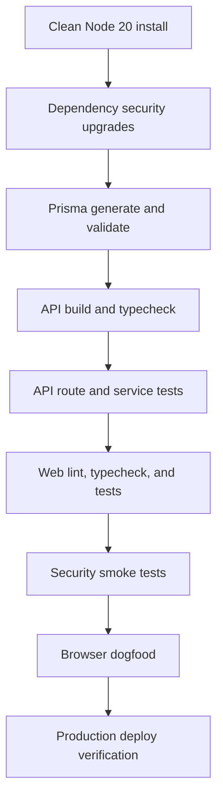
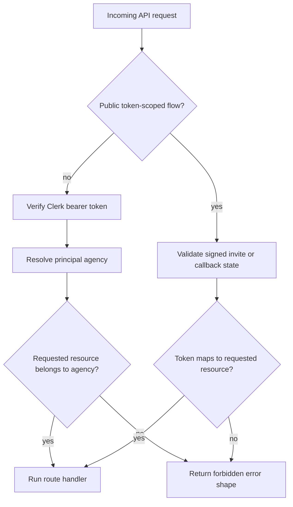
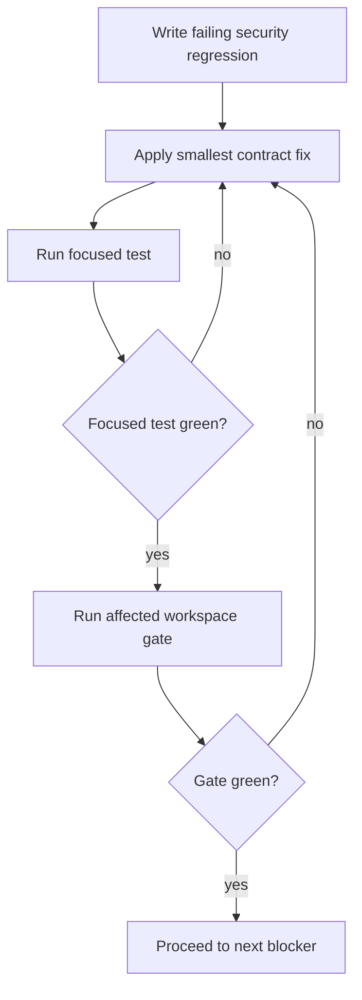

# fix: Production Readiness Remediation

## Summary

This plan turns the production-readiness audit into an implementation path for customer launch. It prioritizes exploitable auth gaps, vulnerable runtime dependencies, broken verification gates, security-contract drift, debug surface cleanup, and deploy readiness over product polish.

---

## Problem Frame

The current app cannot safely launch to customers. The audit found unauthenticated token-management and integration routes, critical/high dependency advisories in auth and framework packages, failing build/test/lint/Prisma gates, debug routes reachable in production, audit logging that cannot record repeated security events, OAuth state behavior that weakens single-use CSRF protection, and access links that exceed the repo's seven-day default.

The plan is remediation-first: restore the app's security boundary and proof gates before browser dogfood, launch marketing, or incremental UX improvements.

---

## Requirements

**Security boundary**

- R1. Every token, connection, refresh, revoke, platform authorization, and Beehiiv connection-management path requires trusted authentication or a scoped signed public token.
- R2. Agency-scoped routes derive agency identity from verified Clerk claims and existing principal-agency resolution, not caller-controlled headers or query/body `agencyId` values.
- R3. Debug and test-only API routes are unavailable in production unless protected by internal-admin authorization.

**Security contracts**

- R4. Audit logging records repeated token and security events without uniqueness collisions.
- R5. OAuth state creation and validation preserve one-time CSRF protection in production, with any fallback behavior explicitly chosen and tested.
- R6. Access request links expire after seven days by default unless a deliberate override is introduced.

**Launch gates**

- R7. Runtime dependency advisories for auth, proxy/framework, and API server packages are resolved or documented as non-runtime false positives.
- R8. Build, typecheck, lint, Prisma generation/validation, unit tests, and the web INP smoke gate pass from a clean Node 20 install.
- R9. Production deploy configuration explicitly reflects launch posture for worker behavior, environment validation, capacity, monitoring, and rollback.

**Production surface**

- R10. Internal web harnesses and non-customer debug pages are removed, hidden behind development-only guards, or protected by internal-admin authorization.
- R11. A final smoke and browser-dogfood pass covers the invite flow, agency connection flow, token-health/connection management, dashboard, and settings/billing surfaces after lower-level gates are green.

---

## Key Technical Decisions

- **Extend existing auth primitives:** Use `authenticate()`, `resolvePrincipalAgency()`, and `assertAgencyAccess()` as the foundation rather than creating a new auth stack. The app already has Fastify route hooks and principal-agency helpers that match the remediation shape.
- **Fail closed for production token state:** OAuth state must keep single-use protection in production. Prior Redis fallback notes are useful context, but customer launch should prefer secure failure or an explicitly scoped fallback over replayable stateless state.
- **Treat dependency upgrades as security work:** Clerk, Next.js, Fastify, and transitive runtime fixes are launch blockers, not maintenance chores, because current auth and proxy behavior depends on those packages.
- **Make tests prove the security contract:** Each auth or security-contract unit starts with focused failing tests or characterization coverage. Passing broad suites is not enough unless the exploit paths have direct regression coverage.
- **Gate debug surfaces instead of documenting them:** Any route or page named as a test, debug, perf, or design harness must be unavailable to normal production customers. Documentation alone does not satisfy the requirement.

---

## High-Level Technical Design

### Launch Gate Dependency Flow

### Protected Route Shape

### Security Contract Repair Loop

---

## Implementation Units

### U1. Restore Clean Dependency and Gate Baseline

- **Goal:** Make the checkout installable and verifiable on Node 20 before deeper remediation relies on test feedback.
- **Requirements:** R7, R8.
- **Dependencies:** None.
- **Files:**
  - `package.json`
  - `package-lock.json`
  - `apps/api/package.json`
  - `apps/web/package.json`
  - `apps/api/prisma/schema.prisma`
  - `apps/api/src/lib/env.ts`
  - `apps/api/.env.example`
- **Approach:** Reconcile the current lockfile and `node_modules` breakage, upgrade or replace vulnerable runtime packages, regenerate Prisma client artifacts, and keep dev-only or docs-only advisory noise separate from runtime blockers. Treat the OpenTelemetry/Superlog dependency changes currently in the dirty diff as in-scope only if they remain compatible with clean install and build gates.
- **Execution note:** Characterize the current failing gates first so regressions are distinguishable from install-state corruption.
- **Patterns to follow:** Root workspace scripts in `package.json`; Render build path in `render.yaml`; Vercel install guidance in `vercel.json`.
- **Test scenarios:**
  - Clean Node 20 install resolves `@babel/types`, `jsdom`, Prisma, and shared workspace packages without invalid dependency state.
  - Runtime audit has no critical or high advisories for Clerk, Next.js, Fastify, or other production dependencies.
  - Prisma client generation and schema validation succeed from the API workspace.
  - API and web typecheck use generated/shared types rather than stale or missing local artifacts.
- **Verification:** A clean workspace can complete build, lint, typecheck, Prisma generation/validation, and test bootstrap without dependency-loader failures.

### U2. Lock Down Token, Connection, Beehiiv, and Sentry Debug API Routes

- **Goal:** Remove unauthenticated access to token health, connection listing/detail, refresh, revoke, Beehiiv verification, and Sentry debug surfaces.
- **Requirements:** R1, R2, R3.
- **Dependencies:** U1 for reliable tests.
- **Files:**
  - `apps/api/src/routes/token-health.ts`
  - `apps/api/src/routes/beehiiv.ts`
  - `apps/api/src/routes/sentry-test.routes.ts`
  - `apps/api/src/routes/sentry-webhooks.ts`
  - `apps/api/src/index.ts`
  - `apps/api/src/lib/authorization.ts`
  - `apps/api/src/services/connection.service.ts`
  - `apps/api/src/services/beehiiv-verification.service.ts`
  - `apps/api/src/routes/__tests__/token-health.routes.test.ts`
  - `apps/api/src/routes/__tests__/beehiiv.routes.test.ts`
  - `apps/api/src/routes/__tests__/sentry-debug.routes.test.ts`
  - `apps/web/src/app/(authenticated)/token-health/page.tsx`
- **Approach:** Apply route-level authentication and agency ownership checks using existing middleware. Replace frontend `x-agency-id` token-health calls with authorized API calls that do not trust caller-controlled agency identifiers. For Beehiiv, choose between authenticated agency-only management and a scoped signed public token if any client-facing flow truly requires public access.
- **Execution note:** Start with failing route tests for unauthenticated and cross-agency callers on each affected route family.
- **Patterns to follow:** `apps/api/src/routes/webhooks.ts` for `authenticate()` plus `requirePrincipalAgency`; `apps/api/src/routes/agency-platforms/index.ts` for principal agency request context.
- **Test scenarios:**
  - Unauthenticated token-health, connection list/detail, refresh, and revoke requests receive the standard error shape.
  - Authenticated callers cannot access or mutate another agency's connection or authorization by ID.
  - Beehiiv verification rejects unauthenticated callers unless a signed token-scoped public flow is deliberately implemented.
  - Sentry test routes are not registered in production.
  - Sentry webhook health and audit endpoints require internal authorization or are unavailable in production.
  - Frontend token-health requests continue to work for the signed-in agency without sending spoofable agency headers.
- **Verification:** Route tests prove the original exploit shapes fail closed, and the authenticated token-health page still renders its own agency data.

### U3. Repair Audit, OAuth State, and Access Link Security Contracts

- **Goal:** Bring persistent security behavior back in line with launch rules for audit trails, OAuth CSRF state, and access-link expiry.
- **Requirements:** R4, R5, R6.
- **Dependencies:** U1.
- **Files:**
  - `apps/api/prisma/schema.prisma`
  - `apps/api/src/services/audit.service.ts`
  - `apps/api/src/services/oauth-state.service.ts`
  - `apps/api/src/services/access-request.service.ts`
  - `apps/api/src/lib/env.ts`
  - `apps/api/.env.example`
  - `apps/api/src/services/__tests__/audit.service.test.ts`
  - `apps/api/src/services/__tests__/oauth-state.service.test.ts`
  - `apps/api/src/services/__tests__/access-request.service.test.ts`
  - `docs/solutions/oauth-state-redis-protocol-hardening.md`
  - `docs/solutions/oauth-state-redis-quota-fallback.md`
- **Approach:** Remove or replace the audit uniqueness constraint with indexes that support repeated events. Reconcile the current Postgres/stateless OAuth state implementation with the repo's Redis-backed, single-use launch requirement, using the prior Redis protocol and quota-fallback notes to avoid repeating operational mistakes. Change default access request expiry to seven days.
- **Execution note:** Use characterization tests before changing OAuth state so the chosen production behavior is explicit.
- **Patterns to follow:** Existing `AuditLog` service API; OAuth state tests under `apps/api/src/services/__tests__/oauth-state.service.test.ts`; prior Redis hardening solution notes.
- **Test scenarios:**
  - Two audit events with the same action and resource ID both persist.
  - Token access audit logs include user email, IP, timestamp, action, and metadata where available.
  - OAuth state tokens are single-use in production behavior.
  - OAuth state creation failure either fails closed or enters an explicitly tested fallback that preserves launch security expectations.
  - Access request creation defaults to seven-day expiry.
  - Expired access requests continue to be rejected by invite/client flows.
- **Verification:** Schema, service tests, and migration review prove repeated audit writes and one-time OAuth state behavior survive normal and failure paths.

### U4. Remove or Gate Internal Web and API Production Surfaces

- **Goal:** Ensure test, dev, perf, and design harnesses are not reachable as ordinary production customer pages or unauthenticated API surfaces.
- **Requirements:** R3, R10.
- **Dependencies:** U1.
- **Files:**
  - `apps/web/src/app/design-system/page.tsx`
  - `apps/web/src/app/dev/client-detail/page.tsx`
  - `apps/web/src/app/perf/dashboard-bootstrap/page.tsx`
  - `apps/web/src/app/test/access-request/page.tsx`
  - `apps/web/src/app/test/asset-creation/page.tsx`
  - `apps/web/src/app/test/layout.tsx`
  - `apps/web/src/proxy.ts`
  - `apps/web/src/__tests__/proxy.test.ts`
  - `apps/web/src/__tests__/app-directory-structure.test.ts`
  - `apps/web/src/lib/dev-auth.ts`
- **Approach:** Classify each harness page as remove, development-only, or internal-admin-only. Keep proxy allowlists narrow and avoid adding broad public matches. Preserve local perf harness capability only through development guards that cannot activate in production.
- **Patterns to follow:** Existing proxy public-route tests; internal admin route grouping under `apps/web/src/app/(authenticated)/internal/admin`.
- **Test scenarios:**
  - Public proxy tests continue to allow invite, referral, sitemap, robots, and OAuth callback routes.
  - `/dev`, `/test`, `/perf`, and `/design-system` routes are not public in production behavior.
  - Any retained internal harness requires authenticated internal admin access.
  - Development-only bypasses are inactive outside development.
- **Verification:** Web route/proxy tests prove public-by-default entry points still work while harness pages are production-gated.

### U5. Harden Production Deploy and Runtime Operations

- **Goal:** Make the Render/API and Vercel/web deployment posture explicit enough for a launch decision.
- **Requirements:** R8, R9.
- **Dependencies:** U1, U2, U3.
- **Files:**
  - `render.yaml`
  - `vercel.json`
  - `apps/api/src/index.ts`
  - `apps/api/src/lib/env.ts`
  - `apps/api/.env.example`
  - `docs/DEPLOYMENT.md`
  - `docs/RENDER_DEPLOYMENT.md`
  - `docs/PRODUCTION_CHECKLIST.md`
  - `docs/monitoring/SENTRY_SETUP.md`
  - `docs/monitoring/SENTRY_WEBHOOK_SETUP.md`
- **Approach:** Explicitly configure worker behavior, production environment requirements, webhook secrets, rate-limit posture, Sentry verification, and deploy capacity. Keep API request availability separate from background worker availability, but avoid silent degradation for launch-critical jobs.
- **Patterns to follow:** Existing env validation in `apps/api/src/lib/env.ts`; background worker toggle documented in `apps/api/.env.example`; Sentry monitoring docs.
- **Test scenarios:**
  - Production env validation rejects localhost URLs, missing required URLs, weak database URLs, and missing security secrets.
  - Background worker launch setting is explicit and documented for pre-launch and launch modes.
  - Sentry webhook signature verification cannot be disabled in production by placeholder values.
  - Rate limiting behavior is deliberate for authenticated and unauthenticated traffic.
  - Render build path matches the clean install/build path proven in U1.
- **Verification:** Deployment configuration review plus env tests show production startup and deploy settings fail loudly on unsafe launch configuration.

### U6. Run Final Launch Verification and Browser Dogfood

- **Goal:** Prove customer-critical flows work after security and deploy blockers are fixed.
- **Requirements:** R8, R9, R11.
- **Dependencies:** U1, U2, U3, U4, U5.
- **Files:**
  - `scripts/perf/web-inp-smoke.sh`
  - `apps/web/src/app/invite/[token]/__tests__/page.test.tsx`
  - `apps/web/src/app/(authenticated)/connections/__tests__/page.test.tsx`
  - `apps/web/src/app/(authenticated)/dashboard/__tests__/page.behavior.test.tsx`
  - `apps/web/src/app/settings/platforms/__tests__/page.test.tsx`
  - `docs/PRODUCTION_CHECKLIST.md`
- **Approach:** Treat browser dogfood as the final proof layer, not as a substitute for unit and route security tests. Cover the invite/client authorization flow, agency platform connection flow, token-health/connection management, dashboard, and settings/billing pages after all lower-level gates are green.
- **Execution note:** Use `ce-test-browser` or `ce-dogfood-beta` only after the app can run cleanly.
- **Patterns to follow:** Existing web route tests and perf smoke harness; Compound `ce-test-browser` route-mapping pattern.
- **Test scenarios:**
  - Invite link loads publicly, rejects expired token, and completes supported client authorization paths.
  - Authenticated agency user can view dashboard and connections without cross-agency leakage.
  - Token-health and connection management flows show only the authenticated agency's data.
  - Settings and billing pages still render after dependency and proxy upgrades.
  - Web INP smoke suite completes without jsdom or dependency bootstrap failures.
- **Verification:** Full gate suite plus browser dogfood produce a launch-ready verdict with no P0/P1 findings remaining.

---

## Scope Boundaries

### In Scope

- Security and launch-readiness blockers from the production audit and Compound review artifact.
- Runtime dependency remediation for packages that affect auth, framework routing/proxy behavior, API serving, Prisma, tests, or production deploys.
- Focused frontend changes needed to remove spoofable headers, keep public-route behavior correct, or gate internal surfaces.
- Documentation updates that make launch configuration, verification, and operations unambiguous.

### Deferred to Follow-Up Work

- Product UX polish that is not necessary to close a launch blocker.
- Broad refactors of connection or OAuth services beyond the minimum needed for security contracts.
- New customer-facing features, dashboards, or analytics.
- Long-term worker architecture changes beyond explicit launch-safe worker configuration.

### Outside This Plan

- Marketing-page redesigns, pricing changes, and acquisition experiments.
- Replacing Clerk, Fastify, Prisma, Render, or Vercel as platform choices.
- Reworking platform OAuth business rules that were not implicated by the audit.

---

## System-Wide Impact

This work changes the production trust boundary for API access, token lifecycle management, OAuth callbacks, audit persistence, frontend proxy behavior, and deployment readiness. It affects agency users, clients using invite links, internal admins, background workers, and launch operations. The most sensitive compatibility point is preserving public token-scoped invite/OAuth flows while removing spoofable agency-scoped access.

---

## Risks & Dependencies

- **Dependency upgrades can cause framework behavior changes:** Clerk and Next.js upgrades may alter proxy or auth behavior. Proxy tests and invite/OAuth route tests must be run before launch.
- **OAuth fallback trade-off is product-critical:** Prior Redis quota failures motivated graceful degradation, but production launch also requires replay protection. The implementation must choose an explicit failure posture rather than preserve an accidental insecure fallback.
- **Audit schema changes need migration care:** Removing uniqueness can affect existing migrations and generated Prisma client types. Schema validation and audit tests must run before deployment.
- **Debug surface cleanup can break local QA:** Development harnesses may need replacement access through internal-admin or development-only paths.
- **Dirty worktree risk:** Current untracked skill/plugin files and tracked dependency changes should be isolated before implementation so remediation commits remain atomic.

---

## Acceptance Examples

- AE1. Given no authentication, when a caller requests token health or connection revoke endpoints, then the API returns the standard unauthorized error and no token or connection state changes.
- AE2. Given an authenticated agency user, when they request another agency's connection by ID, then the API returns forbidden and records no token access.
- AE3. Given two token access events for the same resource, when audit logging records both events, then both persist with distinct timestamps.
- AE4. Given an OAuth state token that has already been consumed, when the callback validates it again, then validation fails.
- AE5. Given a newly created access request, when the expiry is inspected, then the default expiration is seven days after creation.
- AE6. Given production mode, when a request hits Sentry test routes or internal web harnesses, then ordinary customers cannot access them.
- AE7. Given a clean Node 20 environment, when the launch gate suite runs, then build, lint, typecheck, tests, Prisma generation, audit, and web smoke checks complete successfully.

---

## Documentation / Operational Notes

- Update `docs/PRODUCTION_CHECKLIST.md` with the final launch gate order and ownership.
- Update `docs/DEPLOYMENT.md` and `docs/RENDER_DEPLOYMENT.md` with the explicit worker, rate-limit, Sentry, Redis/OAuth-state, and capacity decisions.
- Add a short note to the OAuth state solution docs if the stateless fallback is removed, constrained, or replaced.
- Record the final launch verification result in a durable doc only after all P0/P1 findings are closed.

---

## Sources & Research

- Compound review artifact from run `20260622-211612-a3f7c63e` under the local Compound Engineering review artifact directory.
- Prior remediation plan: `docs/implementation-plans/security-critical-high-remediation.md`.
- Prior OAuth hardening notes: `docs/solutions/oauth-state-redis-protocol-hardening.md` and `docs/solutions/oauth-state-redis-quota-fallback.md`.
- Production checklist: `docs/PRODUCTION_CHECKLIST.md`.
- Clerk Next.js docs note that `clerkMiddleware()` does not protect all routes by default; protection must be explicitly configured: https://clerk.com/docs/reference/nextjs/clerk-middleware
- Next.js proxy docs emphasize precise matchers because proxy can be invoked across the route surface: https://nextjs.org/docs/app/api-reference/file-conventions/proxy
