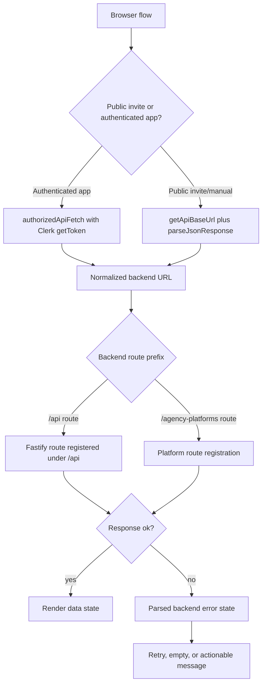
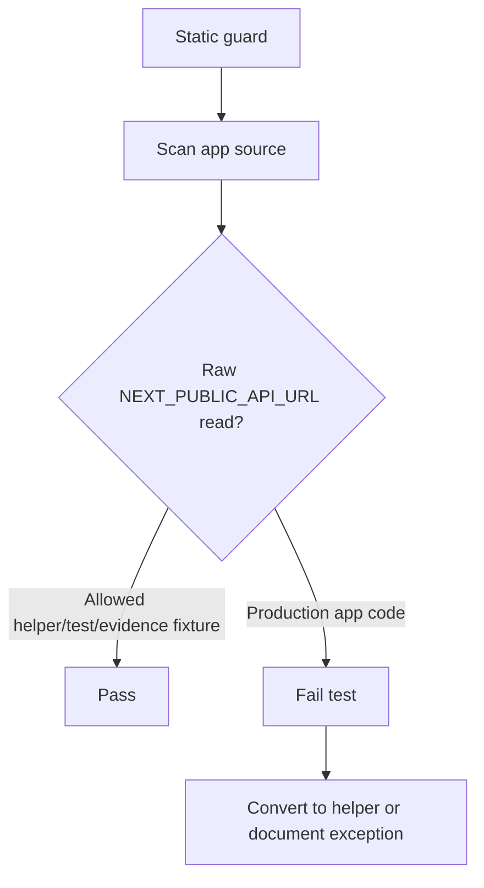

# fix: Browser API Reliability Hardening

## Goal Capsule

| Field | Value |
|---|---|
| Objective | Prevent dashboard, authenticated app, template, and invite/manual flows from hanging or failing because browser code assembles incorrect backend URLs, omits required auth, or hides backend error messages. |
| Authority | Repo instructions in `AGENTS.md`, existing API response contracts, observed dashboard spinner incident, and current frontend/API route topology. |
| Execution profile | Cross-surface reliability fix touching web API clients, selected app pages/components, public invite flows, API route test setup, and CI/static regression guards. |
| Stop conditions | Stop if a flow requires a product behavior change, a backend route contract contradicts the shared API response contract, or route auth requirements are unclear enough to change security posture. |
| Tail ownership | Implementation can proceed unit-by-unit; each unit must leave its target flow with deterministic success, error, and timeout behavior before moving on. |

---

## Product Contract

### Summary

This plan hardens the browser-to-API boundary after the dashboard spinner incident exposed a wider pattern: live frontend code still builds backend URLs directly from `process.env.NEXT_PUBLIC_API_URL`, sometimes without `/api`, sometimes without auth, and sometimes without the shared error parsing helpers. The desired user outcome is simple: a signed-in agency user or client invite recipient should never sit on an endless spinner because a request quietly hit the wrong URL or received an unhandled 404/401.

### Problem Frame

The dashboard fix established the right direction by using `getApiBaseUrl()` and parsed backend errors. The rest of the platform still contains many direct API URL reads across authenticated pages, platform settings, client detail modals, templates, public invite pages, manual connector pages, and callback paths. The backend already registers most business routes under `/api` and protects template/dashboard/client routes with Clerk authentication, so direct unprefixed fetches can fail in production even when local development appears fine.

This is not a redesign of the product flows. It is a reliability and production-readiness pass over how existing flows reach the backend and how they recover when the backend says no.

### Requirements

- R1. Browser code uses the repo's centralized API URL helpers for backend base URL resolution, with raw `process.env.NEXT_PUBLIC_API_URL` reads limited to the helper layer, tests, and intentional evidence/demo fixtures.
- R2. Authenticated backend calls use an auth-aware helper or an equivalent Clerk-token path so protected routes receive `Authorization: Bearer <token>`.
- R3. Active template APIs call the real backend route prefix and include auth, matching `apps/api/src/index.ts` registration and `apps/api/src/routes/templates.ts` route protection.
- R4. Public invite and manual connector flows build client endpoints through the same normalized base URL path and keep deterministic delayed, timeout, retry, and error states.
- R5. Authenticated dashboard, connections, access-request creation/editing, client list/detail, token-health, settings, and platform modal surfaces expose backend error messages instead of indefinite loading.
- R6. Optional third-party browser scripts and widgets remain non-blocking and env-gated, with regression coverage for the Help Scout Beacon behavior already fixed.
- R7. API route tests that validate dashboard/template security run in a clean test shell without requiring real production secrets.
- R8. CI or test gates catch future raw API URL assembly, missing `/api` prefixes on protected API clients, and spinner-prone loading states on the core flows.

### Scope Boundaries

#### In Scope

- Centralizing API URL construction and authorized fetch behavior for browser-executed code.
- Repairing active template client calls and the components that use them.
- Converting the most visible authenticated and invite/manual flows that can produce user-facing stuck loading states.
- Adding static and behavioral tests that make this failure class hard to reintroduce.
- Repairing API route test setup where env validation prevents focused dashboard/security route tests from running.

#### Deferred to Follow-Up Work

- Full cleanup of all existing lint warnings unless a warning directly indicates a stale dependency, broken hook, or spinner risk in this plan's touched flows.
- Broader launch-security remediation already covered by `docs/plans/2026-06-23-001-fix-production-readiness-remediation-plan.md`.
- Runtime monitoring, Sentry alert tuning, and analytics instrumentation beyond ensuring current optional scripts do not block the UI.
- Deep refactors of platform OAuth business logic, token storage, or connector semantics unless implementation discovers that a helper conversion cannot preserve current behavior.

---

## Planning Contract

### Key Technical Decisions

- KTD1. Use existing helper primitives instead of inventing another API client. `getApiBaseUrl()`, `authorizedApiFetch()`, `parseJsonResponse()`, and `extractApiErrorMessage()` already encode the direction the dashboard fix needs the rest of the app to follow.
- KTD2. Treat auth requirement as part of the client contract. If the backend route is protected by `authenticate()` or a route-level principal agency hook, the browser call must either go through `authorizedApiFetch()` or accept a `getToken` dependency at the call site.
- KTD3. Public invite endpoints stay public but still use normalized URL helpers. They should not use `authorizedApiFetch()`, but they should use `getApiBaseUrl()` plus shared response parsing so bad configuration becomes a visible error state.
- KTD4. Repair route prefixes from the backend registration, not by guessing from current frontend strings. Routes registered with `{ prefix: '/api' }` must be called with `/api/...`; platform routes registered separately under `/agency-platforms` should keep that prefix unless backend registration changes.
- KTD5. Add a static guard for raw API URL reads. Focused behavioral tests prove individual flows; a repo-level usage guard prevents the next page from reintroducing string-built URLs outside approved files.
- KTD6. Fix API test env setup without weakening production env validation. Test harnesses should provide or mock required env/config before route imports, while production `env` validation remains strict.

### High-Level Technical Design

### Assumptions

- The immediate dashboard spinner is already addressed by the current local dashboard patch; this plan broadens the same reliability pattern across the platform.
- The active production API topology is represented by `apps/api/src/index.ts`; route strings in old frontend code are not authoritative when they disagree with backend registration.
- Existing public invite timeout UI is directionally correct and should be preserved while endpoint construction is repaired.
- The Help Scout Beacon change should remain in place as a regression-guarded example of optional third-party scripts not blocking app readiness.

### Research Notes

- `apps/web/src/lib/api/api-env.ts` normalizes trailing slashes and throws in production when `NEXT_PUBLIC_API_URL` is missing.
- `apps/web/src/lib/api/authorized-api-fetch.ts` resolves relative endpoints against `getApiBaseUrl()` and injects Clerk bearer tokens.
- `apps/web/src/lib/api/templates.ts` currently calls unprefixed `/agencies/:id/templates` and `/templates/:id` paths with no auth, while `apps/api/src/index.ts` registers `templateRoutes` under `/api` and `apps/api/src/routes/templates.ts` applies `authenticate()`.
- `apps/web/src/lib/query/use-invite-request-loader.ts` already models `loading`, `delayed`, `timeout`, `ready`, and `error`; the failure is endpoint construction, not the basic state machine.
- `docs/plans/2026-06-23-001-fix-production-readiness-remediation-plan.md` remains the broader security and deploy-hardening artifact; this plan is narrower and frontend/API-client specific.

---

## Implementation Units

### U1. Establish API Client Usage Guardrails

- **Goal:** Make centralized API URL resolution enforceable rather than a convention remembered by reviewers.
- **Requirements:** R1, R8.
- **Dependencies:** None.
- **Files:**
  - `apps/web/src/lib/api/api-env.ts`
  - `apps/web/src/lib/api/authorized-api-fetch.ts`
  - `apps/web/src/lib/api/parse-json-response.ts`
  - `apps/web/src/lib/api/__tests__/api-env.test.ts`
  - `apps/web/src/lib/api/__tests__/authorized-api-fetch.test.ts`
  - `apps/web/src/lib/api/__tests__/api-url-usage.test.ts`
- **Approach:** Keep the existing helper layer as the only production source of truth for `NEXT_PUBLIC_API_URL`. Add a static Vitest guard that scans production app source and fails on raw `process.env.NEXT_PUBLIC_API_URL` reads outside approved files such as `api-env.ts`, tests, and intentional evidence/demo fixtures. If implementation discovers server-only helpers need a separate allowlist, keep it explicit and small.
- **Execution note:** Start with the failing usage-guard test before converting call sites so the guard proves the current risk.
- **Patterns to follow:** `apps/web/src/lib/api/__tests__/api-env.test.ts` for env mutation and restoration; `apps/web/src/lib/api/__tests__/authorized-api-fetch.test.ts` for helper behavior.
- **Test scenarios:**
  - Given `NEXT_PUBLIC_API_URL=https://api.example.com/`, `getApiBaseUrl()` returns `https://api.example.com`.
  - Given no API URL in production, `getApiBaseUrl()` throws an actionable configuration error.
  - Given a relative endpoint, `authorizedApiFetch()` calls the normalized backend URL and includes the bearer token.
  - Given production source outside the allowlist reads `process.env.NEXT_PUBLIC_API_URL`, the usage guard fails with the offending file path.
  - Given test files or `api-env.ts` read the env var, the usage guard allows them.
- **Verification:** The helper tests and static guard pass, and the guard would fail against at least one current direct-use file before conversions land.

### U2. Repair Template API Client and Template UI Callers

- **Goal:** Fix the active template feature so it calls the real `/api` routes with authentication and surfaces backend error messages.
- **Requirements:** R2, R3, R5.
- **Dependencies:** U1.
- **Files:**
  - `apps/web/src/lib/api/templates.ts`
  - `apps/web/src/lib/api/__tests__/templates.test.ts`
  - `apps/web/src/components/save-as-template-modal.tsx`
  - `apps/web/src/components/template-selector.tsx`
  - `apps/web/src/components/__tests__/save-as-template-modal.test.tsx`
  - `apps/web/src/components/__tests__/template-selector.test.tsx`
  - `apps/api/src/routes/__tests__/templates.security.test.ts`
- **Approach:** Change template API functions to accept a Clerk `getToken` dependency or move them behind a thin hook that supplies `getToken`, then call `/api/agencies/:agencyId/templates`, `/api/templates/:id`, and `/api/templates/:id/set-default` through `authorizedApiFetch()`. Preserve the shared response shapes from `@agency-platform/shared` and return typed `{ data }` / `{ error }` results at the UI boundary.
- **Execution note:** Characterize the broken URL and missing-auth behavior in client tests before replacing the fetch implementation.
- **Patterns to follow:** `apps/web/src/lib/api/access-requests.ts` for authenticated API functions; `apps/api/src/routes/templates.ts` for route names and auth requirements.
- **Test scenarios:**
  - Creating a template calls `/api/agencies/agency-1/templates` with `Authorization` and JSON content.
  - Listing templates calls `/api/agencies/agency-1/templates` and unwraps `{ data }`.
  - Updating, deleting, and setting default call the `/api/templates/:id` route family with auth.
  - When the backend returns `{ error: { message } }`, the modal renders or propagates that message rather than a generic network failure.
  - Missing Clerk token returns a user-visible unauthorized error and does not call `fetch`.
  - Template route security tests continue to prove unauthenticated and cross-agency access is rejected.
- **Verification:** Save-as-template and template selection flows no longer produce 404s from unprefixed URLs, and template API tests prove auth and prefixes.

### U3. Convert Core Authenticated App Flows to Auth-Aware API Calls

- **Goal:** Remove direct API URL assembly from the authenticated surfaces most likely to create logged-in spinners or stale loading states.
- **Requirements:** R1, R2, R5, R8.
- **Dependencies:** U1.
- **Files:**
  - `apps/web/src/app/(authenticated)/connections/page.tsx`
  - `apps/web/src/app/(authenticated)/connections/__tests__/page.test.tsx`
  - `apps/web/src/app/(authenticated)/access-requests/new/page.tsx`
  - `apps/web/src/app/(authenticated)/access-requests/[id]/edit/page.tsx`
  - `apps/web/src/app/(authenticated)/clients/page.tsx`
  - `apps/web/src/app/(authenticated)/clients/[id]/page.tsx`
  - `apps/web/src/app/(authenticated)/clients/__tests__/page.design.test.tsx`
  - `apps/web/src/app/(authenticated)/token-health/page.tsx`
  - `apps/web/src/app/(authenticated)/dashboard/__tests__/page.behavior.test.tsx`
- **Approach:** Replace direct string-built fetches with `authorizedApiFetch()` where the backend is protected. Keep route prefixes aligned with backend registration: `/api/...` for agency, client, dashboard, token-health, subscriptions, and template route families; `/agency-platforms/...` only where `apps/api/src/index.ts` registers the platform route family outside `/api`. Convert each page's loading model so a rejected request reaches an error state and retry path instead of keeping initial loading forever.
- **Execution note:** Move breadth in batches by page family; after each family, run its focused tests so URL/auth regressions are localized.
- **Patterns to follow:** `apps/web/src/app/(authenticated)/dashboard/page.tsx` for the current dashboard fix; `apps/web/src/lib/query/onboarding.ts` and `apps/web/src/contexts/unified-onboarding-context.tsx` for existing `authorizedApiFetch()` usage.
- **Test scenarios:**
  - Connections page fetches agencies, available platforms, initiate, refresh, and delete endpoints with normalized URLs and auth headers.
  - New access request page fetches agency and active platform data with auth and renders a backend error if the platform fetch fails.
  - Edit access request page renders an error state when the active platform fetch returns a backend error.
  - Clients list/detail pages fetch `/api/clients` route family through helper-based URLs and exit loading on non-ok responses.
  - Token-health page calls protected token endpoints with auth and no spoofable agency header.
  - Dashboard behavior tests keep proving the normalized `/api/dashboard` request and parsed error behavior.
- **Verification:** No targeted authenticated page in this unit appears in the raw API URL guard failure list, and each page family has a focused test for URL/auth/error behavior.

### U4. Convert Platform Settings and Modal Calls Without Changing Connector Semantics

- **Goal:** Remove direct API URL assembly from platform settings, connection modals, client-detail modals, and asset selector surfaces while preserving current connector behavior.
- **Requirements:** R1, R2, R5, R8.
- **Dependencies:** U1, U3 where shared page state is reused.
- **Files:**
  - `apps/web/src/components/meta-unified-settings.tsx`
  - `apps/web/src/components/google-unified-settings.tsx`
  - `apps/web/src/components/meta-business-portfolio-selector.tsx`
  - `apps/web/src/components/meta-connection-settings.tsx`
  - `apps/web/src/components/platform-connection-modal.tsx`
  - `apps/web/src/components/manual-invitation-modal.tsx`
  - `apps/web/src/components/client-detail/CreateRequestModal.tsx`
  - `apps/web/src/components/client-detail/EditClientModal.tsx`
  - `apps/web/src/components/client-detail/DeleteClientModal.tsx`
  - `apps/web/src/components/settings/billing-card.tsx`
  - `apps/web/src/components/__tests__/meta-unified-settings.test.tsx`
  - `apps/web/src/components/__tests__/google-unified-settings.test.tsx`
  - `apps/web/src/components/__tests__/meta-business-portfolio-selector.test.tsx`
  - `apps/web/src/components/__tests__/manual-invitation-modal.shopify.test.tsx`
  - `apps/web/src/components/__tests__/manual-invitation-modal.snapchat.test.tsx`
- **Approach:** Convert protected calls to `authorizedApiFetch()` and public or browser-callback calls to `getApiBaseUrl()` plus shared response parsing. Keep the current platform route family prefixes unless backend registration proves a prefix is wrong. For asset selector components that currently use `process.env.NEXT_PUBLIC_API_URL || ''`, route through a small helper instead of allowing empty-string relative production behavior.
- **Execution note:** This is the widest unit; preserve connector behavior by testing representative platforms rather than rewriting every platform interaction pattern at once.
- **Patterns to follow:** Existing component tests that set `NEXT_PUBLIC_API_URL`; `apps/web/src/components/client-auth/PlatformAuthWizard.tsx` for normalized base URL usage in client auth flows.
- **Test scenarios:**
  - Meta and Google unified settings fetch account/options data through normalized URLs and display backend error messages.
  - Platform connection modal refresh/connect/delete actions include auth when calling protected endpoints.
  - Manual invitation modal uses normalized URLs for both invitation and manual-connect variants.
  - Billing card calls `/api/subscriptions/:orgId` route family through helper-based URLs and exits loading on errors.
  - Asset selector components do not fall back to empty-string production URLs when the API URL is missing.
  - The static usage guard catches any remaining raw env reads in the touched component set.
- **Verification:** Representative platform and billing tests pass, and the static guard no longer reports production component files from this unit.

### U5. Harden Public Invite and Manual Connector Loading Paths

- **Goal:** Ensure client-facing invite and manual connector pages use normalized public endpoints and never leave invite recipients in an indefinite spinner.
- **Requirements:** R1, R4, R5, R8.
- **Dependencies:** U1.
- **Files:**
  - `apps/web/src/app/invite/[token]/client-invite-page.tsx`
  - `apps/web/src/app/invite/[token]/beehiiv/manual/page.tsx`
  - `apps/web/src/app/invite/[token]/kit/manual/page.tsx`
  - `apps/web/src/app/invite/[token]/klaviyo/manual/page.tsx`
  - `apps/web/src/app/invite/[token]/mailchimp/manual/page.tsx`
  - `apps/web/src/app/invite/[token]/pinterest/manual/page.tsx`
  - `apps/web/src/app/invite/[token]/shopify/manual/page.tsx`
  - `apps/web/src/app/invite/[token]/snapchat/manual/page.tsx`
  - `apps/web/src/lib/query/use-invite-request-loader.ts`
  - `apps/web/src/lib/query/__tests__/use-invite-request-loader.test.tsx`
  - `apps/web/src/app/invite/[token]/__tests__/page.test.tsx`
  - `apps/web/src/app/invite/[token]/__tests__/manual-flows.test.tsx`
  - `apps/web/src/app/invite/[token]/__tests__/page-route.test.tsx`
- **Approach:** Introduce or reuse a public client-invite API helper that builds `/api/client/:token` and `/api/client/:token/:platform/manual-connect` endpoints from `getApiBaseUrl()` and parses responses through `parseJsonResponse()`. Preserve `useInviteRequestLoader()`'s delayed and timeout phases, but ensure malformed config, 404s, and backend errors move to visible error states with retry/support actions.
- **Execution note:** Characterize one manual page first, then apply the same helper to all manual platforms to avoid seven subtly different endpoint constructions.
- **Patterns to follow:** `apps/web/src/lib/query/use-invite-request-loader.ts` for state transitions; `apps/web/src/app/invite/[token]/__tests__/manual-flows.test.tsx` for cross-platform manual flow coverage.
- **Test scenarios:**
  - Invite page loader calls `https://api.example.com/api/client/token` when the configured API URL has a trailing slash.
  - Invite page completion posts to `/api/client/:token/complete` through the normalized helper.
  - Each manual platform page passes a normalized `/api/client/:token` endpoint to the loader.
  - Manual connect submits to the correct platform-specific `/api/client/:token/:platform/manual-connect` endpoint and surfaces backend errors.
  - Loader still transitions from loading to delayed to timeout and retry recovers successfully.
  - A 404 response renders the unavailable-link state instead of keeping the spinner.
- **Verification:** Invite and manual flow tests cover normalized endpoints, timeout recovery, and backend error display for representative and generated platform cases.

### U6. Keep Optional Third-Party Scripts Non-Blocking

- **Goal:** Prevent optional browser widgets from masking app readiness failures or adding noisy 404s when not configured.
- **Requirements:** R6, R8.
- **Dependencies:** U1.
- **Files:**
  - `apps/web/src/components/help-scout-beacon.tsx`
  - `apps/web/src/components/__tests__/help-scout-beacon.test.tsx`
  - `apps/web/src/app/(authenticated)/layout.tsx`
  - `apps/web/.env.example`
- **Approach:** Preserve the env-gated Help Scout Beacon behavior from the incident fix and review other authenticated-layout background effects for the same rule: optional integrations should no-op when unconfigured and should not block dashboard rendering. Add regression coverage where a missing public widget env var prevents script injection and identity calls.
- **Execution note:** This unit should stay narrow; do not broaden into analytics vendor redesign.
- **Patterns to follow:** Current `help-scout-beacon` tests and authenticated layout fetches that now use `getApiBaseUrl()`.
- **Test scenarios:**
  - Missing `NEXT_PUBLIC_HELPSCOUT_BEACON_ID` does not inject the Beacon script.
  - Configured Beacon ID injects the script once and identifies only when a user email is available.
  - Authenticated layout background agency/onboarding fetches use normalized API base URL and do not block child rendering on failure.
- **Verification:** Optional widget tests pass and dashboard/layout tests continue to prove app shell rendering without widget config.

### U7. Repair API Route Test Env Harness

- **Goal:** Ensure dashboard and template API route security tests run in a clean shell without real production secrets.
- **Requirements:** R7, R8.
- **Dependencies:** None.
- **Files:**
  - `apps/api/src/routes/__tests__/dashboard.routes.test.ts`
  - `apps/api/src/routes/__tests__/dashboard.security.test.ts`
  - `apps/api/src/routes/__tests__/templates.security.test.ts`
  - `apps/api/src/test/env.ts`
  - `apps/api/vitest.config.ts`
  - `apps/api/src/lib/env.ts`
- **Approach:** Provide a test-only env setup or import-safe mock path before route imports that touch `env`. The fix should let focused route tests run without real `DATABASE_URL`, Clerk, Infisical, Meta, or Creem secrets while preserving strict validation for production startup and any dedicated env validation tests.
- **Execution note:** Reproduce the clean-shell dashboard route test failure first, then add only the minimum test harness required to make route tests deterministic.
- **Patterns to follow:** Existing API route tests that mock auth and services; `apps/api/src/lib/env.ts` production validation boundaries.
- **Test scenarios:**
  - Dashboard route tests import and run with dummy test env values in a clean shell.
  - Dashboard security tests still prove missing auth returns 401 and cross-agency access returns 403.
  - Template security tests continue passing with auth and authorization mocks.
  - Production env validation still rejects missing required production values outside the test harness.
- **Verification:** Focused dashboard/template route tests pass from a clean test shell, and production env validation remains strict.

### U8. Wire Production-Readiness Gates Into CI and Local Verification

- **Goal:** Make the new reliability guarantees visible in routine verification so this failure class does not return quietly.
- **Requirements:** R8.
- **Dependencies:** U1 through U7.
- **Files:**
  - `package.json`
  - `apps/web/package.json`
  - `.github/workflows/web-client-perf-gate.yml`
  - `.github/workflows/dashboard-perf-gate.yml`
  - `scripts/perf/web-inp-smoke.sh`
  - `docs/solutions/browser-api-reliability-hardening.md`
- **Approach:** Add a named script or include the new static guard and focused flow tests in an existing web smoke gate. Extend workflow path filters if needed so changes to API helpers, invite flows, template clients, dashboard, and manual connector pages trigger the relevant checks. Capture final lessons in a solution note only after implementation proves the exact repair shape.
- **Execution note:** Keep CI additions bounded; avoid turning this reliability pass into a full lint-warning cleanup project.
- **Patterns to follow:** Existing `web-client-perf-gate.yml` and `dashboard-perf-gate.yml` path filters; `scripts/perf/web-inp-smoke.sh` for focused web client smoke tests.
- **Test scenarios:**
  - The static raw-API-url usage guard runs in the web test suite or a named web smoke script.
  - CI triggers when API helper files, authenticated dashboard/connections/client/access-request pages, invite/manual pages, or template client files change.
  - Web production build still succeeds with placeholder public env values used by existing verification practice.
  - The final solution note records the enforced helper pattern and the approved exceptions.
- **Verification:** Local scripts and CI workflow definitions include the new guard and focused tests without requiring production secrets.

---

## Verification Contract

| Gate | Scope | Done Signal |
|---|---|---|
| `npm test --workspace=apps/web -- src/lib/api/__tests__/api-env.test.ts src/lib/api/__tests__/authorized-api-fetch.test.ts src/lib/api/__tests__/api-url-usage.test.ts` | Helper behavior and static raw URL guard | Helper normalization, auth injection, and usage guard pass. |
| `npm test --workspace=apps/web -- src/lib/api/__tests__/templates.test.ts` | Template API client | Template client proves `/api` prefixes, auth, and backend error parsing. |
| `npm test --workspace=apps/web -- src/app/(authenticated)/dashboard/__tests__/page.behavior.test.tsx src/app/(authenticated)/connections/__tests__/page.test.tsx` | Core logged-in app flows | Dashboard and connections no longer depend on direct env URL assembly and exit loading on backend errors. |
| `npm test --workspace=apps/web -- src/app/invite/[token]/__tests__/page.test.tsx src/app/invite/[token]/__tests__/manual-flows.test.tsx src/lib/query/__tests__/use-invite-request-loader.test.tsx` | Invite and manual flows | Public invite endpoints are normalized and timeout/error/retry states remain deterministic. |
| `npm test --workspace=apps/web -- src/components/__tests__/help-scout-beacon.test.tsx` | Optional widget gating | Missing Beacon config does not inject scripts or block app shell behavior. |
| `npm test --workspace=apps/api -- src/routes/__tests__/dashboard.routes.test.ts src/routes/__tests__/dashboard.security.test.ts src/routes/__tests__/templates.security.test.ts` | API route/security tests | Focused route tests run in clean test env and preserve auth/security behavior. |
| `npm run typecheck` | All workspaces | TypeScript passes across shared, API, and web packages. |
| `npm run lint --workspace=apps/web` and `npm run lint --workspace=apps/api` | Web/API lint | No new lint errors; existing warning backlog is not expanded by touched files. |
| `npm run build --workspace=packages/shared && npm run build --workspace=apps/api && npm run build --workspace=apps/web` | Production build | Build succeeds with required placeholder/public env configuration documented in the implementation closeout. |

---

## Definition of Done

- All production app code outside approved helper/test/evidence allowlists stops reading `process.env.NEXT_PUBLIC_API_URL` directly.
- Template API calls use `/api` route prefixes and send Clerk auth for protected routes.
- Authenticated dashboard, connections, access-request, client, token-health, platform settings, and modal surfaces either render data or a deterministic error/retry state; none can spin forever because a fetch failed with 404/401.
- Public invite and manual connector pages build normalized `/api/client/:token` endpoints and keep delayed, timeout, retry, and unavailable-link behavior covered by tests.
- Help Scout Beacon remains optional and does not load without `NEXT_PUBLIC_HELPSCOUT_BEACON_ID`.
- Dashboard and template API route tests run without real production secrets while production env validation remains strict.
- CI or local named smoke scripts include the static usage guard and focused browser-flow tests.
- Any temporary exploratory code, duplicate helpers, or one-off fetch wrappers introduced during implementation is removed before landing.

---

## System-Wide Impact

This work changes the platform's frontend reliability posture more than any single feature. Once complete, backend route prefix and auth decisions are encoded in helpers and tests instead of repeated in page-level strings. It also makes production env misconfiguration fail visibly and early, which is better than silently constructing `undefined/api/...` URLs or unprefixed paths that surface as app spinners.

The implementation will touch client-facing invite flows and agency-authenticated flows, so regression testing should cover both signed-in and public-token contexts.

---

## Risks & Dependencies

- **Wide call-site churn:** Many files currently read `NEXT_PUBLIC_API_URL` directly. Mitigation: land by unit and keep the static guard as the final forcing function rather than editing everything blindly.
- **Route-prefix ambiguity:** Some platform routes may intentionally live outside `/api`. Mitigation: derive prefixes from `apps/api/src/index.ts` registration before changing each call.
- **Auth helper fit:** Some existing functions return typed `{ error }` objects instead of throwing. Mitigation: adapt helper usage at the boundary without changing user-facing component contracts unless tests prove a cleaner error path is needed.
- **Test env masking production validation:** API route tests need dummy config, but production validation must stay strict. Mitigation: isolate test setup and keep or add explicit env validation coverage.
- **Invite flow sensitivity:** Public invite pages are customer-facing and token-scoped. Mitigation: preserve current loader states and only change endpoint construction/response parsing unless a test exposes a real behavior bug.

---

## Appendix

### Sources

- `AGENTS.md`
- `apps/web/src/lib/api/api-env.ts`
- `apps/web/src/lib/api/authorized-api-fetch.ts`
- `apps/web/src/lib/api/parse-json-response.ts`
- `apps/web/src/lib/api/templates.ts`
- `apps/api/src/index.ts`
- `apps/api/src/routes/templates.ts`
- `apps/web/src/lib/query/use-invite-request-loader.ts`
- `docs/plans/2026-06-23-001-fix-production-readiness-remediation-plan.md`
