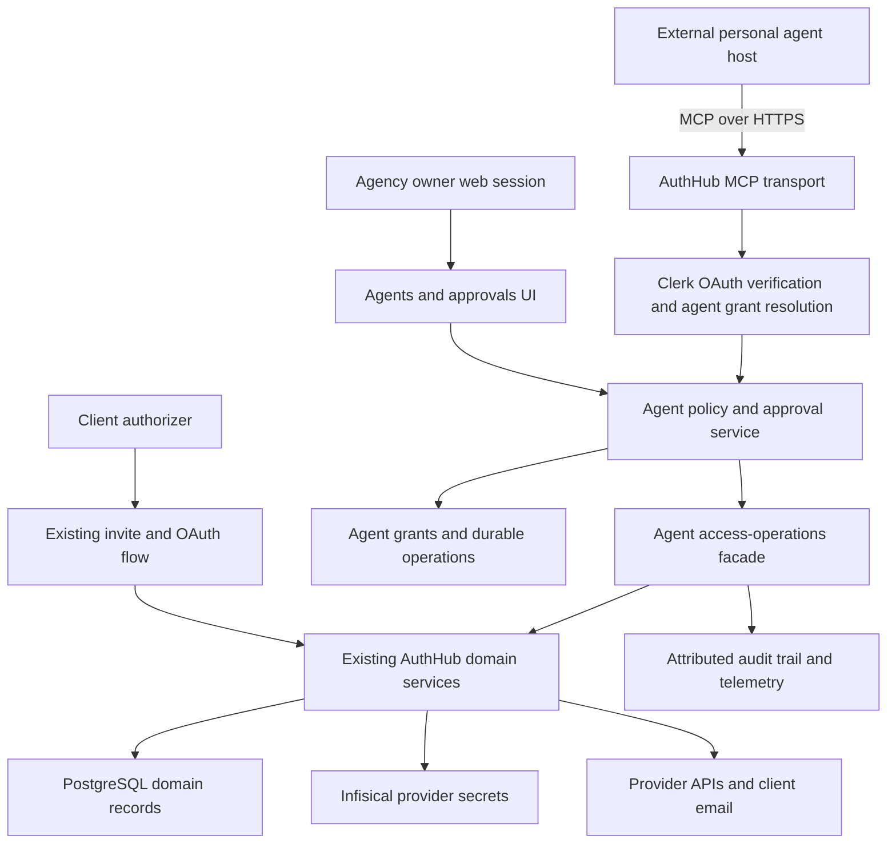
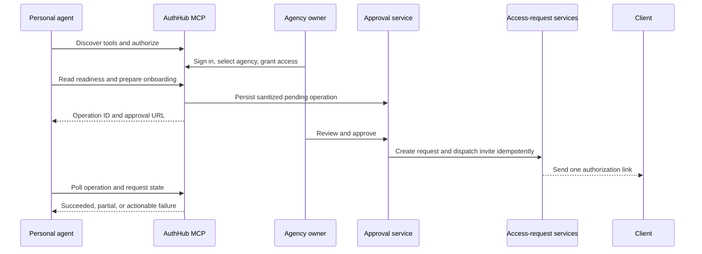
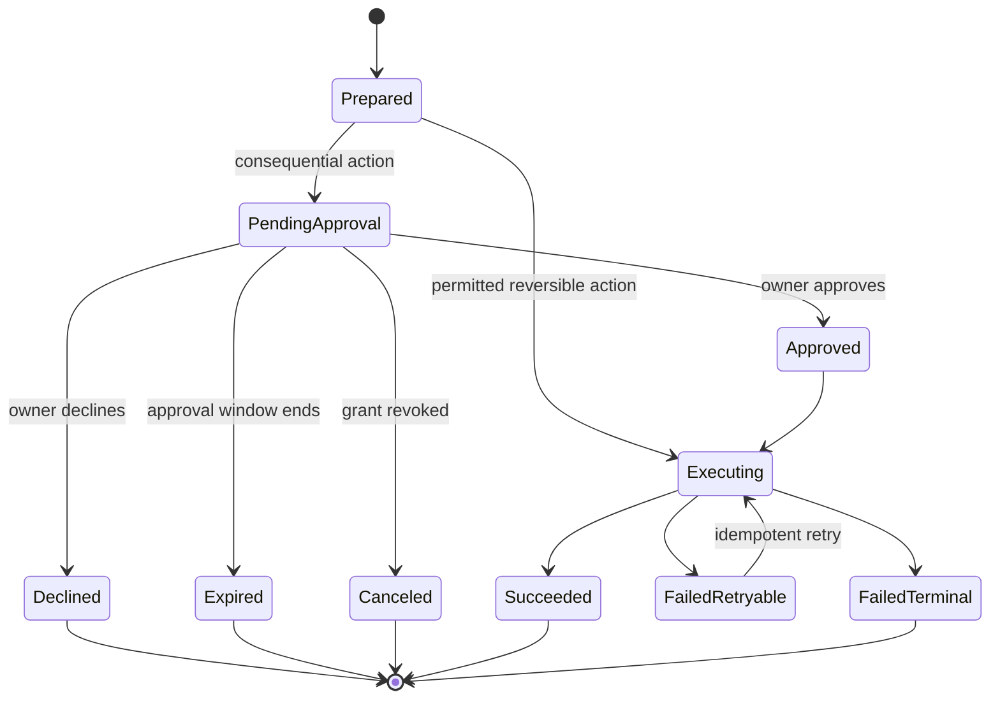

# Agent-Native Access Operations - Plan

## Goal Capsule

- **Objective:** Let an agency owner point an external personal agent at AuthHub and delegate agency setup, client onboarding, and ongoing access maintenance without exposing provider credentials or bypassing human consent.
- **Product authority:** The confirmed scope in this task governs product behavior. Existing AuthHub security rules and truthful fulfillment semantics govern compatibility. Current MCP, OAuth, and Clerk specifications govern interoperability.
- **Execution profile:** Deep, security-sensitive, cross-cutting feature delivered test-first behind a design-partner feature gate.
- **Stop conditions:** Stop if implementation would expose OAuth tokens, let an agent cross agency boundaries, treat client/provider OAuth as machine-completable, weaken approval defaults, or deploy persistent state without a committed migration path.
- **Tail ownership:** The implementer owns code, migrations, tests, documentation, and feature-gated rollout support. Production Clerk configuration, design-partner enrollment, and live provider consent remain operator-owned.

---

## Product Contract

### Summary

AuthHub becomes an access-operations control plane for external personal agents. An agency owner authorizes an agent once, the agent discovers a bounded set of AuthHub capabilities, and it can then configure the workspace, prepare client access requests, monitor fulfillment, and coordinate recovery. AuthHub remains the policy and execution boundary: risky actions require durable owner approval, provider OAuth remains human-only, and no agent receives provider tokens or secret references.

### Problem Frame

AuthHub's current flow assumes a human operates the dashboard: the owner configures the agency, creates a request, copies a client link, and returns to inspect completion or token health. The API already exposes most underlying domain actions, but it authenticates interactive Clerk principals and does not distinguish a delegated agent, express agent permissions, prevent duplicate autonomous mutations, or pause high-risk actions for approval.

The product opportunity is not to add a chat interface. It is to make AuthHub usable as infrastructure inside whichever personal agent an agency owner already prefers, while retaining human control over identity, permissions, external communication, and revocation.

### Actors

- A1. **Agency owner** — authorizes an external agent, sets its permissions, approves consequential operations, and can revoke it immediately.
- A2. **External personal agent** — discovers and invokes AuthHub tools on behalf of A1 within one agency and one active grant.
- A3. **Client authorizer** — receives an access request and completes provider consent or platform-specific authorization steps.
- A4. **AuthHub operator** — enables the feature for design partners, monitors security and reliability, and manages production identity-provider configuration.

### Requirements

**Connection, identity, and context**

- R1. AuthHub exposes a remote agent endpoint with standards-based capability discovery and delegated owner authorization.
- R2. Every agent call resolves a server-verified owner, agency, OAuth client, active grant, and permission set; caller-supplied agency or actor identity is never authoritative.
- R3. A1 can view, name, constrain, and revoke each agent grant without handling provider credentials.
- R4. A2 can read the agency profile, clients, templates, supported platforms, agency connections, access requests, truthful fulfillment state, token health, operations, and recent access events allowed by its grant.
- R5. Agent results use shared structured contracts with stable identifiers, bounded pagination, explicit completion state, and actionable error or remediation data.

**Action parity and human control**

- R6. A2 can configure reversible agency settings, create or update clients, prepare access requests, initiate human connection handoffs, and inspect maintenance needs through primitive composable actions.
- R7. Sending a client request, changing access permissions, canceling or revoking access, rotating credentials, and other externally visible or destructive actions require an unexpired approval from A1 by default.
- R8. Provider OAuth consent, password entry, CAPTCHA, platform permission dialogs, and client authorization remain human-only; agent tools return a bound AuthHub handoff URL rather than accepting sensitive input.
- R9. AuthHub enforces approval and permission policy on the server. MCP annotations or client-side confirmation prompts may improve UX but never authorize an operation.
- R10. Mutating agent calls are idempotent within the grant and operation scope, including retries after timeouts or partial downstream failure.
- R11. Approval previews show the target agency, client, platforms, permissions, external effect, requesting agent, expiry, and any change from current state before A1 decides.

**Full access-operations loop**

- R12. A2 can assess setup readiness, identify missing agency connections, and guide A1 through the human steps needed to complete them.
- R13. A2 can assemble a client onboarding request from client data and templates, validate it against current platform support and agency readiness, and request approval to create and dispatch it.
- R14. A2 can distinguish pending, partial, completed, expired, revoked, invalid, and follow-up-needed states without treating raw OAuth success as product fulfillment.
- R15. A2 can propose recovery for expired links, unhealthy connections, unresolved products, and failed dispatches, then resume from the durable operation state after required human action.
- R16. A1 can revoke an agent grant at any time, after which new calls fail and pending unapproved operations cannot execute.

**Security, compatibility, and rollout**

- R17. Agent activity is attributable to both A1 and A2 in the audit trail, including grant, OAuth client, operation, decision, target resource, IP, user agent, and sanitized outcome.
- R18. Agent tools never return provider access tokens, refresh tokens, API keys, webhook signing secrets, Infisical secret identifiers, raw sensitive submissions, or unnecessary client PII.
- R19. Existing web, REST, invite, OAuth, webhook, quota, and truthful fulfillment behavior remains available and is reused through shared domain services rather than duplicated in the agent transport.
- R20. Authenticated agent traffic has per-grant rate limits and quotas even when normal authenticated browser traffic is exempt from the global IP limiter.
- R21. The feature launches behind an agency allowlist with observable tool, approval, failure, latency, and revocation metrics before general availability.

### Key Flows

- F1. **Connect a personal agent**
  - **Trigger:** A1 gives a supported personal agent the AuthHub endpoint.
  - **Actors:** A1, A2.
  - **Steps:** A2 discovers OAuth metadata, A1 signs in and selects the agency, AuthHub creates a conservative grant, and A2 receives only the granted capability set.
  - **Outcome:** A2 can read the authorized agency and A1 can see and revoke the connection in AuthHub.

- F2. **Set up the agency**
  - **Trigger:** A2 checks whether the agency is ready to onboard a client.
  - **Actors:** A1, A2.
  - **Steps:** A2 reads agency and platform readiness, updates permitted reversible settings, and returns bound handoff URLs for provider connections that require A1.
  - **Outcome:** AuthHub reports a truthful readiness state without exposing credentials to A2.

- F3. **Onboard a client**
  - **Trigger:** A1 asks A2 to onboard a named client.
  - **Actors:** A1, A2, A3.
  - **Steps:** A2 resolves or creates the client, selects a template and platforms, prepares a preview, requests approval, and AuthHub creates and dispatches the request only after approval.
  - **Outcome:** A3 receives one valid AuthHub authorization link and the operation records the created request and dispatch outcome.

- F4. **Monitor and recover access**
  - **Trigger:** A2 inspects requests and connection health on demand or on a schedule controlled by its host.
  - **Actors:** A1, A2, A3.
  - **Steps:** A2 reads lifecycle and fulfillment state, identifies the next safe action, performs allowed reads or preparations, and requests approval or a human handoff where required.
  - **Outcome:** A2 can explain current state and continue from durable operation state without guessing or duplicating work.

- F5. **Revoke an agent**
  - **Trigger:** A1 revokes a grant or AuthHub detects that its delegated authorization is no longer valid.
  - **Actors:** A1, A2, A4.
  - **Steps:** AuthHub disables the grant, blocks new calls, invalidates pending approvals, and records the revocation.
  - **Outcome:** A2 loses access immediately according to the chosen token-validation posture and no queued consequential action executes.

### Acceptance Examples

- AE1. **Delegated read succeeds:** Given an active grant for one agency, when A2 requests workspace context, then AuthHub returns only that agency's sanitized state and attributes the read to A1 and A2.
- AE2. **Cross-tenant input is ignored or rejected:** Given a valid grant for agency A and a tool argument naming agency B, when A2 calls the tool, then AuthHub does not read or mutate agency B.
- AE3. **Dispatch pauses for approval:** Given a valid prepared onboarding request, when A2 asks AuthHub to dispatch it, then AuthHub creates a pending operation and no client email or active request is created before A1 approves.
- AE4. **Retry is idempotent:** Given an approved dispatch whose first response times out after request creation, when A2 retries with the same idempotency key, then AuthHub returns the existing operation and does not create or send a second request.
- AE5. **Declined or expired approval is terminal:** Given a pending operation, when A1 declines it or its approval window expires, then later execution attempts fail without side effects.
- AE6. **OAuth stays human-only:** Given a missing platform connection, when A2 initiates setup, then it receives an AuthHub handoff URL; provider consent cannot be completed through tool arguments and is bound to A1's verified identity.
- AE7. **Fulfillment remains truthful:** Given a client who completes Google OAuth but selects no required assets, when A2 checks the request, then the result remains partial or follow-up-needed with the unresolved products identified.
- AE8. **Grant revocation takes effect:** Given an active agent token and grant, when A1 revokes the grant, then the next agent call is rejected and pending unapproved operations are canceled.
- AE9. **Secrets remain server-side:** Given any successful or failed tool invocation, when its response and audit record are inspected, then neither contains provider tokens, API keys, signing secrets, or Infisical secret identifiers.

### Success Metrics

- A design-partner owner reaches the first successful authenticated tool call within 10 minutes of receiving the endpoint.
- At least three design-partner agencies complete F1 through F4 with no operator database repair or credential handling.
- At least 90% of agent-driven onboarding steps complete without opening the main dashboard, excluding approvals and human-only OAuth/client authorization.
- Every consequential agent action has a matching operation, approval decision, and audit record; the target is 100% coverage.
- Duplicate external effects caused by agent retries remain at zero during the design-partner period.
- No agent response, log, trace, or audit payload contains prohibited secret material.

### Scope Boundaries

#### Included now

- A remote MCP surface for external personal agents, backed by the existing AuthHub API service and domain services.
- Delegated owner authorization, persistent agent grants, server-side permissions, approval operations, idempotency, audit attribution, and revocation.
- Agency setup context and handoffs, client preparation, approved request dispatch, truthful monitoring, and recovery coordination.
- Authenticated web surfaces for connected agents, permission visibility, approval decisions, operation history, and revocation.
- Feature-gated rollout, interoperability smoke tests, and security/operational metrics.

#### Deferred to follow-up work

- User-managed API keys as a non-interactive fallback for agency-owned automation.
- Custom per-action approval policies beyond the conservative default profile.
- Experimental MCP Tasks, server-initiated notifications, and URL elicitation as required client features; the first release remains compatible without them.
- A2A exposure, because AuthHub is a tool and control plane rather than a remote autonomous agent.
- Continuous Access Evaluation Protocol integration, DPoP-bound tokens, and Rich Authorization Requests beyond what the chosen identity provider supports.
- Multi-agency grants, delegated sub-agents, marketplace distribution, and public self-service enrollment.

#### Outside this product's identity

- Hosting a general-purpose agency agent or choosing the model that an agency uses.
- Running campaigns, editing ads, producing creative, or performing post-access agency work.
- Allowing agents to impersonate clients, bypass provider consent, solve CAPTCHA, accept terms, or receive raw provider credentials.

### Assumptions

- The initial buyer is a technically progressive, owner-led marketing agency already using a personal agent with remote MCP support.
- Market momentum justifies a design-partner build, but customer demand is not treated as validated until F1 through F4 are observed with real agencies.
- Clerk remains the authorization server for the first release; AuthHub owns domain permissions and approval policy because Clerk's currently documented OAuth scopes are identity-oriented.
- The first release supports one agency per grant and a conservative fixed permission profile selected during authorization.
- Consequential operations expire after a short, configurable approval window and never auto-approve based on model confidence.

---

## Planning Contract

### Key Technical Decisions

- KTD1. **Add an agent application layer, not an HTTP proxy.** MCP tools call typed AuthHub application services that reuse existing agency, client, access-request, connection, token-health, webhook, and audit services. This keeps REST and MCP behavior aligned and avoids a second set of business rules.
- KTD2. **Use remote MCP over Streamable HTTP as the first interoperability surface.** AuthHub is providing tools and context to an external agent, which matches MCP's role; A2A would imply that AuthHub itself is an autonomous peer agent.
- KTD3. **Keep MCP transport stateless and business operations durable.** Transport sessions do not own approval or execution state. PostgreSQL-backed grants and operations allow retries, polling, horizontal deployment, revocation, and recovery across process restarts.
- KTD4. **Use Clerk OAuth for delegated owner authentication, with AuthHub grants for domain authorization.** The MCP endpoint publishes OAuth Protected Resource Metadata and validates audience, issuer, subject, agency, and client identity. AuthHub then applies its own permission profile to every tool because identity-provider scopes do not fully describe AuthHub actions.
- KTD5. **Represent human control as a server-enforced operation state machine.** Sensitive tool calls prepare a sanitized operation, return an AuthHub approval URL, and execute only after an authenticated owner decision. Client confirmations and MCP annotations are descriptive controls, not authorization.
- KTD6. **Use primitive tools with a small safety taxonomy.** Read tools return scoped state; reversible internal writes can execute within the grant; externally visible, destructive, or privilege-changing actions create approval operations; provider consent and sensitive input are human-only handoffs.
- KTD7. **Do not depend on experimental MCP Tasks for the first release.** AuthHub exposes operation identifiers and polling tools using its own stable state. MCP task augmentation can be added later without changing the domain lifecycle.
- KTD8. **Derive all actor fields server-side.** A discriminated principal context distinguishes human browser users from delegated agents and carries owner, agency, OAuth client, grant, permissions, request metadata, and operation correlation into policy and audit services.
- KTD9. **Create the access request only during approved dispatch.** The prepared operation stores a sanitized request preview. Approval execution creates the canonical request and sends the invite idempotently; a dispatch failure records partial outcome so retry reuses the request instead of creating another.
- KTD10. **Commit the database migration.** Production runs `prisma migrate deploy`, so implementation must stop ignoring `apps/api/prisma/migrations/` and ship an additive migration using the schema's mapped table names. `db push` remains local-only.
- KTD11. **Pin the production-stable official MCP SDK at implementation time.** As of this plan, the official TypeScript SDK recommends v1.x while v2 is pre-release. Keep protocol-facing code behind a small adapter so a later stable-major migration does not touch domain services.
- KTD12. **Rate-limit agents separately from browsers.** The current deployment can exempt authenticated traffic from the global IP limiter. MCP traffic instead uses per-grant and per-agency budgets, with stricter limits for preparation and execution tools.
- KTD13. **Make the AuthHub grant check the immediate revocation boundary.** Every MCP call validates the presented Clerk token and then reloads the stored grant before resolving tools or data. Revoking the local grant therefore blocks the next call even if a self-contained OAuth token remains cryptographically valid; opaque Clerk tokens and authorization-server revocation are defense in depth, not the only kill switch.
- KTD14. **Treat approval URLs as authenticated references, never bearer capabilities.** Operation identifiers are high-entropy but confer no authority by themselves. The approval page requires A1's normal Clerk session, derives agency ownership server-side, revalidates operation state on decision, and never accepts an owner or agency from the URL.

### High-Level Technical Design

#### Component topology

#### Delegated onboarding sequence

#### Agent operation lifecycle

### Permission and Action Policy

- **Read:** workspace, platform catalog, clients, templates, access requests, fulfillment, connection health, operations, and sanitized events. Executes without per-call approval when included in the grant.
- **Reversible internal write:** agency profile settings, client records, request preparation, and connection handoff initiation. Executes without per-call approval but is audited and idempotent.
- **Consequential:** dispatch request, change requested access, cancel request, revoke connection, rotate a secret, or change agent permissions. Creates an approval operation.
- **Human-only:** provider consent, client authorization, passwords, CAPTCHA, terms acceptance, and viewing or copying secrets. Tools can describe and initiate a bound handoff but cannot complete the action.

### Persistent Data Shape

- **AgentGrant:** one agency-scoped record per connected external client, containing owner principal, verified OAuth client identity, display metadata, permission profile, state, last use, and revocation data. It stores no bearer token or provider secret.
- **AgentOperation:** one durable attempted action containing grant, agency, action type, risk class, sanitized input snapshot, approval preview, idempotency key, lifecycle status, approval actor and timestamps, sanitized result, retry classification, and expiry.
- **AuditLog additions:** nullable actor type, actor identifier, agent grant, and operation references make agent activity queryable without breaking existing human and system events.

### Sequencing

1. Land additive shared contracts and persistent state with a deployable migration.
2. Establish delegated agent identity, grant resolution, permissions, and revocation.
3. Build approval, idempotency, execution, and audit policy before exposing any mutation tool.
4. Add the agent-facing application facade and prove it against existing domain semantics.
5. Mount the remote MCP transport and metadata around the proven facade.
6. Add owner-facing connection, approval, and audit controls.
7. Complete monitoring, recovery, interoperability, and design-partner rollout gates.

### System-Wide Impact

- **Authentication and authorization:** Existing Clerk session handling remains intact; a new delegated-agent principal path must not make current routes accept broader tokens or trust client-provided tenant identifiers.
- **Data lifecycle:** Agent grants and operations become security records with explicit expiry and revocation behavior. Operation payloads require PII minimization and retention limits.
- **Record integrity:** Revocation is a soft state transition so grant, operation, and audit attribution survive routine disconnects. Foreign keys and delete behavior must preserve auditability, while an explicit retention/erasure job sanitizes or removes expired payload snapshots according to the existing agency-deletion and privacy policy.
- **Secrets:** Infisical remains the only provider-token store. Agent code receives service outcomes, never secret IDs or raw tokens.
- **Domain consistency:** Agent results must use the same fulfillment evaluator that drives invite completion, agency views, and webhooks.
- **Quotas and abuse:** Agent calls are higher-frequency than UI calls and cannot inherit the current authenticated rate-limit exemption.
- **Deployment:** The work introduces persistent schema and OAuth metadata endpoints, so API-first deployment and committed migrations are required before the web approval surface is enabled.
- **Protocol edge:** Public OAuth metadata remains intentionally unauthenticated, but MCP requests require canonical resource/audience binding, approved-client consent, bounded bodies and pagination, production host/origin validation, and no downstream token passthrough.
- **Operations:** A4 needs metrics for authorization failures, tool calls by risk class, approval latency, duplicate suppression, downstream failures, revocations, and secret-redaction violations.

### Risks and Mitigations

- **Identity-provider capability drift:** Clerk's OAuth and API-key features are evolving. Use documented OAuth flows, keep AuthHub permissions independent, and verify exact token claims and revocation behavior in a staging Clerk instance before enabling design partners.
- **Residual token validity:** A JWT may remain valid after authorization-server revocation. Resolve the active AuthHub grant on every call, deny before tool discovery when it is revoked, and exercise both local-grant and authorization-server revocation in the staging compatibility matrix.
- **Confused deputy or token passthrough:** An MCP client could present a token issued for another resource or attempt to route downstream provider credentials through AuthHub. Enforce exact resource/audience and approved-client binding, retain per-client consent, and never accept or forward provider tokens in tool arguments.
- **MCP SDK churn:** The official TypeScript SDK is between major versions. Pin a production-stable release, isolate it behind the transport adapter, and avoid experimental Tasks as a dependency.
- **Prompt injection or confused intent:** Agents may request harmful actions because of untrusted content. Server policy, approval previews, fixed tool schemas, and least-privilege grants constrain the blast radius.
- **Duplicate external effects:** Network retries can outlive the original response. Unique idempotency keys, row-level operation claiming, persisted downstream resource IDs, and retry-aware dispatch prevent duplication.
- **Approval race or stale context:** Agency state can change after preparation. Revalidate grant, policy, current resource version, and approval expiry immediately before execution; require a new preview when material fields changed.
- **Approval-link leakage:** Links may appear in agent transcripts or browser history. Use an opaque operation identifier only as a locator, require A1's authenticated agency-scoped session for reads and decisions, apply the existing state-changing request protections, and avoid sensitive preview data in URL parameters.
- **PII and secret leakage:** Tool results, operation snapshots, logs, traces, and audit metadata can become a secondary leak path. Centralize sanitization and add negative contract tests for every prohibited field family.
- **Migration baseline gap:** The repo ignores Prisma migrations despite production requiring them. Make the first migration additive, verify it against a production-like schema snapshot, record pre/post row and constraint invariants, and document code rollback plus retained-table behavior before enabling the feature.
- **Client variability:** MCP hosts differ in OAuth, elicitation, and task support. Require only Streamable HTTP, OAuth discovery, tools, and structured results; provide ordinary HTTPS approval URLs and polling as the compatibility floor.
- **Unproven demand:** Treat the allowlisted release as product validation. Do not expand into A2A, custom policy builders, or marketplace distribution until agencies complete the full loop.

---

## Implementation Units

### U1. Add agent contracts and deployable persistent state

- **Goal:** Establish stable shared types, grant/operation records, audit attribution, and a production migration before agent behavior exists.
- **Requirements:** R2, R3, R5, R10, R11, R16-R18; supports AE2, AE4, AE5, AE8, AE9.
- **Dependencies:** None.
- **Files:** `.gitignore`; `apps/api/prisma/schema.prisma`; `apps/api/prisma/migrations/<timestamp>_agent_native_control_plane/migration.sql`; `apps/api/src/lib/agent-schema-readiness.ts`; `apps/api/src/lib/__tests__/agent-schema-readiness.test.ts`; `packages/shared/src/types.ts`; `packages/shared/src/index.ts`; `packages/shared/src/__tests__/agent-types.test.ts`.
- **Approach:** Add AgentGrant and AgentOperation models plus nullable audit actor references. Define permission, risk, lifecycle, sanitized result, pagination, and approval-preview schemas in the shared package. Remove the blanket migration ignore and commit an additive migration using mapped table names and indexes for active grants, idempotency, pending approvals, expiry, and agency activity. Use soft revocation and explicit foreign-key behavior so disconnecting an agent does not erase operation or audit attribution; define bounded retention for sanitized snapshots.
- **Execution note:** Write shared validation and schema-readiness tests before changing the Prisma schema.
- **Patterns to follow:** `WebhookEndpoint` and `WebhookDelivery` for durable lifecycle records; `apps/api/src/lib/webhook-schema-readiness.ts` for launch-critical schema checks; existing mapped table names in `apps/api/prisma/schema.prisma`.
- **Test scenarios:**
  1. Valid grants and each legal operation status parse; unknown permissions, risk classes, and transitions fail validation.
  2. Two operations may not share the same grant-scoped idempotency key.
  3. Agent records contain no field intended to store OAuth or provider bearer secrets.
  4. Schema readiness reports each required table, column, index, and foreign key as present and returns a launch-blocking error when one is missing.
  5. The migration applies to a production-like schema with existing agency and audit rows without changing existing records.
  6. Revoking a grant preserves its operations and audit attribution, while the retention path removes expired snapshots without orphaning required security records.
- **Verification:** Shared contracts build and test, Prisma validates and generates, the migration applies cleanly in a disposable database, and schema readiness passes.

### U2. Resolve delegated agent principals and manage grants

- **Goal:** Authenticate remote agents through Clerk OAuth and resolve a revocable, agency-scoped AgentPrincipal without widening browser authorization.
- **Requirements:** R1-R3, R16, R17, R20; covers F1, F5 and AE1, AE2, AE8.
- **Dependencies:** U1.
- **Files:** `apps/api/src/lib/agent-principal.ts`; `apps/api/src/lib/agent-auth-metadata.ts`; `apps/api/src/middleware/agent-auth.ts`; `apps/api/src/services/agent-grant.service.ts`; `apps/api/src/routes/agent-grants.ts`; `apps/api/src/routes/__tests__/agent-grants.security.test.ts`; `apps/api/src/middleware/__tests__/agent-auth.test.ts`; `apps/api/src/services/__tests__/agent-grant.service.test.ts`; `apps/api/src/lib/env.ts`; `apps/api/.env.example`; `apps/api/src/index.ts`.
- **Approach:** Validate OAuth issuer, audience/resource, subject, client identity, expiry, and the current stored grant. Bind the selected agency during owner consent, then derive it from the grant on calls rather than relying on a mutable token claim or tool argument. Maintain explicit per-owner approval of OAuth clients and reject token passthrough. Keep the existing `authenticate()` and human principal behavior unchanged. Add authenticated human endpoints to list, name, constrain, and revoke grants.
- **Execution note:** Start with security tests proving cross-agency and revoked-grant denial before implementing the middleware.
- **Patterns to follow:** `apps/api/src/middleware/auth.ts`, `apps/api/src/lib/authorization.ts`, `apps/api/src/routes/__tests__/access-requests.security.test.ts`, and Clerk's current OAuth token verification guidance.
- **Test scenarios:**
  1. A valid OAuth token and active grant resolve an AgentPrincipal with server-derived agency and permission data.
  2. Missing, expired, wrong-issuer, wrong-audience, or wrong-resource tokens fail before a tool handler runs.
  3. A token for one agency cannot select another agency through parameters or headers.
  4. A known OAuth client without a grant receives no access.
  5. Revoking a grant blocks the next call and cancels its pending unapproved operations.
  6. Existing Clerk browser session tests continue to pass unchanged.
  7. A token issued for another resource, a client without owner consent, or a downstream-provider token is rejected without introspection data leaking to the caller.
- **Verification:** Focused middleware, service, and security route tests prove tenant isolation and immediate grant enforcement without browser-auth regressions.

### U3. Enforce permission, approval, idempotency, and audit policy

- **Goal:** Create the durable execution boundary that all consequential agent actions must cross.
- **Requirements:** R7, R9-R11, R16-R18, R20; covers AE3-AE5, AE8, AE9.
- **Dependencies:** U1, U2.
- **Files:** `apps/api/src/services/agent-policy.service.ts`; `apps/api/src/services/agent-operation.service.ts`; `apps/api/src/routes/agent-operations.ts`; `apps/api/src/services/audit.service.ts`; `apps/api/src/services/__tests__/agent-policy.service.test.ts`; `apps/api/src/services/__tests__/agent-operation.service.test.ts`; `apps/api/src/routes/__tests__/agent-operations.security.test.ts`; `apps/api/src/index.ts`.
- **Approach:** Centralize action classification, permission checks, sanitized previews, approval decisions, expiry, revalidation, row-level execution claiming, retry classification, and audit emission. Store a digest of the canonical sanitized input alongside the idempotency key so key reuse with changed intent is detectable. Human approval endpoints treat the operation ID only as a locator and resolve the authenticated owner's agency boundary exactly as existing settings routes do. Only the operation service can transition an approved consequential action into execution.
- **Execution note:** Implement the state machine and concurrency tests before wiring any domain side effect.
- **Patterns to follow:** Webhook delivery uniqueness and retry records; `auditService.createAuditLog()` request metadata extraction; standardized API envelopes and error codes.
- **Test scenarios:**
  1. Read and permitted reversible actions bypass per-call approval but still emit attributed audit records.
  2. Consequential actions create pending operations and cannot execute while pending, declined, expired, canceled, or owned by another agency.
  3. Two concurrent execution attempts claim one operation once and return the same terminal result.
  4. Repeating an idempotency key with different sanitized input fails as a conflict.
  5. Approval revalidates grant state, permissions, expiry, resource version, and target agency before execution.
  6. Audit entries contain owner, agent client, grant, operation, decision, target, IP, and user agent but omit prohibited secret and PII fields.
  7. Possessing or guessing an operation ID without the matching authenticated owner and agency cannot read the preview or decide the operation.
- **Verification:** State-transition, concurrency, authorization, and negative leakage tests pass with one audit event chain per operation.

### U4. Build the agent access-operations facade

- **Goal:** Provide transport-neutral action and context parity for agency setup, client onboarding, monitoring, and recovery using existing domain services.
- **Requirements:** R4-R8, R12-R15, R18, R19; covers F2-F4 and AE1, AE3, AE4, AE6, AE7, AE9.
- **Dependencies:** U2, U3.
- **Files:** `apps/api/src/services/agent-access-operations.service.ts`; `apps/api/src/services/access-request-notification.service.ts`; `apps/api/src/services/access-request.service.ts`; `apps/api/src/services/client.service.ts`; `apps/api/src/services/agency-platform.service.ts`; `apps/api/src/services/token-lifecycle.service.ts`; `apps/api/src/services/__tests__/agent-access-operations.service.test.ts`; `apps/api/src/services/__tests__/access-request-notification.service.test.ts`.
- **Approach:** Expose primitive application methods for workspace context, readiness, clients, templates, request preparation, approved dispatch, request state, connection health, handoff initiation, and recovery proposals. Call domain services directly with AgentPrincipal and operation context. Centralize response sanitization and truthful fulfillment mapping. Approved dispatch creates one request and sends one client invitation, recording the request ID before any retryable email failure.
- **Execution note:** Add characterization tests around current fulfillment and connection behavior before adapting services to accept actor context.
- **Patterns to follow:** `access-request.service.ts` fulfillment evaluator; `client.service.ts` activity aggregation; `onboarding-email.service.ts` URL construction; grouped OAuth truthfulness solution docs.
- **Test scenarios:**
  1. Workspace context returns only grant-permitted, agency-scoped, paginated records with no secret identifiers.
  2. Readiness identifies missing platform connections and returns a bound human handoff instead of requesting credentials.
  3. Request preparation validates client, template, supported products, access levels, and agency readiness without creating a canonical request.
  4. Approved dispatch creates one request and one invitation; a retry after email failure reuses the request and retries only the unsatisfied effect.
  5. Google or LinkedIn OAuth without required asset selection remains partial with unresolved products.
  6. Recovery proposes the next action for expired links, invalid connections, and failed dispatches without auto-revoking or expanding permissions.
- **Verification:** Facade tests prove behavior parity with current services, truthful partial states, idempotent external effects, and complete response sanitization.

### U5. Mount the remote MCP transport and tool catalog

- **Goal:** Make the proven facade discoverable and callable from standards-compliant personal agents over remote MCP.
- **Requirements:** R1, R4-R6, R8, R9, R15, R19, R20; covers F1-F4 and AE1-AE7.
- **Dependencies:** U2-U4.
- **Files:** `apps/api/package.json`; `package-lock.json`; `apps/api/src/routes/mcp.ts`; `apps/api/src/lib/mcp-adapter.ts`; `apps/api/src/services/mcp/agent-mcp-server.ts`; `apps/api/src/services/mcp/context-tools.ts`; `apps/api/src/services/mcp/onboarding-tools.ts`; `apps/api/src/services/mcp/operation-tools.ts`; `apps/api/src/routes/__tests__/mcp.protocol.test.ts`; `apps/api/src/routes/__tests__/mcp.security.test.ts`; `apps/api/src/services/mcp/__tests__/tool-contracts.test.ts`; `apps/api/src/index.ts`.
- **Approach:** Pin the current production-stable official TypeScript MCP SDK and expose a stateless Streamable HTTP endpoint. Publish Protected Resource Metadata and OAuth discovery links, return correct authentication challenges, and register a deliberately small tool catalog over the facade. Validate the canonical resource, host, origin where applicable, content type, and body size at the transport edge. Use structured outputs, bounded lists, stable resource identifiers, safety annotations, and ordinary approval URLs; negotiate optional features without requiring elicitation or Tasks.
- **Execution note:** Start with protocol-level initialization, authentication challenge, tool discovery, and structured-output tests using an official client implementation.
- **Patterns to follow:** Fastify route registration and error envelopes; official MCP authorization, tools, and TypeScript SDK documentation; existing `sanitizeConnection()` behavior.
- **Test scenarios:**
  1. An unauthenticated MCP initialization receives discoverable OAuth resource metadata and no protected data.
  2. A supported client completes initialization, lists only granted tools, and calls a read tool with structured output.
  3. Tool arguments containing another agency ID cannot alter the AgentPrincipal scope.
  4. Consequential tools return a pending operation and approval URL rather than executing.
  5. Unknown tools, malformed schemas, oversized pagination, and unsupported protocol features return bounded protocol errors.
  6. Responses and protocol logs redact provider tokens, secret IDs, webhook secrets, and unnecessary PII.
  7. Per-grant limits apply even when the global authenticated IP limiter is bypassed.
  8. Wrong host/origin, wrong resource audience, token passthrough, oversized bodies, and unexpected content types fail before tool execution.
- **Verification:** MCP protocol integration, security, and tool contract tests pass against the pinned official SDK; a local remote-client smoke completes discovery, OAuth, read, prepare, approval, and polling.

### U6. Add owner controls for connected agents and approvals

- **Goal:** Give A1 a clear web surface to understand, approve, constrain, audit, and revoke delegated agents.
- **Requirements:** R3, R7, R11, R16, R17, R21; covers F1, F3, F5 and AE3, AE5, AE8.
- **Dependencies:** U2, U3.
- **Files:** `apps/web/src/app/(authenticated)/settings/page.tsx`; `apps/web/src/components/settings/settings-tabs.tsx`; `apps/web/src/components/settings/agents/agents-settings-tab.tsx`; `apps/web/src/components/settings/agents/agent-grant-card.tsx`; `apps/web/src/app/(authenticated)/agent-operations/[id]/page.tsx`; `apps/web/src/components/agent-operations/approval-card.tsx`; `apps/web/src/lib/api/agents.ts`; `apps/web/src/components/settings/agents/__tests__/agents-settings-tab.test.tsx`; `apps/web/src/components/agent-operations/__tests__/approval-card.test.tsx`; `apps/web/src/app/(authenticated)/agent-operations/[id]/__tests__/page.test.tsx`.
- **Approach:** Add an Agents settings tab with the MCP endpoint, connected grants, permission profile, activity, last use, and revoke control. Add an authenticated approval page with a plain-language diff and explicit approve/decline actions. Use React Query, `authorizedApiFetch()`, compact settings cards, and cache invalidation patterns already used by webhook settings.
- **Execution note:** Write behavior tests for approval comprehension and stale-state handling before component implementation.
- **Patterns to follow:** `WebhookSettingsTab`, `SettingsTabs`, existing authenticated detail pages, and destructive-action confirmation components.
- **Test scenarios:**
  1. The settings tab lists only the current agency's grants with status, permissions, last use, and revoke action.
  2. A pending approval displays agency, client, platforms, permissions, effect, agent, expiry, and material changes.
  3. Approve and decline controls prevent double submission and refresh operation and grant caches.
  4. Expired, already-decided, revoked-grant, and cross-agency operations render non-actionable states.
  5. Revoking a grant requires confirmation and removes its active access immediately after success.
  6. Keyboard and screen-reader semantics identify the decision, impact, and current status.
- **Verification:** Focused component/page tests and authenticated browser smoke prove connection visibility, approval decisions, stale states, and revocation.

### U7. Add agent monitoring, recovery, and operational safeguards

- **Goal:** Make the ongoing access-maintenance loop observable, resumable, and safe under higher-frequency agent traffic.
- **Requirements:** R4, R10, R14-R17, R20, R21; covers F4, F5 and AE4, AE7-AE9.
- **Dependencies:** U3-U5.
- **Files:** `apps/api/src/services/agent-activity.service.ts`; `apps/api/src/services/agent-rate-limit.service.ts`; `apps/api/src/services/agent-telemetry.service.ts`; `apps/api/src/services/mcp/context-tools.ts`; `apps/api/src/services/mcp/operation-tools.ts`; `apps/api/src/services/__tests__/agent-activity.service.test.ts`; `apps/api/src/services/__tests__/agent-rate-limit.service.test.ts`; `apps/api/src/services/__tests__/agent-telemetry.service.test.ts`; `apps/api/src/routes/__tests__/mcp.recovery-flow.test.ts`.
- **Approach:** Provide cursor-based sanitized activity and operation reads over existing request, connection, webhook, and audit state. Add per-grant/per-agency budgets, retry guidance, correlation IDs, metrics, and recovery classification. Preserve current webhook delivery as an agency integration surface instead of making agent hosts receive a new push protocol in V1.
- **Execution note:** Use deterministic clock and concurrency tests for cursors, expiry, and rate windows.
- **Patterns to follow:** Webhook delivery retries and inspector summaries; token-health status calculation; access-request fulfillment state; structured Pino and OpenTelemetry instrumentation.
- **Test scenarios:**
  1. Activity pagination is stable, agency-scoped, and resumes without gaps or duplicates for a fixed cursor.
  2. Partial fulfillment, connection invalidation, operation failure, approval expiry, and grant revocation map to distinct next-action guidance.
  3. Read and mutation budgets are enforced independently per grant and aggregate per agency.
  4. Retry responses state whether retry is safe and preserve the correlation and operation identifiers.
  5. Telemetry reports tool class, latency, outcome, approval latency, and duplicate suppression without arguments containing PII or secrets.
- **Verification:** Monitoring and recovery integration tests prove stable state, safe retries, rate enforcement, and sanitized observability.

### U8. Prove interoperability and stage the design-partner rollout

- **Goal:** Ship a reversible, documented, measurable release that validates the product thesis before broader investment.
- **Requirements:** R1-R21; covers F1-F5 and AE1-AE9.
- **Dependencies:** U1-U7.
- **Files:** `apps/api/src/routes/__tests__/mcp.agent-flow.integration.test.ts`; `apps/web/src/evidence/agent-native-flow-preview.tsx`; `apps/web/scripts/capture-agent-native-flow-evidence.mjs`; `docs/agent-native-access-operations.md`; `docs/RENDER_DEPLOYMENT.md`; `docs/PRODUCTION_CHECKLIST.md`; `apps/api/.env.example`; `render.yaml`.
- **Approach:** Gate MCP route registration and grant creation by environment plus agency allowlist. Add end-to-end contract coverage for the complete loop, a reproducible web evidence harness for owner controls, production setup and rollback documentation, and design-partner metric definitions. The runbook records pre-deploy counts and constraint checks, deploys additive tables with the feature disabled, verifies schema readiness and existing flow health, then enables only the allowlist. Code rollback leaves additive security records in place until a separately reviewed cleanup migration. Validate at least two current MCP hosts against the compatibility floor before enrollment.
- **Execution note:** Treat deployment and interoperability as smoke-first work after all automated contracts are green.
- **Patterns to follow:** Existing browser evidence scripts, production checklist, Render API-first deployment guidance, and webhook rollout documentation.
- **Test scenarios:**
  1. With the feature disabled, the MCP surface and grant creation are unavailable while existing web and API flows remain healthy.
  2. An allowlisted agency completes connect, setup readiness, request preparation, owner approval, dispatch, partial/completed monitoring, and grant revocation.
  3. A non-allowlisted agency cannot create a grant or call tools even with a valid Clerk session.
  4. API deployment with the new migration succeeds before web approval routes become reachable.
  5. Disabling the feature blocks new agent work without disabling existing human access requests or invite links.
  6. Two reference MCP hosts complete the required discovery, OAuth, tools, structured results, approval URL, and polling behaviors without optional protocol features.
  7. Pre/post-deploy checks show unchanged existing domain row counts, no orphaned agent foreign keys, no duplicate grant-scoped idempotency keys, and no expired operation eligible for execution.
- **Verification:** Full agent-flow integration, browser evidence, deployment rehearsal, rollback rehearsal, security audit, and design-partner runbook review meet the Definition of Done.

---

## Verification Contract

| Gate | Scope | Done signal |
|---|---|---|
| Shared contracts | `npm test --workspace=packages/shared` and `npm run typecheck --workspace=packages/shared` | Permission, lifecycle, preview, and result schemas accept only documented states. |
| Prisma contract | `npm run db:generate --workspace=apps/api`, Prisma validation, and disposable-database migration rehearsal | Schema, generated client, committed migration, indexes, and readiness checks agree. |
| API focused tests | Agent auth, grant, policy, operation, facade, MCP, activity, rate-limit, and integration test files | Tenant isolation, approval enforcement, idempotency, truthful fulfillment, recovery, and redaction pass. |
| Web focused tests | Agents settings and approval page tests | Owner decisions, stale states, revocation, accessibility, and cache refresh pass. |
| Full regression | `npm run test`, `npm run typecheck`, `npm run lint`, and `npm run build` from repo root | Existing web, API, shared, invite, OAuth, webhook, and build behavior remains green. |
| Security regression | Existing API security suites plus new MCP security suite | No unauthenticated, cross-agency, revoked-grant, missing-approval, or secret-return path succeeds. |
| Runtime audit | `npm audit --omit=dev --audit-level=moderate --workspace=apps/api --workspace=apps/web` | No critical or high shipping-runtime advisory is introduced. |
| Interoperability | Remote smoke through at least two current MCP hosts | Discovery, OAuth, tool calls, structured results, approval URLs, polling, and revocation work without experimental capabilities. |
| Operational proof | API-first staging deploy, migration rehearsal, metrics inspection, feature disable, and rollback rehearsal | The feature can be enabled and disabled without interrupting existing human or client flows. |
| Data invariants | Read-only pre/post-deploy counts and constraint checks for existing rows, agent foreign keys, idempotency uniqueness, and executable approval state | Existing domain counts are unchanged; agent records are internally consistent; no revoked, declined, expired, or canceled operation can execute. |
| Evidence | Reproducible desktop and mobile capture of Agents settings and approval states | Reviewers can inspect pending, approved, declined, expired, and revoked states without a live manual setup. |

---

## Definition of Done

- All R1-R21 requirements and AE1-AE9 acceptance examples are implemented or explicitly removed through a confirmed plan revision.
- U1-U8 meet their verification outcomes and no feature-bearing unit lacks its planned tests.
- An external agent can connect through standards-based OAuth, discover only its granted capabilities, and complete the full setup, onboarding, monitoring, and recovery loop through AuthHub's durable state.
- Every consequential action is permission-checked, approval-gated, idempotent, revalidated before execution, and attributable to owner plus agent.
- Provider OAuth and client authorization remain human-only, and no provider token, secret identifier, API key, or signing secret appears in agent output, logs, traces, operation payloads, or audit metadata.
- Existing web, REST, invite, OAuth, webhook, quota, billing, and truthful fulfillment regressions remain green.
- The production migration is committed, rehearsed, and deployed before feature enablement; disabling the feature leaves existing workflows operational.
- At least two current MCP hosts pass the compatibility smoke and at least three allowlisted design partners can be enrolled with the runbook.
- Product metrics for connection time, full-loop completion, approval coverage, duplicate suppression, failures, revocations, and secret-redaction violations are visible.
- Documentation explains connection, permissions, approvals, human-only handoffs, revocation, troubleshooting, rollout, and rollback.
- Dead-end SDK experiments, duplicate agent wrappers, debug routes, sample credentials, and abandoned migration artifacts are removed from the final diff.

---

## Appendix

### Sources and Research

**Local grounding**

- `apps/api/src/middleware/auth.ts` and `apps/api/src/lib/authorization.ts` — current Clerk JWT and agency-principal boundary.
- `apps/api/src/routes/access-requests.ts`, `apps/api/src/services/access-request.service.ts`, and `apps/api/src/services/client.service.ts` — current onboarding, fulfillment, and activity behavior.
- `apps/api/src/services/audit.service.ts` and `apps/api/prisma/schema.prisma` — current audit and persistent security contracts.
- `apps/api/src/services/webhook-delivery.service.ts` and `apps/web/src/components/settings/webhooks/webhook-settings-tab.tsx` — durable retries and settings-management patterns.
- `docs/solutions/google-authorization-fulfillment-truthfulness.md` and `docs/solutions/grouped-oauth-product-expansion-with-truthful-fulfillment.md` — completion must be product-level, not raw OAuth-level.
- `docs/solutions/oauth-state-redis-protocol-hardening.md` and `docs/solutions/oauth-state-redis-quota-fallback.md` — keep optional infrastructure from taking down product-critical authorization paths.
- `docs/RENDER_DEPLOYMENT.md` and `render.yaml` — production schema changes require committed migrations and API-first deployment.

**External grounding**

- [MCP Authorization, version 2025-11-25](https://modelcontextprotocol.io/specification/2025-11-25/basic/authorization) — OAuth discovery, protected resource metadata, and authorization-server requirements.
- [MCP Tools, version 2025-11-25](https://modelcontextprotocol.io/specification/2025-11-25/server/tools) — model-controlled tools, structured results, annotations, and human-in-the-loop guidance.
- [MCP Elicitation, version 2025-11-25](https://modelcontextprotocol.io/specification/2025-11-25/client/elicitation) — secure identity binding for browser handoffs and the requirement not to collect secrets through forms.
- [MCP Tasks, version 2025-11-25](https://modelcontextprotocol.io/specification/2025-11-25/basic/utilities/tasks) — useful durable-task direction, but still experimental and therefore deferred.
- [Official MCP TypeScript SDK](https://github.com/modelcontextprotocol/typescript-sdk) — production version guidance and Streamable HTTP implementation patterns.
- [Clerk machine authentication](https://clerk.com/docs/guides/development/machine-auth/overview) and [Clerk OAuth implementation](https://clerk.com/docs/guides/configure/auth-strategies/oauth/how-clerk-implements-oauth) — delegated OAuth, organization claims, token formats, consent, and revocation trade-offs.
- [RFC 9728: OAuth 2.0 Protected Resource Metadata](https://www.ietf.org/rfc/rfc9728.html) — resource discovery, advertised scopes, audience binding, and optional proof-of-possession metadata.
- [RFC 9396: OAuth 2.0 Rich Authorization Requests](https://www.rfc-editor.org/rfc/rfc9396.html) — future path for more expressive authorization details without making it a V1 dependency.
- [OpenID Shared Signals final specifications announcement](https://openid.net/three-shared-signals-final-specifications-approved/) — future continuous revocation and risk-signal direction.
- [Google's A2A announcement](https://developers.googleblog.com/en/a2a-a-new-era-of-agent-interoperability/) — distinguishes agent-to-agent collaboration from MCP tool and context exposure.
