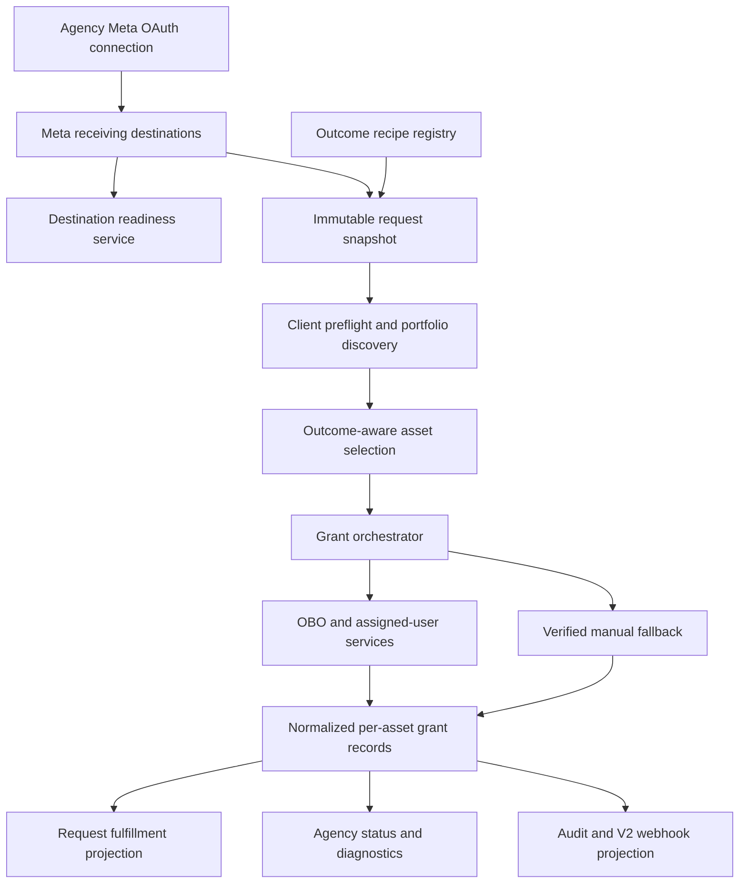
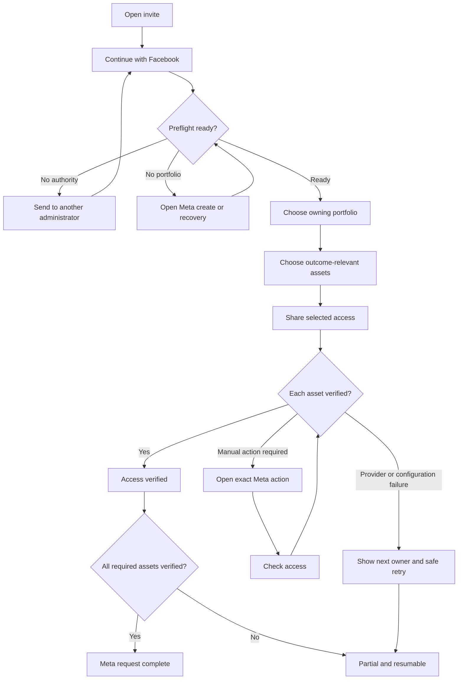
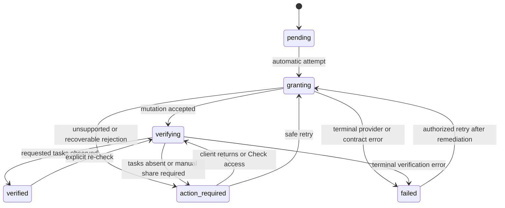

# Outcome-Based Meta Access Experience - Plan

## Goal Capsule

- **Objective:** Let an agency request the minimum Meta access needed for a concrete job, guide the correct client administrator through one resumable flow, and mark onboarding complete only when AuthHub verifies native asset access.
- **Authority hierarchy:** Current user-approved experience decisions; live Meta provider behavior observed during implementation; current code, schema, configuration, and tests; this plan; older sprint and planning documents.
- **Execution profile:** Deep, cross-cutting implementation across shared request contracts, Prisma state, Fastify routes and services, agency setup, client invite UX, request-detail diagnostics, webhooks, and production configuration.
- **Stop conditions:** Stop if Meta's current API cannot support the proposed automatic grant or verification semantics, if a migration would overwrite existing connection or authorization state, or if a launch-blocking provider/app-review requirement cannot be met. Preserve the affected item as `action_required` or hide it rather than claiming success.
- **Tail ownership:** Implementation owns focused and workspace verification, migration review, browser dogfood on desktop and mobile, provider-side sandbox validation, rollout telemetry, and cleanup of abandoned experimental paths. Deployment, production schema/configuration changes, and provider app changes still require explicit approval.

---

## Product Contract

### Summary

Build an outcome-based Meta access journey around three first-release recipes: Run Meta ads, Manage organic social, and View-only audit.
Each recipe creates an immutable least-privilege access snapshot, routes work to a selected agency receiving portfolio, automates only grants AuthHub can verify, and turns provider-required manual work into a focused, resumable verification step.

### Problem Frame

AuthHub already has meaningful Meta foundations: Business Login, client Business Portfolio discovery, OBO relationship and system-user provisioning, verified Page assignment, verified manual Ad Account sharing, audit logs, and secure token references.
The current product surface does not yet compose those foundations into one truthful experience.

Request creation exposes products and a global access level rather than the client outcome.
Agency settings display granular permissions, but the grant route uses hard-coded Page and Ad Account tasks.
Catalog and Dataset settings are visible without end-to-end fulfillment, Instagram is selected but recorded as unresolved, no-portfolio clients reach a dead end, and one stored receiving portfolio is used for every request.
OAuth health, asset selection, native grant state, and request completion are represented in different structures, so a user can see a successful connection without a clear answer to the question that matters: can the agency now do the requested work?

Leadsie's public flow reduces friction through automatic asset relationships, guided creation, and detailed troubleshooting.
AgencyAccess publicly emphasizes native Meta permission dialogs and per-service access levels.
AuthHub's opportunity is to combine that ease with a stronger truth contract: minimum necessary access, automatic where verified, exact manual recovery where required, and per-asset proof before completion.

### Actors

- A1. **Agency administrator:** Connects the agency Meta identity, configures receiving destinations, resolves readiness failures, and controls which recipes can be requested.
- A2. **Agency operator:** Creates an access request, selects a ready receiving destination, sends the link, and follows outstanding client actions.
- A3. **Client Meta administrator:** Authenticates with Meta, selects the owning client portfolio and assets, and completes any native sharing action.
- A4. **Alternate client administrator:** Receives a handed-off request when the original recipient lacks the required portfolio or asset authority, then resumes the same request.
- A5. **AuthHub grant orchestrator:** Derives the approved permission snapshot, performs OBO/native mutations, verifies access, persists state, and computes request fulfillment.
- A6. **Agency support or auditor:** Diagnoses incomplete access from provider-safe evidence without viewing raw tokens.

### Requirements

#### Agency setup and request definition

- R1. An agency administrator can connect Meta once and register one or more receiving Business Portfolios as named destinations, with one default and a readiness result for each destination.
- R2. Readiness checks distinguish connection health from destination readiness and cover portfolio visibility, required admin authority, app/config availability, OBO/system-user capability, required scopes, and the identifiers needed for manual partner sharing.
- R3. An agency operator creates Meta access from one of three outcome recipes: Run Meta ads, Manage organic social, or View-only audit.
- R4. The server derives and stores an immutable, versioned requirement snapshot for the chosen recipe, including destination, required asset kinds, provider tasks, dependencies, and a plain-language permission summary.
- R5. Meta recipes use least privilege by default; a request cannot silently escalate from view or operate permissions to `MANAGE`, maximum Page permissions, or full control.
- R6. Catalog and Dataset request controls remain hidden until their discovery, grant, verification, status, and diagnostics contracts are implemented end to end.

#### Client authorization and recovery

- R7. The client enters through one primary `Continue with Facebook` action and can hand the same resumable request to another Meta administrator before or after a failed preflight.
- R8. Before asset selection, AuthHub checks whether the signed-in Meta user can see a usable Business Portfolio and has enough authority for the selected recipe; failures name the missing condition and the next safe action.
- R9. A client with multiple portfolios chooses the owning portfolio before asset discovery; a client with no usable portfolio receives a guided Meta-native create or recovery path and can retry without restarting the request.
- R10. Asset selection is grouped by the requested outcome and shows dependencies, including Page-to-Instagram relationships, instead of presenting every discoverable asset as an unrelated checkbox.
- R11. AuthHub preselects only safe discovered relationships, supports creation or an exact Meta deep-link for missing first-release assets, and refreshes within the selected portfolio after the client returns.
- R12. Switching Meta administrators within the same client portfolio preserves verified native grants but rotates identity-bound authorization state; switching client portfolios preserves the request, destination, and recipe while retiring the prior portfolio's grants from the active fulfillment projection.

#### Grant, verification, and completion truth

- R13. One `Share selected access` action attempts supported OBO/native grants, verifies each asset, and falls back to a focused provider-native manual action only for assets that cannot be granted or verified automatically.
- R14. Manual recovery shows the exact agency receiving portfolio ID, opens the most specific safe Meta surface available, and offers `Check access`; client self-attestation never marks an asset complete.
- R15. Every required asset has a canonical persisted state that maps to one of three client-facing outcomes: Access verified, Action still needed, or Could not be shared.
- R16. Partial completion is valid and resumable; completed assets stay complete while unresolved assets retain their last safe action and can be handed to another administrator.
- R17. Meta product and request completion are derived from verified required assets, not OAuth success, selected assets, a manual `done` action, or an unverified grant response.
- R18. Instagram readiness is relationship-aware: the flow verifies the linked professional Instagram account and the Page access required by the recipe, and does not claim a direct Instagram grant when Meta exposes no supported verifiable mutation.

#### Agency visibility, integration, and operations

- R19. The agency request detail shows the receiving portfolio, client portfolio, recipe, asset, requested versus verified permissions, grant method, last verification time, and actionable failure reason separately from OAuth health.
- R20. Audit logs cover token reads, OBO relationship and system-user actions, grant attempts, manual-share checks, identity or portfolio switches, and verified outcomes without storing raw provider tokens.
- R21. V2 webhooks expose the recipe and normalized per-asset fulfillment state while preserving backward compatibility for existing consumers of `grantedAssets`.
- R22. The same validated request, readiness, and status contracts serve the agency UI and authenticated APIs; no outcome or grant truth exists only in React state.
- R23. Production configuration fails readiness visibly when Meta Business Login identifiers, redirect surfaces, scopes, or provider app capabilities are missing.
- R24. The client flow is keyboard operable, responsive on mobile, and resilient to popup blocking, OAuth cancellation, expired tokens, transient Graph errors, duplicate submission, and return from an external Meta tab.

### Key Flows

- F1. **Configure receiving destinations**
  - **Trigger:** A1 opens Meta Manage Assets after connecting or reauthenticating Meta.
  - **Actors:** A1, A5.
  - **Steps:** AuthHub discovers portfolios visible to the agency identity, A1 registers one or more destinations, chooses a default, and runs readiness checks. Each destination becomes Ready, Action needed, or Unavailable without changing the health of unrelated destinations.
  - **Outcome:** A2 can choose only a ready destination for a new request.
  - **Covered by:** R1, R2, R19, R23.
- F2. **Create an outcome-based request**
  - **Trigger:** A2 creates or edits an access request containing Meta.
  - **Actors:** A2, A5.
  - **Steps:** A2 chooses a recipe and ready destination, reviews the derived assets and plain-language permissions, and creates the request. The API snapshots the recipe version and requirement contract.
  - **Outcome:** The invite has stable requirements even if agency defaults change later.
  - **Covered by:** R3-R6, R22.
- F3. **Complete the automatic happy path**
  - **Trigger:** A3 opens the invite and continues with Facebook.
  - **Actors:** A3, A5.
  - **Steps:** AuthHub preflights authority, A3 chooses the owning portfolio and outcome-relevant assets, and A5 executes and verifies supported grants. Relationship-derived Instagram readiness is verified with its Page dependency.
  - **Outcome:** Every required asset is Access verified and the Meta portion of the request completes.
  - **Covered by:** R7-R13, R15, R17, R18, R24.
- F4. **Recover through a verified manual action**
  - **Trigger:** An automatic mutation is unsupported, rejected, or cannot be verified.
  - **Actors:** A3, A5.
  - **Steps:** AuthHub preserves completed assets, gives one focused Meta action with destination ID and deep-link, then checks observed native access when A3 returns or selects Check access.
  - **Outcome:** The asset becomes verified, remains action-required with a specific reason, or becomes failed without a false completion.
  - **Covered by:** R13-R17, R24.
- F5. **Hand off and resume**
  - **Trigger:** A3 cannot see the required portfolio or lacks authority.
  - **Actors:** A3, A4, A5.
  - **Steps:** A3 shares the same request with A4. A4 authenticates for the same client portfolio, AuthHub rotates the identity-bound authorization while preserving verified native grants and request requirements, and the flow resumes at the first incomplete action.
  - **Outcome:** Administrative handoff does not duplicate the request or erase valid work.
  - **Covered by:** R7, R8, R12, R16, R20, R24.
- F6. **Diagnose agency-side fulfillment**
  - **Trigger:** A2 or A6 opens a partial or failed request.
  - **Actors:** A2, A6, A5.
  - **Steps:** The detail view separates OAuth health, destination readiness, client authority, native asset truth, and last provider-safe failure; an authorized user retries verification or copies the remaining action.
  - **Outcome:** Support can identify who must act next without inspecting secrets or telling the client to repeat successful work.
  - **Covered by:** R19-R23.

### Acceptance Examples

- AE1. Given two ready agency destinations, when A2 creates a Run Meta ads request for Destination B, then every grant and manual instruction targets Destination B even though Destination A is the agency default.
- AE2. Given a View-only audit request, when the grant snapshot is inspected, then it requests only analyzable or insights-level tasks and never includes `MANAGE`, content creation, moderation, advertising, billing, or user-management capabilities.
- AE3. Given agency settings created before this feature, when a new Meta request is created, then the server produces a supported recipe snapshot rather than copying ambiguous legacy permission settings into the grant.
- AE4. Given the signed-in client user can see no Business Portfolio, when preflight completes, then AuthHub shows the Meta-native create/recovery path and a retry action without showing an empty asset selector or marking OAuth complete as access complete.
- AE5. Given a Run Meta ads request with one Page and two Ad Accounts, when the Page and one Ad Account verify but the second requires partner sharing, then the request is partial, the verified assets remain locked as complete, and only the second Ad Account shows Action still needed.
- AE6. Given an automatic Ad Account assignment returns success but the assigned-user read does not contain the requested tasks, when verification finishes, then the asset is not complete and the user receives the verified manual fallback.
- AE7. Given an Instagram professional account linked to a selected Page, when the recipe's Page tasks verify and the Page-to-Instagram relationship is observed, then Instagram readiness is reported with the relationship evidence; no unsupported direct Instagram grant is claimed.
- AE8. Given the original client contact lacks portfolio authority, when they hand the request to another administrator, then the second administrator resumes the same request and any grants already verified remain complete.
- AE9. Given a request was created with recipe version 1 and recipe defaults later change to version 2, when the client resumes, then AuthHub fulfills the stored version 1 snapshot unless an agency operator explicitly replaces the request requirements.
- AE10. Given Meta returns a transient Graph error or rate limit during a grant, when the client retries, then duplicate submission does not create conflicting grant records and the latest verified provider state wins.
- AE11. Given the agency Meta token is expired but an asset was previously verified natively, when A2 opens request detail, then OAuth health is shown as degraded without rewriting the asset's last verified state to complete or revoked.
- AE12. Given an existing webhook consumer that reads the legacy granted-assets fields, when normalized Meta grant records begin emitting, then the existing fields remain compatible and V2 consumers additionally receive recipe, destination, method, requested tasks, status, and verification timestamp.
- AE13. Given Meta Login configuration is missing in a production-like environment, when A1 runs destination readiness or A3 opens the flow, then AuthHub reports configuration action needed and does not offer a broken login button.
- AE14. Given the client returns from an external Meta tab on a narrow mobile viewport, when they select Check access, then focus returns to the outstanding asset and the verified result is announced without requiring a page restart.
- AE15. Given the client switches to a different owning portfolio, when discovery resumes, then grants from the previous portfolio remain historical but do not satisfy the active request until the newly selected portfolio's required assets verify.

### Success Criteria

- Every Meta request created on the outcome-based path has a recipe version, destination, and derived requirement snapshot; broad enablement disables creation of new legacy Meta requests.
- No first-release path marks Meta complete without verified required asset state.
- View-only requests never include manage, advertise, or content-mutation tasks.
- Automatic grant failures converge on one verified manual action rather than a generic support message.
- Agency users can distinguish token health, destination readiness, client authority, and per-asset access truth in one request detail surface.
- Existing Meta requests and webhook consumers remain readable through the compatibility adapter during rollout.

### Scope Boundaries

#### In Scope

- Three fixed Meta outcome recipes and their least-privilege permission mappings.
- Multiple receiving portfolios visible through the agency's connected Meta identity, with readiness and per-request selection.
- Business Portfolio preflight, selection, guided no-portfolio recovery, Page/Ad Account selection, and Page-linked Instagram readiness.
- Verified automatic Page and Ad Account attempts with per-asset manual fallback where Meta requires it.
- Per-asset canonical grant state, partial completion, handoff/resume, agency diagnostics, audit events, and V2 webhook additions.
- Deprecation or repurposing of Meta settings that imply unsupported or unenforced permissions.

#### Deferred to Follow-Up Work

- Custom recipe authoring and arbitrary per-request provider-task editing.
- Product Catalog and Dataset/Pixel discovery, grant, and verification; their current settings and marketing claims must be hidden or corrected until this is complete.
- Programmatic Business Portfolio creation; the first release uses a guided native Meta creation/recovery path.
- Scheduled re-verification, revocation drift alerts, and automated client offboarding beyond recording current verification timestamps.
- Multiple unrelated agency Meta login identities; first release supports multiple destinations discoverable through one agency Meta connection.

#### Outside This Plan

- Redesigning non-Meta platform recipes or normalizing every platform's access model in the same change.
- Replacing Clerk, Infisical, Prisma, Fastify, Next.js, Render, or Meta Business Login.
- Treating client OAuth tokens as the durable agency access outcome.
- Shipping Catalog, Dataset, or Instagram direct-grant claims without provider-verifiable semantics.

---

## Planning Contract

### Key Technical Decisions

- KTD1. **Outcome recipe snapshots are the request authority.** Persist a server-derived, versioned Meta requirement snapshot in an additive `AccessRequest.metaAccessConfig` JSON field and reject client-supplied raw provider tasks. (session-settled: user-approved — chosen over raw product and access-level controls: users should ask for a business outcome and see the minimum access it requires.)
- KTD2. **Permission mapping is centralized and fail-closed.** One shared server-consumed policy maps recipe plus access intent to required asset kinds and Meta tasks; agency settings become capability/readiness controls rather than a second silent permission source. (session-settled: user-approved — chosen over display-only permission configuration: the permissions shown to users must be the permissions granted and verified.)
- KTD3. **Automatic-first means verified-first.** Attempt OBO/native Page and Ad Account assignment where current provider capability supports it, immediately verify assigned users and tasks, and route only unverified assets to the manual partner-sharing path. (session-settled: user-approved — chosen over always-manual sharing or trusting mutation success: this minimizes client work without weakening access truth.)
- KTD4. **Native asset state is distinct from OAuth health.** OAuth establishes temporary authority to discover and act; normalized grant records establish whether the agency can perform the requested job. Request completion reads the latter only. (session-settled: user-approved — chosen over treating a successful login as fulfillment: agencies need durable native access, not just a token.)
- KTD5. **Receiving portfolios are first-class destinations under one connection.** Keep `AgencyPlatformConnection` as the agency Meta login/token boundary and add destination records keyed by agency connection plus Meta Business Portfolio ID, including default and readiness state. (session-settled: user-approved — chosen over one fixed receiving portfolio: agencies may route different clients to different portfolios without duplicating token state.)
- KTD6. **Per-asset grant state is normalized with a compatibility projection.** Add a relational Meta grant record for queryable lifecycle and idempotency, then project verified results into existing `PlatformAuthorization.metadata.meta` and `ClientConnection.grantedAssets` shapes until all readers migrate. This is preferred to adding more nested JSON transitions that cannot be constrained or queried reliably.
- KTD7. **Instagram is verified through supported relationships.** Treat Page-linked Instagram as a dependency/evidence relationship and do not call a direct Instagram assignment complete unless implementation-time official Meta documentation and sandbox behavior prove a supported mutation and read-back. (session-settled: user-approved — chosen over exposing Instagram as an independently grantable checkbox: the experience must reflect how Meta assets are actually connected.)
- KTD8. **Catalog and Dataset controls are hidden until truthful.** Remove them from requestable and agency-configurable first-release surfaces while retaining internal type compatibility for future work. (session-settled: user-approved — chosen over exposing partial placeholders: unsupported assets should not enter a flow that promises verified access.)
- KTD9. **Handoff reuses the request and preserves only still-valid verified work.** The bearer invite remains the continuity anchor. A new Meta identity for the same client portfolio rotates the authorization and preserves verified native grants; a new client portfolio retires the prior portfolio's grants from active fulfillment. (session-settled: user-approved — chosen over asking the agency to create and send a new request: authority gaps should not erase completed work or let stale work satisfy a different portfolio.)
- KTD10. **Recipe definitions stay server-versioned, not database-authored.** Ship the first three recipes as reviewed code and schema constants with explicit versions. Database-authored custom recipes are deferred until validation, change control, and migration semantics are designed.
- KTD11. **Provider errors are classified for the next actor.** Normalize Meta responses into retryable system errors, client-admin action, agency-admin action, unsupported capability, and terminal failure while preserving provider codes only in safe diagnostic metadata.
- KTD12. **API and UI share the same orchestration contract.** Request creation, destination readiness, preflight, asset selection, grant execution, verification, and status reads are route/service capabilities; React components render those states and do not own fulfillment truth.

### High-Level Technical Design

The diagrams are directional contracts, not implementation specifications.

#### Component and state ownership

#### Client journey and recovery branches

#### Canonical per-asset lifecycle

### Data and Compatibility Design

- Add `MetaAgencyDestination` in `apps/api/prisma/schema.prisma` with agency and connection ownership, `businessId`, display name, default selection, readiness status, readiness details, and verification timestamps. Enforce uniqueness by agency plus Meta Business Portfolio ID and enforce one default per agency with a partial unique database index plus transactional service logic.
- Add `MetaAssetGrant` in `apps/api/prisma/schema.prisma` with request, client connection, platform authorization, destination, client portfolio, recipe/version, asset identity, requested tasks, method, lifecycle status, attempt/version data, provider-safe failure metadata, and grant/verification timestamps. Use a unique idempotency key across request, destination, client portfolio, asset kind, and asset ID.
- Keep `AgencyPlatformConnection` unique by agency and platform in the first release. Existing selected-business metadata becomes a legacy/default hint and is migrated into a destination on first successful destination refresh or explicit save.
- Add nullable `AccessRequest.metaAccessConfig` JSON for the validated recipe snapshot and destination reference. Keep `AccessRequest.platforms` unchanged so the current flat/hierarchical normalization and non-Meta consumers remain compatible.
- Continue projecting compatible selected assets and verified state into `ClientConnection.grantedAssets` and `PlatformAuthorization.metadata.meta`. New status readers prefer normalized grant records and fall back to legacy metadata for pre-migration requests.
- Filter the active fulfillment projection by the request's current client portfolio. Prior-portfolio grant records remain auditable history but cannot satisfy the current snapshot.
- Store no OAuth or system-user token in the new models. Infisical remains the token store; database records keep secret references and non-sensitive verification evidence only.

### Permission Policy Design

- The policy registry in `packages/shared/src/types.ts` defines stable recipe IDs, display copy, version, required/optional asset relationships, and abstract capabilities. The API maps those capabilities to current Meta tasks in one service and tests every recipe for prohibited escalation.
- `meta_run_ads` requires an Ad Account and the Page/Instagram relationships selected for advertising. Its standard snapshot requests advertise and analyze capabilities; manage-level tasks require a separate future recipe or explicit reviewed variant rather than a global access-level side effect.
- `meta_organic_social` requires a Page and optionally its linked professional Instagram account. It requests only the Page capabilities needed for publishing, moderation, messages, and insights that the chosen recipe copy discloses.
- `meta_view_only_audit` discovers relevant Ad Accounts, Pages, and linked Instagram accounts but requests only analyzable or insights capabilities. It never mutates content, campaigns, billing, users, or asset ownership.
- Implementation must reconcile abstract capability names with the current official Meta assigned-user task enums and sandbox read-back before enabling a recipe. Unknown or removed task mappings fail destination readiness and cannot be sent to Graph.

### System-Wide Impact

- **Authentication and authorization:** Agency destination management remains Clerk-authenticated and agency-scoped. Client invite routes remain token-scoped. Every destination, request, connection, authorization, and grant lookup must prove the same agency/request ownership before reading a secret reference or performing a provider mutation.
- **Token lifecycle:** Client OAuth and client-system-user tokens continue through Infisical. An identity switch finalizes and verifies the replacement secret reference before retiring the prior reference, then deletes or revokes the superseded Infisical secret through the existing audited secret lifecycle. A failed replacement leaves the prior authorization intact and cannot make one request reference another request's authorization.
- **Request state:** Access request completion logic, client detail status, request detail status, and webhook event construction must consume the same fulfillment projection so UI and integrations cannot disagree.
- **Data lifecycle:** Legacy metadata remains readable; new grant attempts become idempotent relational records. Retry updates one logical grant rather than appending contradictory JSON entries.
- **External API behavior:** Meta Graph version, task enums, rate limits, business verification, app review, and Business Login configuration are runtime dependencies. Readiness must expose drift before a client reaches a broken step.
- **Agent and API parity:** Authenticated API callers can select recipe/destination and read the same readiness and fulfillment state as the UI. Human-only provider consent and native Meta actions remain explicit approval boundaries.
- **Support and privacy:** Diagnostics can expose asset IDs, portfolio IDs, requested tasks, timestamps, safe error codes, and next actor. They must not expose access tokens, signed requests, Infisical payloads, or raw provider responses containing sensitive data.

### Sequencing and Release Strategy

1. Land shared recipe policy and additive schema before changing request creation or client behavior.
2. Backfill destination records lazily from existing selected-business metadata and keep all legacy readers active.
3. Enable outcome-based request creation behind a server-controlled rollout gate for internal agencies while legacy requests keep their original path.
4. Move the client flow to the new grant orchestrator only for requests carrying a recipe snapshot; do not infer new requirements for existing requests.
5. Enable agency status projection, webhooks, and support diagnostics after normalized grant records are stable.
6. Remove or hide legacy Meta permission, Catalog, and Dataset controls only after the new recipe and destination surfaces are available.
7. Promote broadly only after Meta sandbox/browser verification proves automatic, manual fallback, identity handoff, partial completion, and provider-configuration failure states.
8. Use explicit `META_OUTCOME_ACCESS_ENABLED` and `META_OUTCOME_ACCESS_AGENCY_IDS` configuration for the controlled rollout; do not infer rollout eligibility from the presence of new data.

### Risks and Dependencies

- **Meta API and task drift:** Assigned-user task enums and OBO eligibility can change. Mitigate with a versioned capability mapper, readiness checks, provider-safe failure classes, and implementation-time confirmation against current official docs and sandbox responses.
- **Provider app-review dependency:** Business Login, OBO, or management mutations may require app review or provider business verification not present in local configuration. Treat missing capability as a rollout blocker, not a UI bug.
- **Schema migration and dirty worktree:** The repository is behind `origin/main` and contains broad unrelated local edits. Implementation must isolate touched files, inspect overlap before editing, and avoid folding unrelated work into the feature.
- **Legacy request ambiguity:** Existing requests may have products and access levels that do not map safely to a new recipe. Keep them on the legacy path or require explicit agency conversion; never guess a higher permission set.
- **Multiple destination routing:** A default portfolio can change after request creation. Persist destination identity in the request snapshot and grant record so historical and resumed requests do not retarget.
- **Duplicate and concurrent retries:** Popup return, double click, separate admins, and webhook retries can race. Use idempotency keys, transactionally checked state transitions, and provider read-back as the final authority.
- **Instagram semantics:** Discovery can expose accounts that are not linked or not professional. Relationship verification and clear unsupported states prevent the UI from promising direct grant behavior.
- **Status projection drift:** New relational state, legacy metadata, request status, and webhooks can diverge during migration. Centralize projection and add contract tests that compare every surface for the same fixture.
- **Manual deep-link instability:** Meta Business settings URLs can change. Keep destination ID copy and navigation instructions usable when a deep-link falls back to a stable Meta Business settings entry point.

### Sources and Research

- Current workspace authority and security invariants: `docs/workspace/context.md`, `docs/workspace/source-map.md`, `docs/workspace/workflow.md`, and `docs/workspace/review.md`.
- Existing OBO decisions and implementation history: `docs/sprints/2026-03-11-meta-obo-client-access.md`.
- Existing partner-sharing notes and provider references: `docs/meta-business-portfolio-partner-sharing.md`.
- Prior portfolio refresh plan: `docs/plans/2026-03-11-meta-business-portfolio-modal-fix.md`.
- Current Meta grant and verification paths: `apps/api/src/routes/client-auth/assets.routes.ts`, `apps/api/src/services/meta-obo.service.ts`, `apps/api/src/services/meta-partner.service.ts`, and `apps/api/src/services/meta-system-user.service.ts`.
- Current agency setup and client UX: `apps/web/src/components/meta-unified-settings.tsx`, `apps/web/src/components/client-auth/PlatformAuthWizard.tsx`, `apps/web/src/components/client-auth/MetaAssetSelector.tsx`, `apps/web/src/components/client-auth/AutomaticPagesGrant.tsx`, and `apps/web/src/components/client-auth/AdAccountSharingInstructions.tsx`.
- Leadsie capability and troubleshooting references: https://help.leadsie.com/article/20-what-can-i-get-access-to-with-leadsie, https://help.leadsie.com/article/64-how-to-create-facebook-meta-assets, and https://help.leadsie.com/article/34-overview-of-connection-errors.
- AgencyAccess Meta and connected-account references: https://www.agencyaccess.co/integrations/meta and https://www.agencyaccess.co/docs/managing-connected-accounts.
- Meta OBO and asset-management references already used by the implementation: https://developers.facebook.com/docs/business-management-apis/business-manager/guides/on-behalf-of and https://developers.facebook.com/docs/business-management-apis/business-asset-management/guides/assets.
- Meta assigned-user references already used by the implementation: https://developers.facebook.com/docs/marketing-api/reference/ad-account/assigned_users and https://developers.facebook.com/docs/graph-api/reference/page/assigned_users.
- Live official Meta documentation fetch was throttled during planning. Implementation must re-check the cited provider contracts and current Graph version before enabling mutations; the existing code and prior sprint are evidence of current intent, not proof of current provider behavior.

---

## Implementation Units

### U1. Define the Meta Recipe and Fulfillment Contracts

- **Goal:** Establish one versioned, validated source of truth for outcome recipes, permission capabilities, destination references, and per-asset lifecycle states.
- **Requirements:** R3-R6, R15, R17, R18, R22.
- **Dependencies:** None.
- **Files:**
  - `packages/shared/src/types.ts`
  - `packages/shared/src/__tests__/types.test.ts`
  - `packages/shared/src/__tests__/platform-hierarchy.supported-products.test.ts`
  - `apps/api/src/services/meta-access-policy.service.ts` (new)
  - `apps/api/src/services/__tests__/meta-access-policy.service.test.ts` (new)
- **Approach:** Add stable recipe IDs and versions, requirement-snapshot schemas, abstract capability mappings, destination references, and canonical grant states. The API policy service resolves abstract capabilities to an allowlisted current Meta task set. Callers can name a supported recipe and destination but cannot supply raw tasks.
- **Patterns to follow:** Existing Zod runtime schemas and `PLATFORM_HIERARCHY` in `packages/shared/src/types.ts`; access-level mapping tests in `apps/api/src/services/google-native-access.service.ts`; provider task tests in `apps/api/src/services/__tests__/meta-partner.service.test.ts`.
- **Test scenarios:**
  1. Each of the three supported recipe IDs parses and produces a stable versioned snapshot with required asset relationships and plain-language summary.
  2. View-only audit contains no mutating abstract capability and rejects any derived task set containing manage, advertise, content, moderation, billing, or user-management tasks.
  3. Every abstract capability resolves to an allowlisted current Meta task; unknown capability or task mappings fail closed.
  4. Client-supplied provider tasks, recipe versions, or unsupported recipe IDs fail schema or policy validation.
  5. The same recipe version and inputs produce a deterministic snapshot suitable for persistence and webhook comparison.
  6. Catalog and Dataset are absent from the supported first-release recipe registry.
- **Verification:** Shared and policy-service tests prove deterministic recipe derivation, least-privilege invariants, and fail-closed provider task mapping.

### U2. Persist Receiving Destinations and Canonical Asset Grants

- **Goal:** Make multiple agency receiving portfolios and per-asset grant truth queryable, idempotent, and compatible with existing metadata.
- **Requirements:** R1, R2, R12, R15-R17, R19-R22.
- **Dependencies:** U1.
- **Files:**
  - `apps/api/prisma/schema.prisma`
  - `apps/api/prisma/migrations/` (new additive migration for Meta destinations, request configuration, and asset grants)
  - `apps/api/src/services/meta-assets.service.ts`
  - `apps/api/src/services/meta-access-status.service.ts` (new)
  - `apps/api/src/services/__tests__/meta-assets.service.test.ts`
  - `apps/api/src/services/__tests__/meta-access-status.service.test.ts` (new)
  - `apps/api/src/services/__tests__/schema-integration.test.ts`
- **Approach:** Add `AccessRequest.metaAccessConfig` plus the destination and grant models described in the Data and Compatibility Design. The migration includes a partial unique index for one default destination per agency. Implement transactional default changes, agency/request ownership checks, idempotent grant upserts, allowed state transitions, and a projection service that reads normalized rows first and legacy metadata second. Lazily seed a destination from existing selected-business metadata without deleting or rewriting the legacy field.
- **Patterns to follow:** Existing agency-scoped Prisma relations and uniqueness in `apps/api/prisma/schema.prisma`; metadata parsing through `MetaClientAuthorizationMetadataSchema`; native grant lifecycle patterns in `apps/api/src/services/google-native-access.service.ts`.
- **Test scenarios:**
  1. One agency connection can own multiple distinct destination portfolios and only one is returned as default.
  2. Another agency cannot list, mutate, select, or reference a destination by ID.
  3. Concurrent attempts to make two destinations default leave exactly one default after the transaction.
  4. The same request, destination, portfolio, asset kind, and asset ID updates one logical grant across retries.
  5. An illegal transition from verified directly to pending is rejected unless an explicit re-check creates a new attempt/version.
  6. A pre-feature authorization with only `metadata.meta.obo.assetGrantResults` renders the same status through the compatibility projection.
  7. Deleting or revoking an agency connection cannot strand cross-agency destination or grant references; referential behavior matches the approved retention policy.
- **Verification:** Prisma validation, migration review, schema integration, and service tests prove additive migration, ownership, idempotency, and legacy read compatibility.

### U3. Build Agency Destination Readiness and Setup UX

- **Goal:** Let an agency register multiple receiving portfolios and know whether each can receive the requested access before sending a client invite.
- **Requirements:** R1, R2, R19, R23.
- **Dependencies:** U1, U2.
- **Files:**
  - `apps/api/src/routes/agency-platforms/assets.routes.ts`
  - `apps/api/src/routes/__tests__/meta-assets.routes.test.ts`
  - `apps/api/src/services/meta-assets.service.ts`
  - `apps/api/src/services/meta-readiness.service.ts` (new)
  - `apps/api/src/services/__tests__/meta-readiness.service.test.ts` (new)
  - `apps/api/src/services/connectors/meta.ts`
  - `apps/api/src/services/connectors/__tests__/meta.connector.test.ts`
  - `apps/web/src/components/meta-unified-settings.tsx`
  - `apps/web/src/components/meta-business-portfolio-selector.tsx`
  - `apps/web/src/components/__tests__/meta-unified-settings.test.tsx`
  - `apps/web/src/components/__tests__/meta-business-portfolio-selector.test.tsx`
- **Approach:** Replace the single stored-portfolio control with a destination list, default selector, and on-demand readiness action. Readiness reports separate checks for OAuth, portfolio visibility, business/admin authority, app/config/scopes, OBO/system-user capability, and manual partner ID availability. Preserve cached portfolios on transient refresh failure. Repurpose enabled-asset settings as recipe availability/readiness hints and hide Catalog/Dataset controls.
- **Patterns to follow:** Cached-then-refresh behavior from `docs/plans/2026-03-11-meta-business-portfolio-modal-fix.md`; agency ownership hooks in `apps/api/src/routes/agency-platforms`; semantic status panels in `apps/web/src/components/meta-unified-settings.tsx`.
- **Test scenarios:**
  1. A connected agency registers two visible portfolios, selects either as default, and sees independent readiness results.
  2. A cached destination remains selectable with a refresh warning when Meta discovery fails transiently.
  3. Missing Business Login config or required scopes produces Action needed and blocks new recipe requests for that destination.
  4. A portfolio no longer visible to the connected identity becomes Unavailable without deleting historical requests or grants.
  5. A readiness retry updates timestamps and check results without creating a duplicate destination.
  6. Catalog and Dataset cannot be enabled or advertised from the updated settings UI.
  7. Keyboard and screen-reader users can add, set default, refresh, and inspect a destination's failures.
- **Verification:** Focused API/web tests plus a browser pass prove multi-destination setup, cached failure behavior, readiness gating, and accessible controls.

### U4. Replace Raw Meta Selection with Outcome-Based Request Creation

- **Goal:** Make agencies request a concrete job, choose a ready destination, and review the actual minimum permissions before sending the invite.
- **Requirements:** R3-R6, R22.
- **Dependencies:** U1, U3.
- **Files:**
  - `apps/web/src/components/client-detail/CreateRequestModal.tsx`
  - `apps/web/src/components/client-detail/__tests__/CreateRequestModal.test.tsx` (new or existing nearest request-modal suite)
  - `apps/web/src/app/(authenticated)/access-requests/new/page.tsx`
  - `apps/web/src/app/(authenticated)/access-requests/new/__tests__/page.test.tsx`
  - `apps/web/src/app/(authenticated)/access-requests/[id]/edit/page.tsx`
  - `apps/web/src/lib/api/access-requests.ts`
  - `apps/web/src/contexts/access-request-context.tsx`
  - `apps/web/src/contexts/__tests__/access-request-context.test.tsx`
  - `apps/api/src/routes/access-requests.ts`
  - `apps/api/src/routes/__tests__/access-requests.routes.test.ts`
  - `apps/api/src/services/access-request.service.ts`
  - `apps/api/src/services/__tests__/access-request.service.test.ts`
- **Approach:** When Meta is selected, replace its raw product checklist and global-access inheritance with recipe cards, a ready-destination picker, and a server-backed permission summary. The create/update route accepts only recipe ID plus destination, calls the policy service, and writes `metaAccessConfig` alongside the unchanged normalized platform array. Preserve existing selection behavior for other platform groups. Editing a legacy Meta request leaves it legacy unless the operator explicitly chooses a recipe and confirms replacement of requirements.
- **Patterns to follow:** Current hierarchical group selection and API payload construction; Google Ads account destination selection in `CreateRequestModal.tsx`; existing access-request context validation.
- **Test scenarios:**
  1. Selecting Run Meta ads requires a ready destination and renders the server-derived required asset and permission summary before submit.
  2. Selecting View-only audit never displays or submits a generic Admin or Manage access level for Meta.
  3. A destination that becomes unready between page load and submit is rejected by the API and the UI refreshes readiness without losing the draft.
  4. A mixed-platform request sends the Meta recipe snapshot inputs and preserves existing access-level inputs for non-Meta products.
  5. Editing a legacy request does not infer a recipe; explicit conversion previews which requirements will change.
  6. Catalog and Dataset do not appear as requestable Meta outcomes or assets.
  7. Client-supplied raw tasks or snapshot fields cannot bypass server derivation during create or edit.
- **Verification:** Request-page, modal, context, route, and service tests show that every new Meta request is outcome-based, destination-bound, and stored separately from the legacy platform array.

### U5. Add Client Preflight, Portfolio Recovery, and Administrator Handoff

- **Goal:** Detect authority problems before asset selection and let the correct administrator resume the same request without erasing verified work.
- **Requirements:** R7-R12, R16, R24.
- **Dependencies:** U1, U2, U4.
- **Files:**
  - `apps/api/src/routes/client-auth/assets.routes.ts`
  - `apps/api/src/routes/client-auth/schemas.ts`
  - `apps/api/src/routes/client-auth/__tests__/assets.meta.test.ts`
  - `apps/api/src/services/client-assets.service.ts`
  - `apps/api/src/services/__tests__/client-assets.service.test.ts`
  - `apps/web/src/components/client-auth/PlatformAuthWizard.tsx`
  - `apps/web/src/components/client-auth/MetaAssetSelector.tsx`
  - `apps/web/src/components/client-auth/MetaAssetCreator.tsx`
  - `apps/web/src/components/client-auth/__tests__/PlatformAuthWizard.test.tsx`
  - `apps/web/src/components/client-auth/__tests__/MetaAssetSelector.test.tsx`
  - `apps/web/src/components/client-auth/__tests__/MetaAssetSelector.interaction.test.tsx`
- **Approach:** Add a preflight response before selectable assets that classifies no portfolio, insufficient authority, missing recipe assets, configuration failure, and ready state. Persist identity and selected-portfolio fingerprints in non-sensitive metadata. An identity switch within the same portfolio safely rotates the Infisical secret reference, invalidates identity-bound discovery and pending attempts, and preserves verified native grants. A portfolio switch retires the prior portfolio's grants from active fulfillment. Add copy/share handoff and `Use a different Meta administrator`; use a stable Meta Business creation/settings deep-link with retry instead of building programmatic portfolio creation.
- **Patterns to follow:** Popup-to-redirect fallback in `PlatformAuthWizard.tsx`; business-scoped discovery in `client-assets.service.ts`; selection persistence in `MetaClientAuthorizationMetadataSchema`; existing asset creator and guided redirect components.
- **Test scenarios:**
  1. A user with multiple portfolios must choose one before discovery and sees only assets from that portfolio.
  2. A user with no portfolio sees create/recovery, returns, retries, and reaches selection without a new request.
  3. A user who can view a portfolio but lacks the recipe's required authority sees the exact missing condition and Send to another administrator.
  4. A second administrator opens the same invite and resumes at preflight or the first incomplete asset.
  5. Switching identity within the same portfolio clears stale discovery and pending attempts, preserves verified native grants, and retires the superseded Infisical secret only after replacement finalization succeeds.
  6. Switching client portfolios preserves historical grant records but starts a new active fulfillment projection that cannot count the prior portfolio's verified assets.
  7. A failed identity replacement leaves the prior authorization usable and creates no orphan or cross-request secret reference.
  8. OAuth cancellation, popup blocking, expired token, and a transient Graph error each produce a safe retry without duplicate authorization state.
  9. Refresh after external Meta asset creation retains the selected client portfolio and discovers the new asset.
- **Verification:** API and component interaction tests plus desktop/mobile browser dogfood prove preflight branches, recovery, handoff, and safe resume.

### U6. Centralize Least-Privilege Grants and Verified Manual Fallback

- **Goal:** Execute the stored recipe snapshot idempotently, verify every supported grant, and converge failures on one per-asset recovery path.
- **Requirements:** R4-R6, R13-R18, R20, R24.
- **Dependencies:** U1, U2, U5.
- **Files:**
  - `apps/api/src/routes/client-auth/assets.routes.ts`
  - `apps/api/src/routes/client-auth/schemas.ts`
  - `apps/api/src/routes/client-auth/__tests__/assets.meta.test.ts`
  - `apps/api/src/services/meta-access-policy.service.ts`
  - `apps/api/src/services/meta-grant-orchestrator.service.ts` (new)
  - `apps/api/src/services/meta-obo.service.ts`
  - `apps/api/src/services/meta-partner.service.ts`
  - `apps/api/src/services/meta-system-user.service.ts`
  - `apps/api/src/services/__tests__/meta-grant-orchestrator.service.test.ts` (new)
  - `apps/api/src/services/__tests__/meta-obo.service.test.ts`
  - `apps/api/src/services/__tests__/meta-partner.service.test.ts`
  - `apps/api/src/services/__tests__/meta-system-user.service.test.ts`
  - `apps/web/src/components/client-auth/AutomaticPagesGrant.tsx`
  - `apps/web/src/components/client-auth/AdAccountSharingInstructions.tsx`
  - `apps/web/src/components/client-auth/__tests__/AutomaticPagesGrant.test.tsx`
  - `apps/web/src/components/client-auth/__tests__/AdAccountSharingInstructions.test.tsx`
- **Approach:** Move hard-coded task constants and grant branching out of the route into a policy mapper and orchestrator. The orchestrator loads the immutable request snapshot, proves ownership, establishes OBO prerequisites, upserts each grant, attempts automatic assignment, verifies assigned tasks, classifies failures, and prepares manual instructions only where needed. Page-linked Instagram produces relationship evidence rather than an unsupported direct mutation. Manual `Check access` uses the same verification and grant record.
- **Patterns to follow:** Existing OBO state helpers and audited Infisical reads; `grantPageAccess`, `grantAdAccountAccess`, and assigned-user verification in `meta-partner.service.ts`; verified manual Ad Account route behavior in `assets.routes.ts`.
- **Test scenarios:**
  1. Run Meta ads standard grants only the tasks resolved from its stored snapshot and never the current hard-coded manage task set.
  2. View-only audit cannot invoke a mutating Meta endpoint even if a caller alters the request body or agency settings.
  3. A Page grant becomes verified only when all requested tasks are present in assigned-user read-back.
  4. An Ad Account automatic grant that is unsupported or unverified becomes action-required with the correct destination ID and manual verification target.
  5. Check access moves a manual Ad Account to verified only after observed native partner/assigned-user access.
  6. A linked Instagram account reports verified relationship readiness only when its selected Page and required Page tasks verify.
  7. Duplicate automatic, popup-return, and manual-check requests update one grant and do not duplicate OBO relationships, system users, or audit side effects.
  8. A provider rate limit stays retryable, a permissions error names the client or agency actor, and an unknown task mapping fails closed before Graph mutation.
  9. A partial batch preserves verified assets and retries only unresolved or failed eligible assets.
- **Verification:** Focused route/service/component tests prove exact permission mapping, assigned-user read-back, idempotency, partial completion, and manual fallback truth.

### U7. Project Fulfillment into Client Completion, Agency Diagnostics, and Webhooks

- **Goal:** Give clients and agencies one consistent explanation of what is verified, what remains, and who must act next.
- **Requirements:** R15-R22, R24.
- **Dependencies:** U2, U6.
- **Files:**
  - `apps/api/src/services/meta-access-status.service.ts`
  - `apps/api/src/services/client.service.ts`
  - `apps/api/src/services/access-request.service.ts`
  - `apps/api/src/services/webhook-event.service.ts`
  - `apps/api/src/services/__tests__/client.service.test.ts`
  - `apps/api/src/services/__tests__/access-request.service.test.ts`
  - `apps/api/src/services/__tests__/webhook-event.service.test.ts`
  - `apps/web/src/components/client-auth/PlatformAuthWizard.tsx`
  - `apps/web/src/components/client-auth/__tests__/PlatformAuthWizard.test.tsx`
  - `apps/web/src/app/(authenticated)/access-requests/[id]/page.tsx`
  - `apps/web/src/app/(authenticated)/access-requests/[id]/__tests__/page.test.tsx` (new or existing nearest request-detail suite)
  - `apps/web/src/app/(authenticated)/clients/[id]/page.tsx`
  - `apps/web/src/components/client-detail/RequestedAccessBoard.tsx`
- **Approach:** Centralize a fulfillment projection that maps canonical machine states to client labels, request/product status, agency diagnostics, and webhook fields. Keep OAuth health and last native verification separate. Add authorized retry/check actions and copyable remaining-step instructions to request detail. Extend V2 webhook assets with recipe, destination, method, requested/verified permissions, status, and timestamps while preserving legacy fields.
- **Patterns to follow:** Existing grouped status calculation in `client.service.ts`; V2 per-asset normalization in `webhook-event.service.ts`; client wizard partial/manual summaries; Requested Access Board status cards.
- **Test scenarios:**
  1. All required grants verified produces Meta complete and allows the overall request to complete when other platforms are also complete.
  2. Any action-required or retryable grant produces Meta partial and never complete; terminal failure remains visible without erasing verified assets.
  3. OAuth expiry changes token health but not the last verified native asset state or request history.
  4. Client and agency views render the same status labels and next actor from the same grant fixture.
  5. Agency detail shows requested versus verified tasks, method, destination/client portfolios, timestamp, and safe error reason without secret data.
  6. V2 webhooks include normalized Meta state and legacy consumers still receive compatible granted-assets fields.
  7. Repeated status reads and webhook retries are side-effect free and do not change fulfillment.
  8. Status changes emit audit/webhook events once per logical transition.
- **Verification:** Service contract tests and UI tests demonstrate one projection across request state, client completion, agency diagnostics, and webhooks.

### U8. Close Configuration, Documentation, Rollout, and Browser Proof

- **Goal:** Make the new flow launchable only when provider configuration and observed behavior support its truth claims.
- **Requirements:** R6, R20, R23, R24.
- **Dependencies:** U3-U7.
- **Files:**
  - `apps/api/src/lib/env.ts`
  - `apps/api/.env.example`
  - `apps/web/.env.example`
  - `render.yaml`
  - `docs/PRODUCTION_OAUTH_SETUP.md`
  - `docs/PRODUCTION_CHECKLIST.md`
  - `docs/meta-business-portfolio-partner-sharing.md`
  - `apps/web/src/app/(marketing)/guides/meta-ads-access/page.tsx`
  - `apps/api/src/lib/__tests__/env.test.ts` (or current environment validation suite)
  - `apps/web/src/lib/api/__tests__/api-env.test.ts`
- **Approach:** Declare all server/client Meta Business Login configuration, redirect inputs, `META_OUTCOME_ACCESS_ENABLED`, and `META_OUTCOME_ACCESS_AGENCY_IDS`; validate production-critical identifiers without exposing secrets. Correct marketing and support claims to match shipped assets. Add rollout telemetry for preflight outcomes, grant method, verification result, manual fallback, handoff, resume, and provider error class. Run the full focused suite and provider sandbox/browser matrix before broad enablement.
- **Patterns to follow:** Existing env validation and `.env.example` documentation; production checklist conventions; popup/redirect configuration in `meta-business-login.ts`; workspace review standard in `docs/workspace/review.md`.
- **Test scenarios:**
  1. Missing server or public Meta Login configuration fails readiness and displays configuration action needed instead of a broken client login.
  2. Development/test environments can use explicit safe fixtures without weakening production validation.
  3. Marketing and guide pages list only recipes and assets that the end-to-end flow can verify.
  4. Rollout-disabled agencies keep the legacy path and requests already carrying recipe snapshots continue on the new path.
  5. Desktop and mobile browser runs cover automatic success, manual fallback, no portfolio, insufficient authority, admin handoff, partial resume, popup block, OAuth cancel, provider failure, and final agency diagnostics.
  6. Audit inspection confirms token reads and grant side effects are recorded without raw tokens or provider payload leakage.
- **Verification:** Environment tests, focused workspace gates, browser evidence, provider sandbox read-back, and documentation review satisfy the rollout gates before production promotion.

---

## Verification Contract

| Gate | Command or evidence | Applies to | Done signal |
|---|---|---|---|
| Shared recipe contracts | `npm run test --workspace=packages/shared -- --run src/__tests__/types.test.ts src/__tests__/platform-hierarchy.supported-products.test.ts && npm run test --workspace=apps/api -- --run src/services/__tests__/meta-access-policy.service.test.ts` | U1 | Recipes, snapshot schemas, policy mapping, and supported-product exposure pass. |
| API Meta services and routes | `npm run test --workspace=apps/api -- --run src/routes/client-auth/__tests__/assets.meta.test.ts src/routes/__tests__/meta-assets.routes.test.ts src/services/__tests__/meta-assets.service.test.ts src/services/__tests__/meta-access-status.service.test.ts src/services/__tests__/meta-readiness.service.test.ts src/services/__tests__/meta-grant-orchestrator.service.test.ts src/services/__tests__/meta-obo.service.test.ts src/services/__tests__/meta-partner.service.test.ts src/services/__tests__/meta-system-user.service.test.ts` | U2, U3, U5-U7 | Ownership, readiness, exact tasks, idempotency, verification, partial state, and compatibility pass. |
| Access request contracts | `npm run test --workspace=apps/api -- --run src/routes/__tests__/access-requests.routes.test.ts src/services/__tests__/access-request.service.test.ts src/services/__tests__/client.service.test.ts src/services/__tests__/webhook-event.service.test.ts` | U1, U4, U7 | Recipe persistence, completion projection, legacy compatibility, and webhook shape pass. |
| Prisma contract | `npm run db:generate --workspace=apps/api && npm exec --workspace=apps/api -- prisma validate` | U2 | Client generation and schema validation succeed; migration SQL receives manual destructive-change review. |
| Web Meta experience | `npm run test --workspace=apps/web -- --run src/components/__tests__/meta-unified-settings.test.tsx src/components/__tests__/meta-business-portfolio-selector.test.tsx 'src/app/(authenticated)/access-requests/new/__tests__/page.test.tsx' src/components/client-auth/__tests__/PlatformAuthWizard.test.tsx src/components/client-auth/__tests__/MetaAssetSelector.test.tsx src/components/client-auth/__tests__/MetaAssetSelector.interaction.test.tsx src/components/client-auth/__tests__/AutomaticPagesGrant.test.tsx src/components/client-auth/__tests__/AdAccountSharingInstructions.test.tsx` | U3-U7 | Setup, recipe creation, preflight, selection, grant, fallback, handoff, and status UI pass. |
| Workspace type safety | `npm run typecheck --workspace=packages/shared && npm run typecheck --workspace=apps/api && npm run typecheck --workspace=apps/web` | U1-U8 | Touched workspaces typecheck; unrelated pre-existing failures are recorded with evidence and not misreported as feature failures. |
| Lint and build | `npm run lint --workspace=apps/api && npm run lint --workspace=apps/web && npm run build` | U1-U8 | Lint and production builds pass from the verified dependency/runtime baseline. |
| Provider sandbox | Meta test business and assets, current official task references, assigned-user read-back, manual partner share, and linked Instagram relationship | U3, U5, U6, U8 | Each recipe's enabled path matches current provider behavior; unsupported mappings remain gated or action-required. |
| Browser dogfood | Desktop and mobile invite plus agency request detail against the local or approved preview environment | U3-U8 | Evidence covers automatic, manual, partial, handoff, recovery, configuration failure, focus, and responsive states. |
| Security and audit | Cross-agency route tests plus local audit-log inspection | U2, U3, U5-U8 | Ownership fails closed, raw tokens remain in Infisical, and every token read/provider mutation has a safe audit event. |
| Rollout review | Diff inspection, migration review, config checklist, metrics/rollback checklist, and explicit approval before deployment | U8 | No P0/P1 truth or security gap remains; deployment and production mutations are separately approved. |

---

## Definition of Done

### Global Completion

- All R1-R24 requirements and AE1-AE15 examples are implemented. A provider-dependent automatic mutation may remain disabled only when the verified manual fallback still satisfies the affected requirement and acceptance example.
- Every Meta request created on the outcome-based path is bound to a ready destination and immutable supported recipe snapshot; broad enablement prevents creation of new legacy Meta requests.
- The tasks disclosed in request creation, sent to Meta, read back during verification, displayed in diagnostics, and emitted in V2 webhooks agree.
- No OAuth, asset-selection, mutation-response, or self-attested state can mark a required Meta asset complete without verification.
- Multiple receiving destinations, no-portfolio recovery, alternate-admin handoff, partial resume, and focused manual fallback work on desktop and mobile.
- Catalog and Dataset are absent from customer request/settings claims until their full contract ships; Instagram copy describes relationship-backed readiness accurately.
- Legacy requests, connection metadata, granted assets, and webhook consumers remain readable without permission escalation or destructive backfill, and identity replacement leaves no orphaned client token secret.
- Production Meta configuration is explicit and readiness fails visibly when app, scope, redirect, or provider capability prerequisites are missing.
- Focused tests, typechecks, lint, build, Prisma validation, provider sandbox checks, browser dogfood, security checks, and audit inspection satisfy the Verification Contract.
- The final diff contains no unrelated dirty-worktree changes and no abandoned experimental grant paths, duplicate status logic, stale false-success copy, or dead compatibility code beyond the documented rollout window.

### Unit Completion

- U1 is done when the policy service deterministically produces only supported least-privilege recipe snapshots and rejects raw or unknown provider tasks.
- U2 is done when destination and grant state are agency-scoped, idempotent, migration-safe, and legacy-readable.
- U3 is done when agencies can manage multiple destinations and see independent actionable readiness before request creation.
- U4 is done when both request entry points cannot persist a new outcome-based Meta request without a valid server-derived recipe snapshot and ready destination, while mixed-platform and legacy editing behavior remain correct.
- U5 is done when client preflight, portfolio recovery, identity/portfolio switching, handoff, and resume preserve only valid state.
- U6 is done when exact least-privilege tasks drive automatic attempts, assigned-user verification, relationship-backed Instagram readiness, and manual fallback.
- U7 is done when client completion, agency diagnostics, request status, audits, and V2 webhooks agree for the same grant fixture.
- U8 is done when configuration, truthful documentation, rollout controls, sandbox behavior, and browser evidence support broad enablement.
