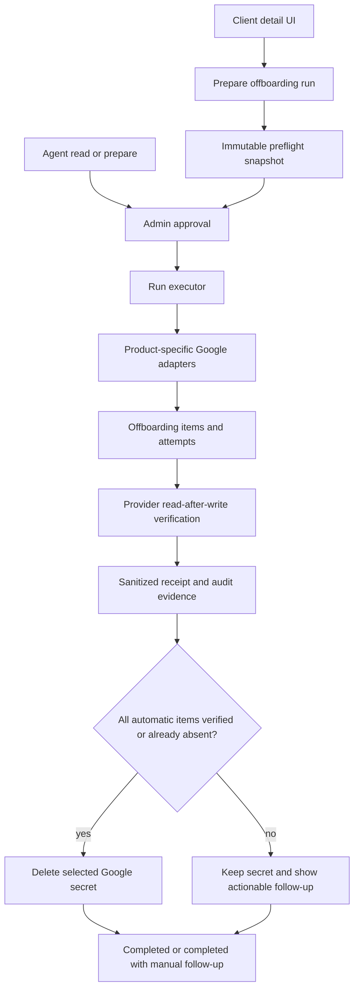
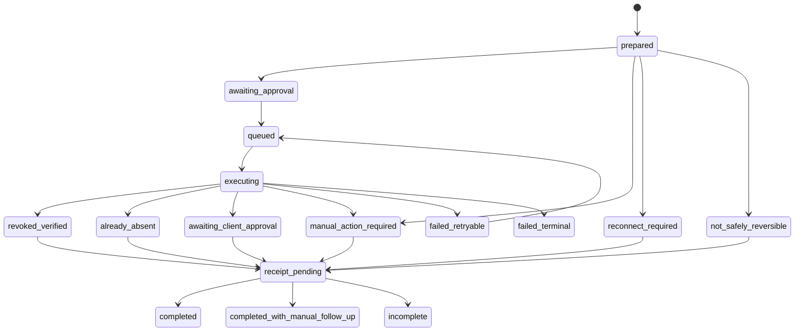
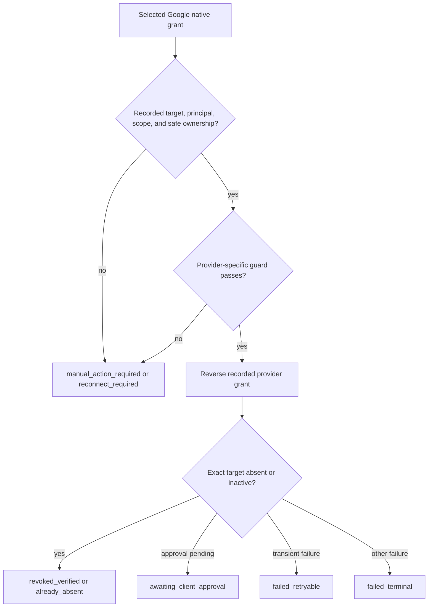

# feat: Add Google client offboarding

## Goal Capsule

- **Objective:** Let an agency admin offboard one selected active Google client connection through a confirmed, per-asset batch that reverses eligible agency access, records a durable receipt, and removes AuthHub's Google secret only after automatic revocations are safe.
- **Authority:** Current user decisions, current code and schema, then current official Google API documentation.
- **Execution profile:** Deep, security-sensitive, external-provider mutation work. Use focused test-first implementation and a feature-gated release.
- **Stop conditions:** Do not claim provider removal from local status or secret deletion. Stop and surface `manual_action_required` when a grant cannot be identified safely, required scope is missing, Search Console needs a human action, or a provider requires a second approver.
- **Tail ownership:** The implementation owner verifies current direct-database migration state and approved live-provider behavior before enabling the feature beyond a design-partner rollout.

---

## Product Contract

### Summary

AuthHub will add one-click Google marketing-asset offboarding for a selected active client connection.
The action is a confirmed batch, not a generic OAuth disconnect.
It reverses only recorded agency grants that a product-specific preflight can identify and authorize safely.
The receipt remains truthful when items need a reconnect, external approval, or manual removal.

### Problem Frame

Agency teams can grant access quickly but lack a reliable way to prove that former-client access was removed across the Google product stack.
Deleting AuthHub credentials only removes the app's access to its token; it does not remove the agency from the client's assets.
Manual, product-by-product removal creates missed-access and audit risk.

### Actors

- A1. Agency admin who prepares, confirms, retries, and reviews a Google offboarding run.
- A2. Delegated AuthHub agent with the dedicated offboarding permission. It may inspect and prepare a run, but cannot perform an external revocation without A1 approval.
- A3. Agency member who can view authorized client details but cannot perform consequential offboarding actions.
- A4. Client-side Google administrator who may need to complete a Google Ads multi-party approval or the Search Console handoff.

### Requirements

#### Run and authorization

- R1. AuthHub must offboard exactly one selected active Google `ClientConnection` per run. It must not silently include historical or separately reconnected client connections.
- R2. An agency admin must see an immutable preflight preview and explicitly confirm the batch before any provider mutation occurs. Confirmation must consume a short-lived, single-use capability bound to the run, selected connection, credential generation, snapshot hash, agency admin, and requested action. The preview must name every selected product/asset, the target agency identity, automatic eligibility, secret-cleanup effect, and each manual handoff.
- R3. The preflight must classify every original grant as `eligible_automatic`, `manual_action_required`, or `not_safely_reversible`. Missing provider identifiers, missing recipient/manager identity, missing required scope, or ambiguous ownership must never trigger a guessed provider mutation.

#### Provider reversal

- R4. AuthHub must reverse supported grants for Google Ads, GA4, Business Profile, Tag Manager, and Merchant Center using product-specific provider adapters, then persist a verified, already-absent, approval-pending, manual, retryable, or terminal result per item.
- R5. Google Ads manager links, direct user access, and pending user invitations must be handled as distinct reversal targets. A Google Ads multi-party approval is not completion.
- R6. Search Console must remain a human-only offboarding item. AuthHub must present the removal handoff and record an agency-admin attestation, but must never report Search Console as API-revoked or allow an agent to attest it.

#### Receipt and cleanup

- R7. AuthHub must preserve a sanitized, durable client offboarding receipt and append audit evidence for preparation, approval, execution, each item outcome, manual attestation, secret cleanup, and final outcome. Sanitization occurs at ingestion: tokens, authorization headers, raw provider payloads/errors, and Infisical secret references must never enter persistence, logs, queues, telemetry, UI, agent output, or audit metadata.
- R8. AuthHub must delete the selected connection's stored Google secret only after every automatic item is verified removed or proven already absent. Search Console manual follow-up does not block cleanup. Any retryable or unresolved automatic failure blocks cleanup and leaves the run visibly incomplete. A credential-generation change invalidates pending cleanup and requires a fresh run/preflight.

#### OAuth and provider readiness

- R9. Existing Google connections that lack required management scopes must be classified as reconnect/manual work before revocation. New or reconnected Google authorizations must request and record the scopes needed for GA4 and GTM user removal.
- R10. Merchant Center support must use Merchant Accounts API v1 and its required developer-registration path. AuthHub must not add new dependency on the legacy Content API user-management path.

#### Agent and operational safety

- R11. AuthHub must expose the same durable run and sanitized receipt to the UI and the existing agent-native surface. Agents may read and prepare the batch; only an agency-admin approval can execute it.
- R12. The feature must be additive, feature-gated, idempotent, and safe when background workers are disabled. It must not widen production `pgboss` database permissions.

### Key Flows

- F1. Admin offboarding
  - **Trigger:** A1 selects one active Google connection from the client detail surface.
  - **Steps:** AuthHub produces a preflight preview, A1 confirms it, the durable run executes and verifies eligible items, then displays a receipt and any manual handoffs.
  - **Outcome:** The run is completed, completed with manual follow-up, pending external approval, or incomplete with an actionable per-item explanation.
- F2. Agent-assisted offboarding
  - **Trigger:** A2 requests offboarding context or prepares an offboarding operation.
  - **Steps:** AuthHub returns sanitized eligibility and creates a consequential operation. A1 approves through the existing approval posture. The shared run becomes the source for status polling.
  - **Outcome:** A2 never bypasses approval or records Search Console completion.
- F3. Reconnect prerequisite
  - **Trigger:** A selected GA4 or GTM grant lacks a management scope, or a historical grant lacks reversal metadata.
  - **Steps:** Preflight creates a non-mutating reconnect or manual item instead of calling the provider.
  - **Outcome:** The receipt explains why automatic reversal could not safely run.

### Acceptance Examples

- AE1. Covers R1-R4. Given a selected connection with a verified Google Ads manager link and a GTM account permission, when an agency admin confirms the preview, then both provider actions execute once, verify their result, and appear separately in the receipt.
- AE2. Covers R3 and R9. Given a historical GA4 grant without an access-binding identifier or `analytics.manage.users`, when the admin prepares offboarding, then no GA4 delete call occurs and the item asks for reconnect or manual removal.
- AE3. Covers R5. Given a Google Ads user removal that produces a multi-party approval review, when execution receives the review reference, then the item is pending external approval, cleanup does not run, and a retry does not create a second removal.
- AE4. Covers R6 and R8. Given all automatic items verify removal while Search Console remains manual, when the batch completes, then AuthHub deletes the connection secret, marks the run completed with manual follow-up, and requires an agency-admin attestation for Search Console.
- AE5. Covers R11. Given an authorized agent prepares an offboarding operation, when no agency admin has approved it, then no provider call or secret cleanup occurs and the agent sees only the sanitized preview/status.

### Scope Boundaries

**In scope**

- One selected active Google connection per run.
- Google Ads, GA4, Business Profile, Tag Manager, Merchant Center, and the human-only Search Console handoff.
- Admin UI/API and agent read/prepare/approved execution parity.
- Preflight, provider verification, receipt, audit, secret cleanup, and feature-gated release readiness.

**Deferred to Follow-Up Work**

- Cross-platform offboarding for Meta, LinkedIn, TikTok, and other providers.
- Bulk offboarding across a client's connection history or multiple selected connections.
- Agent-selected subsets of assets and autonomous retries beyond the bounded provider/job policy.
- Client-facing email delivery or a public receipt-sharing workflow.

---

## Planning Contract

### Key Technical Decisions

- KTD1. **Run scope is one active connection.** (session-settled: user-directed — chosen over all active client connections: prevents accidental revocation of stale or separately reconnected access.) The client-detail experience must make the target connection explicit, and route authorization must resolve its agency server-side. Governs R1.
- KTD2. **Use a database-enforced immutable offboarding run and item ledger.** `GoogleNativeGrant` remains the mutable onboarding/reversal input. A separate run, item, and insert-only attempt history owns confirmation snapshots, provider outcomes, verification evidence, receipt data, and idempotency. Runs bind to agency and connection; automatic items bind to their source grant; receipt records are retained without cascading deletion when a connection changes. Governs R2, R4, R7, R12.
- KTD3. **Preflight is fail-closed.** Automatic execution requires a recorded product-specific reversal target, agency principal, required scope, and safe provider ownership. A lookup fallback may confirm an exact ledger-backed target, but an asset alone never identifies whom to remove. Governs R3 and R9.
- KTD4. **Use current provider APIs behind isolated adapters.** Google Ads uses current supported Ads API resources; GA4 access bindings remain isolated behind a feature flag because user management is `v1alpha`; Business Profile uses Account Management API v1 rather than deprecated My Business v4; Merchant uses Accounts API v1 rather than Content API. Governs R4, R5, R9, R10.
- KTD5. **Provider reversal precedes secret cleanup.** (session-settled: user-directed — chosen over retaining the secret until Search Console completion: Search Console is a separate human follow-up.) Secret cleanup is a separate receipt item and only begins after automatic provider outcomes are verified or already absent. Governs R6-R8.
- KTD6. **One safety-critical batch operation has agent parity.** (session-settled: user-directed — chosen over UI/API-only delivery: the existing agent-native control plane must not lose parity for this consequential action.) Agents receive read/prepare/poll primitives; a dedicated permission and agency-admin approval gate execution. Governs R11.
- KTD7. **Dispatch follows the existing worker posture.** The run is idempotent under a database-enforced one-active-batch claim. It queues only when workers are enabled, and executes product-critical work inline when they are disabled. Retry only classified transient provider failures with bounded backoff and a fresh revalidation. Governs R4, R8, R12.
- KTD8. **External mutation is a leased saga, never a long database transaction.** A short transaction claims an item and writes call intent; provider calls execute outside it. Recovery re-reads the exact recorded target before repeat mutation. The connection-scoped lease also protects cleanup; cleanup returns a typed result (`deleted`, `already_absent`, or `failed`) and marks only the selected authorization generation as retired. Governs R2, R4, R7, R8, R12.

### High-Level Technical Design

### Provider Reversal Matrix

| Product | Reversal and verification | Preconditions / guarded cases |
| --- | --- | --- |
| Google Ads manager | Set client-side `CustomerManagerLink` to `INACTIVE`; verify inactive. | Client token, manager link ID/resource, active client account owner. |
| Google Ads direct user | Remove matching `CustomerUserAccess`; remove a still-pending invitation separately. | Agency recipient identity; handle multi-party approval as pending, not complete. |
| GA4 | Discover matching account/property access bindings, delete each, and verify absence. | `analytics.manage.users`; alpha adapter/flag; account and property scope. |
| Business Profile | Delete matching account or location admin and verify absence. | `business.manage`; never remove a primary/only owner automatically. |
| Tag Manager | Delete account `UserPermission` and verify absence. | `tagmanager.manage.users`; clear preview warning that it covers all account containers. |
| Merchant Center | Delete Merchant Accounts API v1 user and verify absence. | v1 registration, admin permission, and no super-admin/last-admin removal. |
| Search Console | Show human removal instruction and capture agency-admin attestation. | Never call `sites.delete` as an access-revocation substitute. |

### Assumptions

- Agency `admin` membership is the minimum role for UI prepare, confirm, retry, manual attestation, and cleanup. The plan verifies existing role enforcement before reuse.
- `already_absent` satisfies an automatic item only when a provider lookup proves the exact recorded target is absent.
- Receipt retention follows the normal durable database/audit retention posture, while containing only minimal asset labels, actor/timestamps, safe provider codes, and audit references.
- Feature enablement begins disabled and is limited to a design partner after provider-specific test accounts prove each automatic path.

### Risks and Dependencies

| Risk or dependency | Mitigation |
| --- | --- |
| Existing `GoogleNativeGrant` schema may not have a committed migration. | Reconcile migration history and live/staging schema before adding any offboarding migration. Ship additive migration only. |
| GA4/GTM tokens often have readonly discovery scopes. | Add incremental reauthorization and persisted granted-scope evidence before automatic removal. |
| Merchant Content API is near its shutdown window; Merchant v1 requires registration. | Migrate inventory/user management to Merchant Accounts API v1 before enabling Merchant offboarding. |
| Google Ads multi-party approval can delay an accepted removal. | Persist review resource and status; do not retry, clean up secret, or issue completion until reconciliation. |
| API deletion acknowledgement may not prove absence. | Require read-after-write verification where supported; distinguish acknowledged from verified. |
| Worker-disabled production cannot use `pgboss` privileges. | Retain inline dispatch mode and test both inline and queued paths. |
| Secret deletion is best effort today. | Record cleanup success/failure/unknown explicitly; never use it as proof of provider access removal. |

---

## Implementation Units

### U1. Establish offboarding contracts, elevated authorization, and provider prerequisites

- **Goal:** Add the shared product vocabulary, permission boundary, Google management-scope path, and Merchant v1 prerequisite that every later unit requires.
- **Requirements:** R2, R3, R9, R10, R11, R12.
- **Dependencies:** None.
- **Files:** `packages/shared/src/types.ts`, `packages/shared/src/__tests__/webhook-types.test.ts`, `apps/api/src/services/connectors/google.ts`, `apps/api/src/routes/client-auth/oauth-state.routes.ts`, `apps/api/src/routes/agent-grants.ts`, `apps/api/src/services/agent-grant.service.ts`, `apps/api/src/services/__tests__/agent-grant.service.test.ts`, `apps/api/src/routes/__tests__/agent-grants.security.test.ts`, `apps/api/src/services/connectors/__tests__/google.test.ts`.
- **Approach:**
  1. Define offboarding run/item states and sanitized read contracts separately from onboarding fulfillment.
  2. Add a dedicated agent permission and policy entry for offboarding preparation/read access.
  3. Add incremental Google authorization requirements for GA4/GTM management and record granted scopes for preflight.
  4. Replace Merchant discovery/user-management reliance on Content API with Merchant Accounts API v1 readiness and registration checks.
- **Patterns to follow:** `GOOGLE_PRODUCT_OAUTH_REQUIREMENTS` in `packages/shared/src/types.ts`; Google OAuth scope resolution in `apps/api/src/routes/client-auth/oauth-state.routes.ts`; existing agent-grant permission and security patterns.
- **Test scenarios:**
  - A GA4 or GTM offboarding preflight identifies a missing management scope before it can request a provider mutation.
  - Merchant readiness reports registration/migration work without exposing credentials.
  - An agent without the new permission cannot discover or prepare offboarding.
  - An authorized agent can prepare only sanitized context and cannot execute an external removal directly.
- **Verification:** Shared contracts build, OAuth scope tests prove management-scope escalation, and agent grant security tests prove least privilege.

### U2. Create an immutable Google offboarding ledger and migration gate

- **Goal:** Persist an idempotent run, immutable preparation snapshot, per-item lifecycle, provider attempts, verification evidence, manual attestation, and secret-cleanup outcome without overloading `GoogleNativeGrant`.
- **Requirements:** R1-R4, R6-R8, R12.
- **Dependencies:** U1.
- **Files:** `apps/api/prisma/schema.prisma`, `apps/api/prisma/migrations/<timestamp>_add_google_client_offboarding/migration.sql`, `apps/api/src/services/google-native-grant.service.ts`, `apps/api/src/services/client-offboarding.service.ts`, `apps/api/src/services/__tests__/client-offboarding.service.test.ts`, `apps/api/src/services/__tests__/schema-integration.test.ts`.
- **Approach:**
  1. Verify current Prisma migration history before generating an additive migration.
  2. Stop and reconcile any direct-database/schema-migration drift before generating an additive migration; do not infer deployed state from the Prisma schema alone.
  3. Model one active run per selected connection/provider scope with a database partial-unique active-run index, bounded idempotency key, intent/snapshot hash, and captured credential generation.
  4. Store immutable item snapshots separately from mutable source grants; allow insert-only attempts and use foreign keys that bind run to agency/connection and automatic item to its source grant without cascading receipt deletion.
  5. Store only safe provider identifiers, response classifications, verification evidence, and non-secret correlation/audit references.
  6. Provide ledger queries that preserve historical grants as input and turn incomplete historical metadata into a visible manual outcome.
- **Execution note:** Start with lifecycle and idempotency characterization tests before writing the migration or service behavior.
- **Patterns to follow:** `GoogleNativeGrant` schema and service for source-grant lookup; append-only audit migration `apps/api/prisma/migrations/20260623_allow_repeated_audit_events/migration.sql`; existing Prisma integration tests.
- **Test scenarios:**
  - A duplicate prepare request for the same active connection returns the existing non-terminal run rather than creating a second batch.
  - Same idempotency key with a changed intent hash conflicts rather than reusing or overwriting the confirmation.
  - A new onboarding upsert cannot alter an existing offboarding item snapshot or attempt history.
  - Database constraints reject a second active run, cross-agency source grant, receipt-cascading deletion, or mutable attempt update.
  - A historical grant with missing reversal metadata becomes `not_safely_reversible` and retains its reason.
  - Receipt serialization excludes tokens, secret IDs, and raw provider responses.
  - A run with mixed verified, manual, and retryable items derives the correct non-success aggregate.
- **Verification:** Direct database/migration history is reconciled before migration creation; Prisma validate/generate succeeds against the additive schema; focused service and schema-integration coverage proves database constraints, idempotency, immutability, and sanitized persistence.

### U3. Add provider-specific reversal and verification adapters

- **Goal:** Implement isolated, testable reversals for each automatic Google product and the explicit Search Console manual boundary.
- **Requirements:** R3-R6, R9, R10.
- **Dependencies:** U1, U2.
- **Files:** `apps/api/src/services/connectors/google-ads.ts`, `apps/api/src/services/connectors/google.ts`, `apps/api/src/services/connectors/google-offboarding.ts`, `apps/api/src/services/connectors/__tests__/google-ads.test.ts`, `apps/api/src/services/connectors/__tests__/google-offboarding.test.ts`, `apps/api/src/services/__tests__/google-native-access.execution.test.ts`.
- **Approach:**
  1. Extend the Ads connector with client-token manager unlink, direct-user lookup/removal, pending-invitation removal, multi-party approval detection, and read-after-write verification.
  2. Introduce product-specific adapter operations for GA4 bindings, Business Profile admins, GTM account permissions, and Merchant v1 users.
  3. Keep GA4 behind a feature flag and use Business Profile Account Management API v1 only.
  4. Implement Search Console as a manual handoff builder rather than a provider mutation.
  5. Normalize provider outputs into the offboarding contract while retaining safe reason codes, retryability, request identifiers, and verification evidence.
- **Execution note:** Add failing connector tests per provider before wiring the adapter into the batch executor. Validate each provider on a dedicated test account before widening enablement.
- **Patterns to follow:** Ads error normalization and lookup methods in `apps/api/src/services/connectors/google-ads.ts`; connector interface conventions in `apps/api/src/services/connectors/factory.ts`; Google product grouping in `packages/shared/src/types.ts`.
- **Test scenarios:**
  - Ads manager link moves to inactive using the client token and later verifies inactive.
  - Ads removes a matching direct user or pending invitation, and persists multi-party approval as pending rather than success.
  - GA4 discovers both account and property bindings, and missing scope produces reconnect/manual work without a delete call.
  - Business Profile refuses automatic removal of a primary or sole owner.
  - GTM preview and execution treat one account permission as all-container access.
  - Merchant v1 rejects super-admin/last-admin removal as manual work and verifies normal user absence.
  - Search Console produces only a manual instruction/attestation item.
  - A 429/transient provider error is retryable with safe revalidation; permission and malformed-target errors are terminal/manual rather than blindly retried.
- **Verification:** Connector tests prove each provider's request, expected response classification, and read-after-write verification without live credentials.

### U4. Orchestrate confirmed, idempotent batch execution and safe cleanup

- **Goal:** Use the ledger and adapters to execute a confirmed run once, verify every automatic item, audit all effects, and clean up secrets only under the defined gate.
- **Requirements:** R1-R8, R12.
- **Dependencies:** U2, U3.
- **Files:** `apps/api/src/services/client-offboarding.service.ts`, `apps/api/src/services/google-native-access.service.ts`, `apps/api/src/services/token-lifecycle.service.ts`, `apps/api/src/lib/queue-helpers.ts`, `apps/api/src/lib/pg-boss.ts`, `apps/api/src/lib/job-handlers.ts`, `apps/api/src/lib/worker-runtime.ts`, `apps/api/src/services/audit.service.ts`, `apps/api/src/lib/infisical.ts`, `apps/api/src/services/__tests__/client-offboarding.service.test.ts`, `apps/api/src/lib/__tests__/worker-runtime.test.ts`, `apps/api/src/lib/__tests__/pg-boss.test.ts`, `apps/api/src/lib/__tests__/job-handlers.test.ts`, `apps/api/src/lib/__tests__/infisical.test.ts`.
- **Approach:**
  1. Revalidate ownership, run state, immutable snapshot/hash, credential generation, and provider eligibility immediately before execution.
  2. Claim each item and a connection-scoped lease in a short transaction, append a sanitized call intent, invoke the relevant adapter outside the transaction, append attempt/audit evidence, and verify before selecting the next lifecycle state.
  3. Use a dedicated offboarding job and singleton key when workers are enabled; use the same idempotent executor inline when they are disabled.
  4. On lease expiry or recovery, read the exact recorded target before repeating any mutation. Gate secret deletion on automatic items only and the same connection lease, prove no in-flight/retryable/unverified automatic work remains, record a typed explicit result, and preserve the secret on unresolved automatic work.
  5. Derive aggregate outcome centrally so UI, API, agent polling, and receipts cannot disagree.
- **Patterns to follow:** `resolveGoogleNativeGrantDispatchMode`; queue job registration in `apps/api/src/lib/job-handlers.ts`; token access audit and secret deletion conventions; retry classification from Google Ads execution.
- **Test scenarios:**
  - Double confirmation, worker replay, or agent/UI collision causes one provider reversal per intended item.
  - A reconnect that changes credential generation after preparation cannot execute or clean up using the stale snapshot.
  - Lease expiry, concurrent retry, and worker recovery do not duplicate a provider mutation; recovery verifies target state first.
  - Workers disabled executes the run inline without attempting inaccessible queue schema work; workers enabled queues one singleton job.
  - An already-absent exact target completes its item without a destructive retry.
  - A mixed batch persists each result, blocks cleanup on retryable automatic failure, and retains actionable retry status.
  - A fully verified automatic batch deletes the selected connection secret even when Search Console remains manual, then reports `completed_with_manual_follow_up`.
  - Secret cleanup failure is recorded as cleanup failure/unknown and does not rewrite verified provider outcomes.
  - Audit metadata, attempts, queues, logs, telemetry, and rendered receipt contain no token, header, raw payload/error, or secret reference.
- **Verification:** Focused orchestration, queue, worker-runtime, Infisical, and audit tests prove ordering, lease/race safety, idempotency, cleanup gating, source-authorization tombstoning, and safe degraded dispatch.

### U5. Expose authorized UI/API and agent control-plane entry points

- **Goal:** Let agency admins prepare, confirm, retry, attest, and poll one selected connection while preserving the same run for agent-assisted work.
- **Requirements:** R1, R2, R6, R7, R11, R12.
- **Dependencies:** U1, U2, U4.
- **Files:** `apps/api/src/routes/client-offboarding.routes.ts`, `apps/api/src/routes/index.ts`, `apps/api/src/routes/__tests__/client-offboarding.security.test.ts`, `apps/api/src/services/agent-access-operations.service.ts`, `apps/api/src/routes/agent-access-operations.ts`, `apps/api/src/services/__tests__/agent-access-operations.service.test.ts`, `packages/shared/src/types.ts`, `packages/shared/src/__tests__/webhook-types.test.ts`.
- **Approach:**
  1. Add connection-scoped routes that resolve agency identity server-side, require agency-admin authority for consequential actions, and return only durable run snapshots.
  2. Require a server-issued, one-time confirmation capability plus idempotency key before dispatching provider work; bind it to the connection, credential generation, snapshot hash, action, expiry, and approving admin.
  3. Reuse agent operation approval, expiration, revalidation, and polling patterns for a read/prepare/approved-execute offboarding operation, resolving the dedicated agent scope server-side to avoid caller-supplied authority.
  4. Keep Search Console attestation agency-admin-only and outside agent execution.
- **Patterns to follow:** Ownership checks in `apps/api/src/routes/token-health.ts`; current agent-operation snapshots and policies; API `{ data, error }` contracts.
- **Test scenarios:**
  - A cross-agency connection ID cannot be prepared, confirmed, retried, read, or attested.
  - An agency member without admin authority cannot trigger or finalize cleanup.
  - Preparing is non-mutating and idempotent; confirmation is required for provider work.
  - A replayed capability, expired capability, changed snapshot hash, or changed credential generation cannot dispatch provider work.
  - An expired, revoked, or changed agent operation cannot execute the saved preview.
  - Agent status polling and UI/API reads return the same sanitized run state.
  - No agent path can mark Search Console complete; a human attestation appends an agency-admin assertion rather than a provider-verified outcome.
- **Verification:** Route security and agent-operation tests prove ownership, one-time confirmation, approval, revalidation, idempotency, human-only attestation, and parity.

### U6. Add client-detail offboarding controls, progress, and receipt rendering

- **Goal:** Give agency admins a clear, honest client-detail experience for selection, confirmation, progress, manual handoffs, retries, and the final receipt.
- **Requirements:** R1, R2, R6-R8, R11.
- **Dependencies:** U2, U4, U5.
- **Files:** `apps/web/src/app/(authenticated)/clients/[id]/page.tsx`, `apps/web/src/components/client-detail/ClientDetailHeader.tsx`, `apps/web/src/components/client-detail/ClientTabs.tsx`, `apps/web/src/components/client-detail/GoogleOffboardingPanel.tsx`, `apps/web/src/lib/api/client-offboarding.ts`, `apps/web/src/components/client-detail/__tests__/google-offboarding-panel.test.tsx`, `apps/web/src/app/(authenticated)/clients/[id]/__tests__/page.test.tsx`.
- **Approach:**
  1. Present active Google connection selection and an explicit irreversible-action confirmation preview in the client detail surface.
  2. Use existing protected API helpers and React Query invalidation/polling to render durable run data, not optimistic local success.
  3. Render each provider item, verification state, manual Search Console handoff, retry action, and secret-cleanup result; label the Search Console assertion as human-reported rather than provider-verified.
  4. Keep receipt views sanitized and distinguish completed, completed with manual follow-up, pending external approval, and incomplete states.
- **Patterns to follow:** Client-detail query/error states in `apps/web/src/app/(authenticated)/clients/[id]/page.tsx`; client-detail tab components; `authorizedApiFetch` and shared API error parsing.
- **Test scenarios:**
  - The admin can select exactly one active Google connection and sees all automatic/manual items before confirmation.
  - A mixed result never renders a generic success badge; it shows the affected asset, status, and next action.
  - Search Console displays a human handoff and allows only an authorized agency admin to attest completion.
  - A pending Ads multi-party approval and retryable provider error show polling/retry guidance while cleanup remains blocked.
  - The receipt renders provider verification and cleanup outcomes without token or secret-reference fields.
  - API/network errors render a recoverable error state rather than indefinite loading.
- **Verification:** Focused client-detail component/page tests prove safe confirmation, truthful state rendering, role-aware actions, and degraded-network behavior.

### U7. Gate rollout, document limits, and prove live-provider behavior

- **Goal:** Ship the feature safely with explicit provider capability boundaries, operational observability, and a design-partner verification gate.
- **Requirements:** R4, R6-R12.
- **Dependencies:** U1-U6.
- **Files:** `apps/api/src/lib/env.ts`, `apps/api/.env.example`, `docs/google-oauth-verification-demo-script.md`, `docs/PRODUCTION_CHECKLIST.md`, `docs/solutions/grouped-oauth-product-expansion-with-truthful-fulfillment.md`, `apps/api/src/lib/__tests__/env.test.ts`.
- **Approach:**
  1. Add a disabled-by-default feature flag and narrow allowlist for provider adapters and agent tools.
  2. Document current provider limitations, required permission upgrades, Search Console manual process, and the direct-database migration prerequisite.
  3. Define a design-partner test matrix using isolated client/provider test accounts before broad enablement, including a reconnect during an active run.
  4. Define rollback as disabling the feature and worker dispatch while preserving immutable receipts; document retention/purge separately from operational rollback.
  5. Record operational signals for run/item status, safe error class, retry count, provider request correlation, and cleanup result.
- **Patterns to follow:** Existing environment validation, rollout controls, and Google OAuth demonstration guidance.
- **Test scenarios:**
  - The feature is unavailable when the gate is disabled and only the intended allowlisted tenant can use it during the design-partner rollout.
  - Environment validation rejects an enabled provider adapter without its required non-secret configuration.
  - The documented live matrix validates each automatic path, manual Search Console, scope-missing reconnect, Ads external approval, partial failure, and worker-disabled execution.
- **Verification:** Complete focused suites, shared build/typechecks, Prisma validation/generation, approved staging/direct-provider checks, and Render health/deploy verification before enabling more tenants.

---

## Verification Contract

| Gate | Applies to | Evidence of completion |
| --- | --- | --- |
| Shared contract build | U1, U5 | `npm run build --workspace=packages/shared` completes with offboarding types consumed by API and web. |
| Prisma safety | U2 | Direct database migration state is reconciled, then `npm run db:generate --workspace=apps/api` and `npx prisma validate --schema apps/api/prisma/schema.prisma` pass; integration checks prove the partial active-run index, FKs, and non-cascading receipt retention. |
| API service and connector tests | U1-U5 | Focused `npx vitest run --config apps/api/vitest.config.ts` suites cover connectors, offboarding service, native access execution, token lifecycle, queue/job handlers, Infisical, routes, and agent operations. |
| Web client-detail tests | U6 | Focused `npx vitest run --config apps/web/vitest.config.ts` suites cover selection, confirmation, partial/manual/pending states, and error rendering. |
| Workspace typechecks | U1-U7 | `npm run typecheck --workspace=apps/api` and `npm run typecheck --workspace=apps/web` pass after the shared build and Prisma generation. |
| Diff hygiene | U1-U7 | `git diff --check` passes and unrelated working-tree edits remain untouched. |
| Live-provider design-partner gate | U3, U4, U7 | Approved isolated accounts demonstrate each adapter's mutation and verification, worker-enabled/disabled dispatch, and receipt behavior. Local mocks alone do not satisfy this gate. |
| Release gate | U2, U7 | Approved direct endpoint migration deploy, intended Render deployment/health, feature flag remains disabled until the above provider evidence is recorded. |

---

## Definition of Done

- All R1-R12 behavior is implemented with an additive, committed Prisma migration, reconciled direct database state, and no unresolved launch-blocking question.
- An agency admin can safely prepare and confirm offboarding for exactly one selected active Google connection.
- Every provider item has a durable, sanitized terminal or actionable state. The aggregate result cannot report success while automatic removal is unresolved.
- Google Ads, GA4, Business Profile, GTM, and Merchant Center use the documented current API path with product-specific verification. Search Console is visibly human-only.
- Historical or under-scoped authorizations fail closed into reconnect/manual work.
- The selected Google secret is deleted only after the automatic cleanup gate under the exact authorization generation and connection lease; its own typed outcome and tombstone are recorded separately.
- UI and agent read/prepare/poll surfaces expose the same durable run, while approval and admin authority prevent unsupervised external effects.
- Focused tests—including capability replay, credential-change, lease/recovery, sanitization, and database-constraint cases—shared build, Prisma generation/validation, API/web typechecks, and diff hygiene pass.
- Approved live-provider checks and deployment verification are complete before wider enablement.
- Experimental or abandoned implementation paths are removed before handoff.

---

## Sources and Research

- Existing AuthHub patterns: `apps/api/src/services/google-native-access.service.ts`, `apps/api/src/services/connectors/google-ads.ts`, `apps/api/src/services/connection.service.ts`, `apps/api/src/services/agent-access-operations.service.ts`, `apps/api/src/lib/worker-runtime.ts`, `apps/web/src/app/(authenticated)/clients/[id]/page.tsx`, and `apps/api/prisma/schema.prisma`.
- Institutional constraints: `docs/solutions/google-authorization-fulfillment-truthfulness.md`, `docs/solutions/grouped-oauth-product-expansion-with-truthful-fulfillment.md`, `docs/solutions/browser-api-reliability-hardening.md`, and current Google-native-grant worker deployment learnings.
- Official Google API references: [Google Ads user access](https://developers.google.com/google-ads/api/docs/account-management/managing-users), [Google Ads manager links](https://developers.google.com/google-ads/api/docs/account-management/linking-manager-accounts), [GA4 Admin API](https://developers.google.com/analytics/devguides/config/admin/v1), [Business Profile admins](https://developers.google.com/my-business/content/manage-admins), [GTM user permission deletion](https://developers.google.com/tag-platform/tag-manager/api/reference/rest/v2/accounts.user_permissions/delete), [Merchant user access](https://developers.google.com/merchant/api/guides/accounts/control-access), and [Search Console site deletion limits](https://developers.google.com/webmaster-tools/v1/sites/delete).
