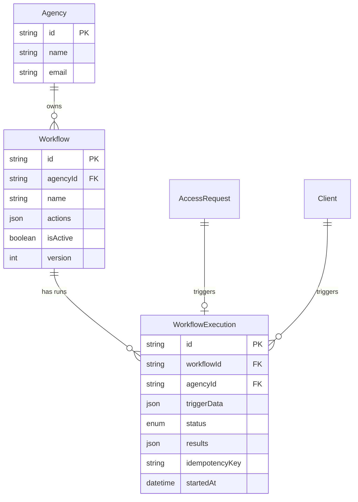

# Workflow Automation Builder (Simplified MVP)

**Type**: Feature
**Status**: Planning (Revised)
**Priority**: High (10X Differentiator)
**Created**: February 14, 2026
**Last Updated**: February 14, 2026

---

## Overview

A lightweight workflow automation system that sends notifications when clients complete onboarding. Agencies configure a single trigger (`All Platforms Connected`) that executes a sequence of actions (Email + Webhook) automatically.

**The Shift**: From "send link → get access → manually notify team" to "send link → workflow notifies everyone automatically"

**Strategic Value**: This is a 10X differentiator. No competitor (Leadsie, AgencyAccess) has integrated workflow automation. This starts simple but provides extensibility through webhooks.

---

## Why This Approach (Based on Reviewer Feedback)

### What Reviewers Said

| Reviewer | Key Feedback |
|----------|--------------|
| **DHH** | "You're building Zapier inside your OAuth platform. Stop it." - Use webhooks instead |
| **Kieran** | "Do not proceed until CRITICAL issues are addressed" - Missing type safety, idempotency, transactions |
| **Simplicity** | "75% reduction possible" - Start with 1 trigger, 2 actions, 2 models |

### Our Response

We're building the **minimum viable automation** that:
1. Solves 80% of the use case (notify when onboarding complete)
2. Provides extensibility via webhooks (agencies can connect Zapier/Make)
3. Uses existing infrastructure (Resend for email, no new OAuth)
4. Takes 1-2 weeks, not 7 weeks

---

## Problem Statement

### Current State

1. **Manual notification overhead**: After clients authorize access, agencies manually:
   - Send welcome emails
   - Notify team in Slack
   - Update project management tools
   - Log new clients in CRM

2. **Time drain**: Each client takes 5-10 minutes of manual notification
3. **Human error**: Steps get missed, emails forgotten
4. **Inconsistent**: Different team members handle differently

### Target State

1. **Automated notifications**: Workflows execute notifications automatically
2. **Consistent processes**: Every client gets same treatment
3. **Extensible**: Webhooks enable infinite integrations via Zapier/Make
4. **Observable**: Execution history shows exactly what happened

---

## Proposed Solution

### Core Concept: One Trigger + Two Actions

```
┌─────────────────────────┐     ┌──────────────────┐     ┌─────────────────┐
│ TRIGGER: All Platforms  │ ──► │  WORKFLOW RUN    │ ──► │  ACTIONS:       │
│ Connected               │     │  (Sequential)    │     │  1. Send Email  │
│                         │     │                  │     │  2. Send Webhook│
└─────────────────────────┘     └──────────────────┘     └─────────────────┘
```

**Example Flow**:
```
TRIGGER: Client connects all requested platforms
  └─► ACTION: Send welcome email to client
  └─► ACTION: POST webhook to Zapier (which can do anything)
```

### MVP Scope

| In Scope | Out of Scope (Phase 2) |
|----------|------------------------|
| 1 trigger (`ALL_PLATFORMS_CONNECTED`) | Additional triggers |
| 2 actions (`SEND_EMAIL`, `SEND_WEBHOOK`) | Native Slack/Drive/Asana |
| 2 database models | Templates model |
| Simple list-based UI | Visual canvas builder |
| Basic retry logic | Conditional branching |
| Execution history | Parallel execution |

---

## Technical Approach

### Architecture Overview

```
┌──────────────────────────────────────────────────────────────────────┐
│                           Frontend (Next.js)                          │
│  ┌─────────────────┐  ┌─────────────────┐                            │
│  │  Workflow       │  │  Execution      │                            │
│  │  List/Form      │  │  History        │                            │
│  └────────┬────────┘  └────────┬────────┘                            │
└───────────┼─────────────────────┼─────────────────────────────────────┘
            │                     │
            └──────────┬──────────┘
                       │ API Routes
                       ▼
┌──────────────────────────────────────────────────────────────────────┐
│                            Backend (Fastify)                          │
│  ┌─────────────────────────────────────────────────────────────────┐ │
│  │                     Workflow Service                             │ │
│  │  - CRUD operations                                               │ │
│  │  - Trigger detection                                             │ │
│  │  - Sequential execution                                          │ │
│  └─────────────────────────────┬───────────────────────────────────┘ │
│                                │                                      │
│  ┌─────────────────────────────▼───────────────────────────────────┐ │
│  │                   BullMQ Job Queue (Redis)                       │ │
│  │  workflow-execution-queue                                        │ │
│  └─────────────────────────────┬───────────────────────────────────┘ │
│                                │                                      │
│  ┌─────────────────────────────▼───────────────────────────────────┐ │
│  │                      Action Executors                            │ │
│  │  ┌──────────┐  ┌──────────┐                                     │ │
│  │  │ Resend   │  │ Webhook  │                                     │ │
│  │  │ Email    │  │ HTTP     │                                     │ │
│  │  └──────────┘  └──────────┘                                     │ │
│  └─────────────────────────────────────────────────────────────────┘ │
└──────────────────────────────────────────────────────────────────────┘
                                  │
                                  ▼
┌──────────────────────────────────────────────────────────────────────┐
│                          Data Layer                                   │
│  ┌──────────────────────┐                                            │
│  │     PostgreSQL       │                                            │
│  │  - Workflow Defs     │                                            │
│  │  - Executions        │                                            │
│  └──────────────────────┘                                            │
└──────────────────────────────────────────────────────────────────────┘
```

---

## Shared Types (CRITICAL: Define First)

```typescript
// packages/shared/src/workflow-types.ts

import { z } from 'zod';

// ============================================
// ENUMS
// ============================================

export const WorkflowTriggerTypeSchema = z.enum([
  'ALL_PLATFORMS_CONNECTED',
]);

export const WorkflowActionTypeSchema = z.enum([
  'SEND_EMAIL',
  'SEND_WEBHOOK',
]);

export const WorkflowExecutionStatusSchema = z.enum([
  'PENDING',
  'RUNNING',
  'COMPLETED',
  'FAILED',
]);

// ============================================
// ACTION CONFIGS (Discriminated Union)
// ============================================

export const SendEmailActionConfigSchema = z.object({
  type: z.literal('SEND_EMAIL'),
  id: z.string(),
  order: z.number().int().min(0),
  config: z.object({
    to: z.array(z.string().email()).min(1).max(10),
    cc: z.array(z.string().email()).max(5).optional(),
    subject: z.string().min(1).max(200),
    body: z.string().min(1).max(10000),
  }),
});

export const SendWebhookActionConfigSchema = z.object({
  type: z.literal('SEND_WEBHOOK'),
  id: z.string(),
  order: z.number().int().min(0),
  config: z.object({
    url: z.string().url().max(500),
    method: z.enum(['POST', 'PUT']),
    headers: z.record(z.string()).optional(),
    bodyTemplate: z.string().max(10000).optional(),
  }),
});

export const WorkflowActionConfigSchema = z.discriminatedUnion('type', [
  SendEmailActionConfigSchema,
  SendWebhookActionConfigSchema,
]);

// ============================================
// VARIABLE SUBSTITUTION
// ============================================

export const ALLOWED_VARIABLES = [
  'client_name',
  'client_email',
  'client_company',
  'agency_name',
  'request_id',
  'platforms',
  'timestamp',
  'date',
] as const;

export type AllowedVariable = typeof ALLOWED_VARIABLES[number];

// ============================================
// WORKFLOW SCHEMA
// ============================================

export const WorkflowSchema = z.object({
  id: z.string(),
  agencyId: z.string(),
  name: z.string().min(1).max(100),
  isActive: z.boolean(),
  triggerType: WorkflowTriggerTypeSchema,
  actions: z.array(WorkflowActionConfigSchema).min(1).max(20),
  version: z.number().int().min(0),
  createdAt: z.date(),
  updatedAt: z.date(),
});

export const CreateWorkflowInputSchema = z.object({
  name: z.string().min(1).max(100),
  isActive: z.boolean().default(true),
  actions: z.array(WorkflowActionConfigSchema).min(1).max(20),
});

export const UpdateWorkflowInputSchema = z.object({
  name: z.string().min(1).max(100).optional(),
  isActive: z.boolean().optional(),
  actions: z.array(WorkflowActionConfigSchema).min(1).max(20).optional(),
  version: z.number().int().min(0), // Required for optimistic locking
});

// ============================================
// API RESPONSE TYPES
// ============================================

export interface WorkflowResponse {
  data?: {
    id: string;
    agencyId: string;
    name: string;
    isActive: boolean;
    triggerType: 'ALL_PLATFORMS_CONNECTED';
    actions: z.infer<typeof WorkflowActionConfigSchema>[];
    version: number;
    createdAt: Date;
    updatedAt: Date;
  };
  error?: {
    code: string;
    message: string;
    details?: unknown;
  };
}

export interface WorkflowListResponse {
  data?: Array<{
    id: string;
    name: string;
    isActive: boolean;
    executionCount: number;
    lastExecutedAt: Date | null;
  }>;
  error?: {
    code: string;
    message: string;
  };
}

export interface WorkflowExecutionResponse {
  data?: {
    id: string;
    workflowId: string;
    status: 'PENDING' | 'RUNNING' | 'COMPLETED' | 'FAILED';
    results: Array<{
      actionId: string;
      actionType: 'SEND_EMAIL' | 'SEND_WEBHOOK';
      status: 'SUCCESS' | 'FAILED';
      error?: string;
      completedAt: Date;
    }> | null;
    error: string | null;
    startedAt: Date;
    completedAt: Date | null;
  };
  error?: {
    code: string;
    message: string;
  };
}

// ============================================
// TYPE EXPORTS
// ============================================

export type WorkflowTriggerType = z.infer<typeof WorkflowTriggerTypeSchema>;
export type WorkflowActionType = z.infer<typeof WorkflowActionTypeSchema>;
export type WorkflowExecutionStatus = z.infer<typeof WorkflowExecutionStatusSchema>;
export type WorkflowAction = z.infer<typeof WorkflowActionConfigSchema>;
export type CreateWorkflowInput = z.infer<typeof CreateWorkflowInputSchema>;
export type UpdateWorkflowInput = z.infer<typeof UpdateWorkflowInputSchema>;
```

---

## Database Schema

```prisma
// ============================================
// WORKFLOW AUTOMATION SCHEMA (SIMPLIFIED)
// File: apps/api/prisma/schema.prisma
// Only 2 models, ~40 lines vs 140 lines in original
// ============================================

// Workflow Trigger Types (1 for MVP)
enum WorkflowTriggerType {
  ALL_PLATFORMS_CONNECTED    // When client has authorized all requested platforms
}

// Workflow Action Types (2 for MVP)
enum WorkflowActionType {
  SEND_EMAIL                 // Resend transactional email
  SEND_WEBHOOK               // Custom HTTP webhook
}

// Workflow Execution Status (4 states)
enum WorkflowExecutionStatus {
  PENDING                    // Queued for execution
  RUNNING                    // Currently executing
  COMPLETED                  // All actions succeeded
  FAILED                     // One or more actions failed
}

// Main Workflow Definition
model Workflow {
  id          String   @id @default(cuid())
  agencyId    String   @map("agency_id")

  // Workflow metadata
  name        String
  isActive    Boolean  @default(true) @map("is_active")

  // Trigger (fixed for MVP)
  triggerType WorkflowTriggerType @default(ALL_PLATFORMS_CONNECTED) @map("trigger_type")

  // Actions configuration (ordered array with typed configs)
  actions     Json     @map("actions")

  // Optimistic locking
  version     Int      @default(0) @map("version")

  // Audit
  createdBy   String   @map("created_by") // AgencyMember email
  createdAt   DateTime @default(now()) @map("created_at")
  updatedAt   DateTime @updatedAt @map("updated_at")

  // Relations
  agency      Agency   @relation(fields: [agencyId], references: [id], onDelete: Cascade)
  executions  WorkflowExecution[]

  @@unique([agencyId, name])
  @@index([agencyId, isActive])
  @@map("workflows")
}

// Workflow Execution Record (includes action results in JSON)
model WorkflowExecution {
  id          String   @id @default(cuid())
  workflowId  String   @map("workflow_id")
  agencyId    String   @map("agency_id") // Denormalized for efficient queries

  // Execution context
  triggerData Json  @map("trigger_data") // Data that triggered this

  // Status tracking
  status      WorkflowExecutionStatus @default(PENDING)

  // Related entities
  accessRequestId String? @map("access_request_id")
  clientId        String? @map("client_id")

  // Results - Array of action results (collapsed from ActionExecution model)
  // Format: [{ actionId, actionType, status, error?, output?, completedAt }]
  results     Json?    @map("results")

  // Error summary
  error       String?  @db.Text

  // Idempotency key (prevents duplicate executions)
  idempotencyKey String? @unique @map("idempotency_key")

  // Timing
  startedAt   DateTime @default(now()) @map("started_at")
  completedAt DateTime? @map("completed_at")

  // Relations
  workflow    Workflow @relation(fields: [workflowId], references: [id], onDelete: Cascade)
  agency      Agency   @relation(fields: [agencyId], references: [id], onDelete: Cascade)
  accessRequest AccessRequest? @relation(fields: [accessRequestId], references: [id])
  client      Client?  @relation(fields: [clientId], references: [id])

  @@index([workflowId, status])
  @@index([agencyId, status])
  @@index([agencyId, createdAt(sort: Desc)])
  @@map("workflow_executions")
}
```

### ERD Diagram



---

## Implementation Phases (1-2 Weeks)

### Phase 1: Backend Core (Days 1-3)

**Goal**: Database, types, and CRUD operations

#### Tasks

1. **Shared Types Package**
   - [ ] Create `packages/shared/src/workflow-types.ts`
   - [ ] Export from `packages/shared/src/index.ts`
   - [ ] **File**: `packages/shared/src/workflow-types.ts`

2. **Database Schema**
   - [ ] Add workflow models to `apps/api/prisma/schema.prisma`
   - [ ] Run `npx prisma migrate dev --name add_workflows`
   - [ ] Generate Prisma client
   - [ ] **File**: `apps/api/prisma/schema.prisma`

3. **Workflow Service**
   - [ ] Create workflow service with Zod validation
   - [ ] Implement CRUD with optimistic locking
   - [ ] **File**: `apps/api/src/services/workflow.service.ts`

4. **API Routes**
   - [ ] `GET /api/workflows` - List workflows
   - [ ] `POST /api/workflows` - Create workflow
   - [ ] `GET /api/workflows/:id` - Get workflow
   - [ ] `PUT /api/workflows/:id` - Update workflow (with version check)
   - [ ] `DELETE /api/workflows/:id` - Delete workflow
   - [ ] **File**: `apps/api/src/routes/workflows.ts`

#### Success Criteria
- ✅ Can create workflow via API with typed validation
- ✅ Workflows stored in PostgreSQL
- ✅ Optimistic locking prevents concurrent edit issues

---

### Phase 2: Execution Engine (Days 4-6)

**Goal**: Trigger detection and action execution

#### Tasks

1. **BullMQ Queue Setup**
   - [ ] Create workflow-execution queue
   - [ ] Configure worker with proper job options
   - [ ] **File**: `apps/api/src/lib/workflow-queue.ts`

2. **Trigger Detection Service**
   - [ ] Hook into `ClientConnection` creation
   - [ ] Check if all requested platforms connected
   - [ ] Queue workflow execution if match found
   - [ ] **File**: `apps/api/src/services/workflow-trigger.service.ts`

3. **Workflow Executor Service**
   - [ ] Sequential action execution
   - [ ] Transaction boundaries for status updates
   - [ ] **File**: `apps/api/src/services/workflow-executor.service.ts`

4. **Action Executors**
   - [ ] Email executor (uses existing Resend)
   - [ ] Webhook executor (with URL validation)
   - [ ] **Files**: `apps/api/src/executors/*.ts`

5. **Error Handling**
   - [ ] Error classification system
   - [ ] Exponential backoff retry (max 3)
   - [ ] **File**: `apps/api/src/lib/workflow-errors.ts`

6. **Variable Substitution**
   - [ ] Template variable replacement
   - [ ] Context-aware sanitization
   - [ ] **File**: `apps/api/src/lib/variable-substitution.ts`

#### Success Criteria
- ✅ Trigger fires when all platforms connected
- ✅ Email action sends via Resend
- ✅ Webhook action POSTs to external URL
- ✅ Execution history recorded correctly
- ✅ Failed actions retry with backoff

---

### Phase 3: Frontend UI (Days 7-10)

**Goal**: Simple workflow management UI

#### Tasks

1. **Workflow List Page**
   - [ ] Create workflows index page
   - [ ] Display active/inactive workflows
   - [ ] Add create, toggle, delete actions
   - [ ] **File**: `apps/web/src/app/(dashboard)/workflows/page.tsx`

2. **Workflow Create/Edit Form**
   - [ ] Name input
   - [ ] Actions list (add/remove/reorder)
   - [ ] Email action form
   - [ ] Webhook action form
   - [ ] Variable preview
   - [ ] **Files**: `apps/web/src/components/workflows/*.tsx`

3. **Execution History**
   - [ ] Simple list view with status
   - [ ] Expandable action results
   - [ ] **File**: `apps/web/src/app/(dashboard)/workflows/[id]/executions/page.tsx`

#### Success Criteria
- ✅ Can create workflow via UI
- ✅ Can configure email and webhook actions
- ✅ Can view execution history
- ✅ Form validation prevents invalid configs

---

### Phase 4: Testing & Polish (Days 11-14)

**Goal**: Production readiness

#### Tasks

1. **Unit Tests**
   - [ ] Test workflow service CRUD
   - [ ] Test action executors
   - [ ] Test variable substitution
   - [ ] Test error classification
   - [ ] **Files**: `apps/api/src/__tests__/*.test.ts`

2. **Integration Tests**
   - [ ] Test full workflow execution
   - [ ] Test trigger detection
   - [ ] **Files**: `apps/api/src/__tests__/integration/*.test.ts`

3. **Security Audit**
   - [ ] Webhook URL validation (no SSRF)
   - [ ] Variable sanitization
   - [ ] Rate limiting for webhooks
   - [ ] **File**: `apps/api/src/lib/security.ts`

4. **Documentation**
   - [ ] Update CLAUDE.md with workflow architecture
   - [ ] Document API endpoints
   - [ ] Add inline code comments

#### Success Criteria
- ✅ Test coverage >80%
- ✅ Security review passed
- ✅ Documentation complete

---

## Critical Technical Details

### Error Classification System

```typescript
// apps/api/src/lib/workflow-errors.ts

export type WorkflowErrorCategory =
  | 'TRANSIENT'      // Network issues, temporary failures
  | 'PERMANENT'      // Invalid config, not found
  | 'AUTHENTICATION' // Token expired, revoked
  | 'RATE_LIMITED'   // Hit API rate limit
  | 'TIMEOUT';       // Action took too long

export const ERROR_RETRY_STRATEGY: Record<WorkflowErrorCategory, {
  shouldRetry: boolean;
  maxRetries: number;
  baseDelayMs: number;
}> = {
  TRANSIENT:    { shouldRetry: true,  maxRetries: 3, baseDelayMs: 1000 },
  PERMANENT:    { shouldRetry: false, maxRetries: 0, baseDelayMs: 0 },
  AUTHENTICATION: { shouldRetry: false, maxRetries: 0, baseDelayMs: 0 },
  RATE_LIMITED: { shouldRetry: true,  maxRetries: 3, baseDelayMs: 60000 },
  TIMEOUT:      { shouldRetry: true,  maxRetries: 2, baseDelayMs: 5000 },
};

export class WorkflowActionError extends Error {
  constructor(
    message: string,
    public readonly category: WorkflowErrorCategory,
    public readonly actionId: string,
    public readonly retryAfter?: Date,
  ) {
    super(message);
    this.name = 'WorkflowActionError';
  }
}
```

### Idempotency Pattern

```typescript
// In workflow-executor.service.ts

async function executeWorkflow(executionId: string): Promise<void> {
  // Use execution ID as job ID for natural deduplication
  // BullMQ won't add duplicate job IDs

  const execution = await prisma.workflowExecution.findUnique({
    where: { id: executionId },
    include: { workflow: true },
  });

  if (!execution || execution.status !== 'PENDING') {
    return; // Already processed or doesn't exist
  }

  // Transition to RUNNING with state machine validation
  await transitionStatus(executionId, 'PENDING', 'RUNNING');

  // Execute actions...
}
```

### Webhook Security

```typescript
// apps/api/src/lib/security.ts

const BLOCKED_HOSTS = [
  'localhost', '127.0.0.1', '0.0.0.0',
  '169.254.169.254', // AWS metadata
  '10.0.0.0/8', '172.16.0.0/12', '192.168.0.0/16',
];

export async function validateWebhookUrl(url: string): Promise<boolean> {
  const parsed = new URL(url);

  // Only HTTPS allowed
  if (parsed.protocol !== 'https:') {
    throw new Error('WEBHOOK_URL_MUST_BE_HTTPS');
  }

  // Resolve DNS and check against blocked ranges
  const addresses = await dns.promises.lookup(parsed.hostname);

  for (const addr of addresses) {
    if (isPrivateIP(addr.address)) {
      throw new Error('WEBHOOK_URL_BLOCKED');
    }
  }

  return true;
}
```

### Variable Substitution

```typescript
// apps/api/src/lib/variable-substitution.ts

const ALLOWED_VARIABLES = [
  'client_name', 'client_email', 'client_company',
  'agency_name', 'request_id', 'platforms',
  'timestamp', 'date',
] as const;

function sanitizeForContext(value: string, context: 'email' | 'json' | 'url'): string {
  switch (context) {
    case 'email':
      return value.replace(/[\r\n]/g, '').slice(0, 254);
    case 'json':
      return value; // JSON.stringify will escape
    case 'url':
      return encodeURIComponent(value);
  }
}

export function substituteVariables(
  template: string,
  variables: Record<string, string>,
  context: 'email' | 'json' | 'url',
): string {
  return template.replace(/\{([a-z_][a-z0-9_]*)\}/g, (match, varName) => {
    if (!ALLOWED_VARIABLES.includes(varName as any)) {
      throw new Error(`UNKNOWN_VARIABLE: ${varName}`);
    }
    const value = variables[varName] ?? '';
    return sanitizeForContext(value, context);
  });
}
```

---

## Acceptance Criteria

### Functional Requirements

**Triggers**
- [ ] `ALL_PLATFORMS_CONNECTED` - Fires when client authorizes all requested platforms

**Actions**
- [ ] `SEND_EMAIL` - Send email via Resend with variable substitution
- [ ] `SEND_WEBHOOK` - POST/PUT to URL with JSON payload

**Builder**
- [ ] Create workflow with name
- [ ] Add/remove/reorder actions
- [ ] Configure email action (to, subject, body)
- [ ] Configure webhook action (URL, method, body)
- [ ] Preview variable substitution
- [ ] Save workflow
- [ ] Toggle workflow active/inactive

**Execution**
- [ ] Actions execute sequentially
- [ ] Failed actions retry up to 3 times
- [ ] Execution history shows all results
- [ ] Idempotent (no duplicate executions)

### Non-Functional Requirements

**Performance**
- [ ] Workflow execution starts within 10 seconds of trigger
- [ ] Individual action timeout: 30 seconds
- [ ] UI loads in <2 seconds

**Security**
- [ ] Webhook URLs validated (no SSRF)
- [ ] Variable substitution sanitized
- [ ] Agency-scoped isolation

---

## Success Metrics

| Metric | Target (1 month) |
|--------|------------------|
| Agencies using workflows | 30% of active agencies |
| Average workflows per agency | 1-2 |
| Webhook usage | 50% connect to Zapier/Make |
| Workflow success rate | >95% |

---

## Future Considerations (Phase 2+)

When we have validated demand:

1. **Additional Triggers**
   - `ACCESS_REQUEST_CREATED`
   - `CLIENT_AUTHORIZES_PLATFORM`
   - `REQUEST_EXPIRING`
   - `ACCESS_REVOKED`

2. **Native Integrations**
   - Slack notification (requires OAuth)
   - Google Drive folder creation
   - Asana task creation

3. **Advanced Features**
   - Conditional branching
   - Parallel execution
   - Visual canvas builder
   - Template library

---

## Open Questions (Resolved)

| Question | Decision |
|----------|----------|
| Trigger detection mechanism | Polling (check on ClientConnection change) |
| Failure strategy | Continue to next action, classify errors |
| Max actions per workflow | 20 |
| Credential storage | N/A (no native integrations in MVP) |

---

*This plan was revised based on feedback from DHH Rails Reviewer, Kieran TypeScript Reviewer, and Code Simplicity Reviewer.*
